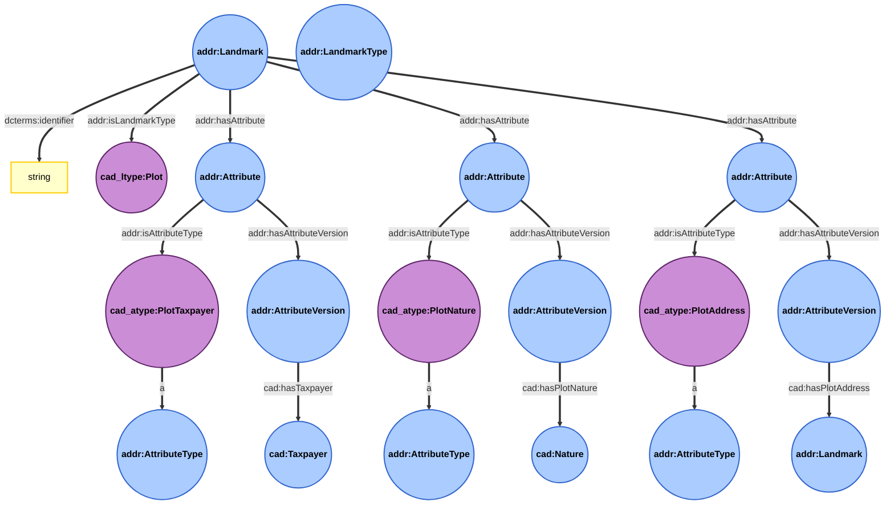
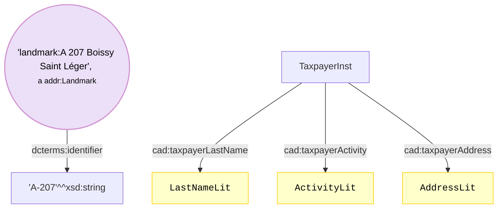
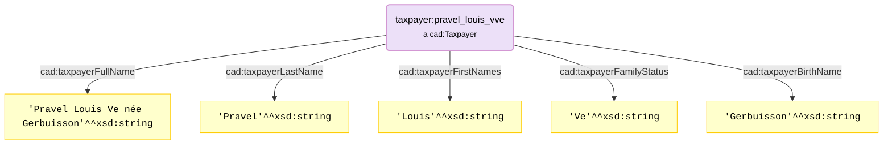

# Illustrated documentation of the Land Registry Landmarks extension

This page proposes illustrated representation of the ```Land Registry Landmarks``` sub-module of the *PeGazUs* ontology (extension dedicated to the land registry).
Please refer to the ontology to get the full definitions of each property.

## Ontology
*Exemple developped with a landmark of type plot. It reprents the additions provided to described land plots.
For the precise temporal evolution details (changes, events), please refer to the core PeGazUs ontology (temporal evolution sub module).*


### Note
* ```rdfs:label``` can be used to provide a nice complete label of the plot (including identifier and commune name for instance).
* ```dcterms:identifier``` is used to provide the plot id.


## Examples
*Barbaroux quincailler à Paris*

*Pravel Louis Ve née Gerbuisson*
