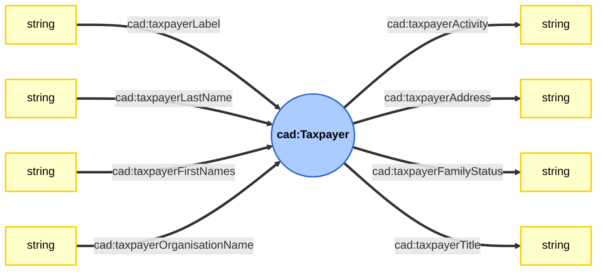

# Illustration of Taxpayers

## Ontology

### Datatype properties

```mermaid
graph LR
    %% 1. Nodes
    TaxpayerNode(("cad:Taxpayer"))
    NameLit["string"]
    LastNameLit["string"]
    FirstNamesLit["string"]
    OrganisationNameLit["string"]
    ActivityLit["string"]
    AddressLit["string"]
    FamilyStatusLit["string"]
    TitleLit["string"]

    %% 2. Connect the unique IDs
    NameLit == "cad:taxpayerLabel" ==> TaxpayerNode
    LastNameLit == "cad:taxpayerLastName" ==> TaxpayerNode
    FirstNamesLit == "cad:taxpayerFirstNames" ==> TaxpayerNode
    OrganisationNameLit == "cad:taxpayerOrganisationName" ==> TaxpayerNode
    TaxpayerNode == "cad:taxpayerActivity" ==> ActivityLit
    TaxpayerNode == "cad:taxpayerAddress" ==> AddressLit
    TaxpayerNode == "cad:taxpayerFamilyStatus" ==> FamilyStatusLit
    TaxpayerNode == "cad:taxpayerTitle" ==> TitleLit

    %% 3. Apply WebVOWL Style
    classDef vowlClass fill:#aaccff,stroke:#3366cc,stroke-width:2px,color:#000,font-weight:bold;
    classDef vowlLiteral fill:#ffffcc,stroke:#ffcc00,stroke-width:2px,color:#000;

    class TaxpayerNode vowlClass;
    class LabelLit,NameLit,LastNameLit,FirstNamesLit,ActivityLit,AddressLit,TitleLit,OrganisationNameLit,FamilyStatusLit vowlLiteral;
```
## Examples
