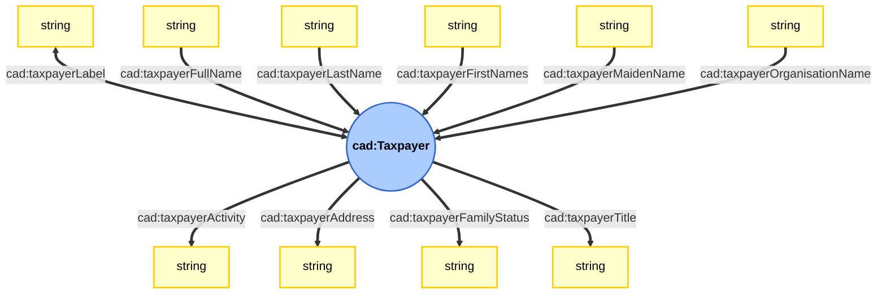
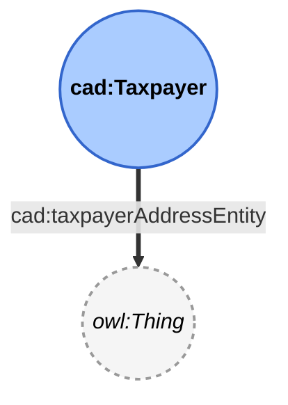

# Graphic documentation of Taxpayers

This page proposes a graphic representation of the ```Taxpayer``` modelet of the *PeGazUs* ontology.
Please refer to the ontology to get the full definitions of each property.

## Ontology
### Datatype properties

### Object properties

### Note
* ```cad:taxpayerLabel``` is a super-property for ```cad:taxpayerFullName``` and ```cad:taxpayerOrganisationName```.
* ```cad:taxpayerAddressEntity``` can be used when the value associated to ```cad:taxpayerAddress``` as been linked to any geographical entity of a KG. For instance, it can be an ```addr:Landmark``` entity.
* Upcomming developpements will create object properties for actitivies, family status and titles.