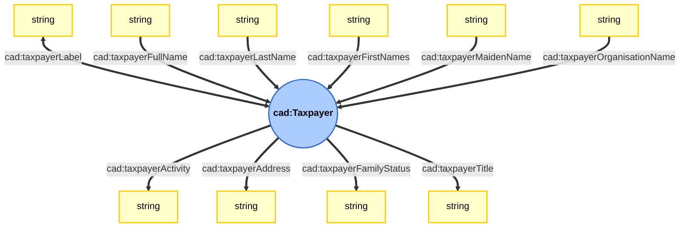

# Illustration of Taxpayers

This page proposes a graphic representation of the ontology.
Please refer to the ontology to get the full definitions of each property.

## Ontology
### Datatype properties

### Object properties

### Note

## Examples
