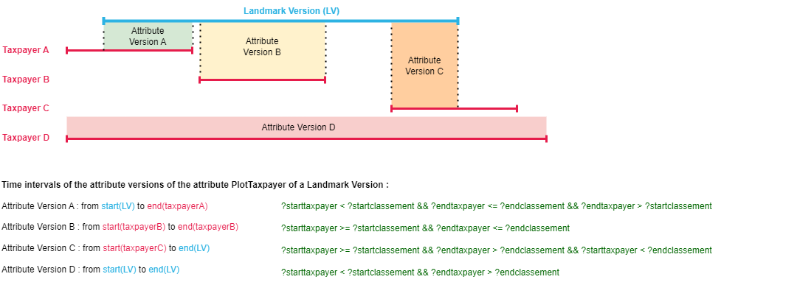

# Update initial data
These requests are used to complete the initial data created from archival sources with Python.

## 1. Add *add:hasTime* property on *rico:Record Resources*
### 1.1 Add *add:hasTime* on each *rico:ResourcePart* of type *cad:CompteFoncier*
* Using min and max time of a version of *add:Landmark*
```sparql
PREFIX add: <http://rdf.geohistoricaldata.org/def/address#>
PREFIX cad: <http://rdf.geohistoricaldata.org/def/cadastre#>
PREFIX cad_etype: <http://rdf.geohistoricaldata.org/id/codes/cadastre/eventType/>
PREFIX rico: <https://www.ica.org/standards/RiC/ontology#>
PREFIX srctype: <http://rdf.geohistoricaldata.org/id/codes/cadastre/sourceType/>
PREFIX time: <http://www.w3.org/2006/time#>

INSERT { GRAPH <http://rdf.geohistoricaldata.org/landmarksversions>{
    ?cf add:hasTime [
        add:hasBeginning [add:timeStamp ?cfStart; add:timePrecision time:Year; add:timeCalendar time:Gregorian]; 
		add:hasEnd [add:timeStamp ?cfEnd; add:timePrecision time:Year; add:timeCalendar time:Gregorian]].}}
WHERE {
    SELECT ?cf (MIN(?start) AS ?cfStart) (MAX(?end) AS ?cfEnd) 
    WHERE { 
            ?cf a rico:RecordPart; cad:isSourceType srctype:CompteFoncier.
            ?cf rico:hasOrHadConstituent ?classement.
            ?classement cad:isSourceType srctype:ArticleDeClassement.
            ?classement cad:mentions/add:isAttributeVersionOf/add:isAttributeOf ?landmark.
            ?landmark add:hasTime/add:hasBeginning/add:timeStamp ?start.
            ?landmark add:hasTime/add:hasEnd/add:timeStamp ?end.
        }
    GROUP BY ?cf
}
```
### 1.2. Add *add:hasTime* on each *rico:ResourcePart* of type *cad:ArticleDeClassement*
```sparql
PREFIX add: <http://rdf.geohistoricaldata.org/def/address#>
PREFIX rico: <https://www.ica.org/standards/RiC/ontology#>
PREFIX cad: <http://rdf.geohistoricaldata.org/def/cadastre#>
PREFIX srctype: <http://rdf.geohistoricaldata.org/id/codes/cadastre/sourceType/>
PREFIX time: <http://www.w3.org/2006/time#>

INSERT {
    GRAPH <http://rdf.geohistoricaldata.org/landmarksversions>{
        ?classement add:hasTime[
            add:hasBeginning[add:timeStamp ?startclassement; add:timePrecision time:Year; add:timeCalendar time:Gregorian];
            add:hasEnd[add:timeStamp ?endclassement; add:timePrecision time:Year; add:timeCalendar time:Gregorian]].
    }} 
WHERE { 
	?cf a rico:RecordPart; cad:isSourceType srctype:CompteFoncier.
    ?cf add:hasTime/add:hasBeginning/add:timeStamp ?startcf.
    ?cf add:hasTime/add:hasEnd/add:timeStamp ?endcf.
    ?cf rico:hasOrHadConstituent ?classement.
    ?classement cad:isSourceType srctype:ArticleDeClassement.
    ?classement cad:mentions/add:isAttributeVersionOf/add:isAttributeOf ?landmark.
    ?landmark add:hasTime/add:hasBeginning/add:timeStamp ?startclassement.
    ?landmark add:hasTime/add:hasEnd/add:timeStamp ?endclassement.
}
```
## 2. Taxpayers in a property account
### 2.1 Update *add:Event* related to the first taxpayer of a *cad:CompteFoncier*
```sparql
PREFIX add: <http://rdf.geohistoricaldata.org/def/address#>
PREFIX time: <http://www.w3.org/2006/time#>
PREFIX cad: <http://rdf.geohistoricaldata.org/def/cadastre#>
PREFIX cad_etype: <http://rdf.geohistoricaldata.org/id/codes/cadastre/eventType/>
PREFIX rico: <https://www.ica.org/standards/RiC/ontology#>
PREFIX srctype: <http://rdf.geohistoricaldata.org/id/codes/cadastre/sourceType/>
PREFIX ctype: <http://rdf.geohistoricaldata.org/id/codes/address/changeType/>

INSERT {GRAPH <http://rdf.geohistoricaldata.org/landmarksversions> {
    ?event add:hasTime[add:timeStamp ?start; add:timePrecision time:Year; add:timeCalendar time:Gregorian].
	?event cad:isEventType cad_etype:OpenPropertyAccount.}
}
WHERE {SELECT ?cf ?start ?mutation ?version ?change ?event
    WHERE { 
        ?cf a rico:RecordResource.
        ?cf cad:isSourceType srctype:CompteFoncier.
        ?cf add:hasTime[add:hasBeginning[add:timeStamp ?start; add:timePrecision time:Year; add:timeCalendar time:Gregorian]] .
        ?cf rico:hasOrHadConstituent ?mutation.
        ?mutation cad:isSourceType srctype:ArticleDeMutation.
        ?mutation add:hasAttribute[add:hasAttributeVersion ?version].
        ?version add:isMadeEffectiveBy ?change.
        ?change add:isChangeType ctype:AttributeVersionAppearance.
        ?change add:dependsOn ?event.
        FILTER NOT EXISTS{?event cad:isEventType cad_etype:TaxpayerMutation.}
    }
}
```
### 2.2 Update *add:Event* related to the last taxpayer of a property account
```sparql
PREFIX add: <http://rdf.geohistoricaldata.org/def/address#>
PREFIX time: <http://www.w3.org/2006/time#>
PREFIX cad: <http://rdf.geohistoricaldata.org/def/cadastre#>
PREFIX cad_etype: <http://rdf.geohistoricaldata.org/id/codes/cadastre/eventType/>
PREFIX rico: <https://www.ica.org/standards/RiC/ontology#>
PREFIX srctype: <http://rdf.geohistoricaldata.org/id/codes/cadastre/sourceType/>
PREFIX ctype: <http://rdf.geohistoricaldata.org/id/codes/address/changeType/>

INSERT {GRAPH <http://rdf.geohistoricaldata.org/landmarksversions> {
    ?event add:hasTime[add:timeStamp ?end; add:timePrecision time:Year; add:timeCalendar time:Gregorian].
    ?event cad:isEventType cad_etype:ClosePropertyAccount.}
}
WHERE {SELECT ?cf ?end ?mutation ?version ?change ?event
    WHERE { 
        ?cf a rico:RecordResource.
        ?cf cad:isSourceType srctype:CompteFoncier.
        ?cf add:hasTime[add:hasEnd[add:timeStamp ?end; add:timePrecision time:Year; add:timeCalendar time:Gregorian]] .
        ?cf rico:hasOrHadConstituent ?mutation.
        ?mutation cad:isSourceType srctype:ArticleDeMutation.
        ?mutation add:hasAttribute[add:hasAttributeVersion ?version].
        ?version add:isOutdatedBy ?change.
        ?change add:isChangeType ctype:AttributeVersionDisappearance.
        ?change add:dependsOn ?event.
        FILTER NOT EXISTS{?event cad:isEventType cad_etype:TaxpayerMutation.}
    }
}
```
## 3. Create *cad:Taxpayer* aggregations
### 3.1 Create keys to compare taxpayers names
```sparql
PREFIX cad: <http://rdf.geohistoricaldata.org/def/cadastre#>
PREFIX add: <http://rdf.geohistoricaldata.org/def/address#>
PREFIX ctype: <http://rdf.geohistoricaldata.org/id/codes/address/changeType/>
PREFIX jsfn: <http://www.ontotext.com/js#>
PREFIX skos: <http://www.w3.org/2004/02/skos/core#>

INSERT {GRAPH<http://rdf.geohistoricaldata.org/landmarksversions>{
    ?taxpayer skos:hiddenLabel ?hiddenLabel}}
WHERE {
    BIND(CONCAT(?labelWALower,?surnameEmpty,?statusEmpty) AS ?hiddenLabel)
            
	{SELECT ?taxpayer ?label ?surname ?status ?labelWALower ?surnameEmpty ?statusEmpty
	WHERE { 
	    ?taxpayer a cad:Taxpayer .
        ?taxpayer cad:isTaxpayerOf ?attrV.
        ?taxpayer cad:taxpayerLabel ?label.
        OPTIONAL{?taxpayer cad:taxpayerStatus ?status}.
        OPTIONAL{?taxpayer cad:taxpayerFirstName ?surname}.
        BIND(REPLACE(lcase(jsfn:replaceAccent(?label)),"[.*$^:;, ]+","") AS ?labelWALower)
        BIND(jsfn:replaceSubwords(REPLACE(lcase(jsfn:replaceAccent(?surname)),"[.*$^:;, ]+","")) AS ?surnameWALower)
        BIND(jsfn:replaceSubwords(REPLACE(lcase(jsfn:replaceAccent(?status)),"[.*$^:;, ]+","")) AS ?statusWALower)
        BIND(IF(notexists{?taxpayer cad:taxpayerStatus ?status} , "", ?statusWALower) AS ?statusEmpty)
        BIND(IF(notexists{?taxpayer cad:taxpayerFirstName ?surname} , "", ?surnameWALower) AS ?surnameEmpty)
	}
    }
}
```
### 3.2 Create links between similar taxpayers
```sparql
PREFIX cad: <http://rdf.geohistoricaldata.org/def/cadastre#>
PREFIX skos: <http://www.w3.org/2004/02/skos/core#>
PREFIX jsfn: <http://www.ontotext.com/js#>
PREFIX add: <http://rdf.geohistoricaldata.org/def/address#>

INSERT {GRAPH <http://rdf.geohistoricaldata.org/tmp/taxpayersmatching>{
    ?taxpayer skos:exactMatch ?taxpayer.
    ?taxpayer skos:exactMatch ?taxpayer2.
    ?taxpayer2 skos:exactMatch ?taxpayer.
    ?taxpayer2 skos:exactMatch ?taxpayer2.
}}
WHERE {
    ?taxpayer a cad:Taxpayer.
    ?taxpayer skos:hiddenLabel ?hiddenLabel.

    ?taxpayer2 a cad:Taxpayer.
    ?taxpayer2 skos:hiddenLabel ?hiddenLabel2.
    
    BIND(jsfn:normalizedLevenshtein(?hiddenLabel,?hiddenLabel2) AS ?lev)
    FILTER(?lev > 0.8)
}
```
### 3.3 Initialized taxpayers aggregations
```sparql
PREFIX cad: <http://rdf.geohistoricaldata.org/def/cadastre#>
PREFIX add: <http://rdf.geohistoricaldata.org/def/address#>
PREFIX skos: <http://www.w3.org/2004/02/skos/core#>

INSERT { GRAPH <http://rdf.geohistoricaldata.org/taxpayersaggregations>{ 
	?taxpayerAGG a cad:Taxpayer.
    ?taxpayerAGG add:hasMergedValue ?mergedValue.
}}
WHERE {
    BIND (IRI(CONCAT("http://rdf.geohistoricaldata.org/id/taxpayer/","AGG_",STRUUID())) AS ?taxpayerAGG) 
    {SELECT DISTINCT (GROUP_CONCAT(?taxpayer2) AS ?mergedValue)
	WHERE {?taxpayer1 a cad:Taxpayer; 
                         skos:exactMatch+ ?taxpayer2.
        ?taxpayer2 a cad:Taxpayer.}
    GROUP BY ?taxpayer1
    ORDER BY ?mergedValue}
}
```
### 3.4. Cast add:hasMergedValue elements as URIs
```sparql
PREFIX add: <http://rdf.geohistoricaldata.org/def/address#>
PREFIX spif: <http://spinrdf.org/spif#>
PREFIX cad: <http://rdf.geohistoricaldata.org/def/cadastre#>

INSERT {GRAPH <http://rdf.geohistoricaldata.org/taxpayersaggregations>{
    ?taxpayerAGG add:hasTrace ?taxpayer.
    ?taxpayer add:isTraceOf ?taxpayerAGG.
    }}
WHERE {
    SELECT ?taxpayerAGG ?taxpayer
    WHERE {
         ?taxpayer a cad:Taxpayer.
         FILTER(STR(?taxpayer) = ?strbn)
        {
        SELECT ?taxpayerAGG ?strbn
        WHERE { 
            ?taxpayerAGG add:hasMergedValue ?concatstrbn .
            ?strbn spif:split(?concatstrbn " ").
        }}
    }
}
```
### 3.5 Add attributes to the taxpayers
```sparql
PREFIX rdfs: <http://www.w3.org/2000/01/rdf-schema#>
PREFIX cad: <http://rdf.geohistoricaldata.org/def/cadastre#>
PREFIX add: <http://rdf.geohistoricaldata.org/def/address#>
PREFIX skos: <http://www.w3.org/2004/02/skos/core#>

INSERT { GRAPH <http://rdf.geohistoricaldata.org/taxpayersaggregations> {
    ?taxpayerAGG rdfs:label ?fulllabel;
    	cad:taxpayerLabel ?label;
        cad:taxpayerFirstName ?firstname;
    	cad:taxpayerAddress ?address;
    	cad:taxpayerActivity ?activity;
    	skos:hiddenLabel ?hidden.
    }}
WHERE {select distinct ?taxpayerAGG ?fulllabel ?label ?firstname ?address ?activity ?source ?hidden
where {
    GRAPH <http://rdf.geohistoricaldata.org/taxpayersaggregations>{
        ?taxpayerAGG a cad:Taxpayer.
        ?taxpayerAGG add:hasTrace ?taxpayer.
    }
    GRAPH <http://rdf.geohistoricaldata.org/landmarksversions> {
        ?taxpayer a cad:Taxpayer.}
    ?taxpayer rdfs:label ?fulllabel.
    ?taxpayer cad:taxpayerLabel ?label.
    OPTIONAL{?taxpayer cad:taxpayerFirstName ?firstname.}
    OPTIONAL{?taxpayer cad:taxpayerAddress ?address.}
    OPTIONAL{?taxpayer cad:taxpayerActivity ?activity.}
    ?taxpayer cad:fromSource ?source.
    ?taxpayer skos:hiddenLabel ?hidden.
} 
ORDER BY ?taxpayerAGG}
```

## 4. Create PlotTaxpayer attribute on landmarks versions
### 4.1. Initialise attribute of type *cad_atype:PlotTaxpayer*
```sparql
PREFIX add: <http://rdf.geohistoricaldata.org/def/address#>
PREFIX cad_atype: <http://rdf.geohistoricaldata.org/id/codes/cadastre/attributeType/>
PREFIX cad_ltype: <http://rdf.geohistoricaldata.org/id/codes/cadastre/landmarkType/>

INSERT {GRAPH <http://rdf.geohistoricaldata.org/landmarksversions>{
     ?plot add:hasAttribute[a add:Attribute; add:isAttributeType cad_atype:PlotTaxpayer].
    }}
WHERE { 
    GRAPH <http://rdf.geohistoricaldata.org/landmarksversions>{
        ?plot a add:Landmark; add:isLandmarkType cad_ltype:Plot.
        FILTER NOT EXISTS {?plot add:hasAttribute[add:isAttributeType cad_atype:PlotTaxpayer]}
    }
}
```
### 4.2. Create *add:AttributeVersion* of *PlotTaxpayer* attribute on each version of landmark



#### 4.2.1 Case A
* Taxpayer validity interval starts before landmark version validity interval
* Taxpayer validity interval ends during landmark version
```sparql
PREFIX rico: <https://www.ica.org/standards/RiC/ontology#>
PREFIX cad: <http://rdf.geohistoricaldata.org/def/cadastre#>
PREFIX srctype: <http://rdf.geohistoricaldata.org/id/codes/cadastre/sourceType/>
PREFIX add: <http://rdf.geohistoricaldata.org/def/address#>
PREFIX ofn: <http://www.ontotext.com/sparql/functions/>
PREFIX cad_atype: <http://rdf.geohistoricaldata.org/id/codes/cadastre/attributeType/>
PREFIX ctype: <http://rdf.geohistoricaldata.org/id/codes/address/changeType/>
PREFIX cad_etype: <http://rdf.geohistoricaldata.org/id/codes/cadastre/eventType/>
PREFIX time: <http://www.w3.org/2006/time#>

INSERT {GRAPH <http://rdf.geohistoricaldata.org/landmarksversions> {
    ?attr add:hasAttributeVersion ?attrv;
    	  add:changedBy ?change1;
          add:changedBy ?change2.
    ?attrv a add:AttributeVersion; 
             cad:hasTaxpayer ?taxpayerAGG.
    ?event1 a add:Event; cad:isEventType cad_etype:TaxpayerEvent.
    ?event2 a add:Event; cad:isEventType cad_etype:TaxpayerEvent.
    ?change1 a add:Change; add:isChangeType ctype:AttributeVersionAppearance.
    ?change2 a add:Change; add:isChangeType ctype:AttributeVersionDisappearance.
    ?change1 add:makesEffective ?attrV.
    ?change2 add:outdates ?attrV.
    ?change1 add:dependsOn ?event1.
    ?change2 add:dependsOn ?event2.
    ?event1 add:hasTime[add:timeStamp ?start; add:timePrecision time:Year; add:timeCalendar time:Gregorian].
    ?event2 add:hasTime[add:timeStamp ?end; add:timePrecision time:Year; add:timeCalendar time:Gregorian]
    }}
WHERE { 
    {SELECT ?landmark ?attr ?taxpayerAGG ?start ?end (IRI(CONCAT("http://rdf.geohistoricaldata.org/id/change/",STRUUID())) AS ?change1) (IRI(CONCAT("http://rdf.geohistoricaldata.org/id/change/",STRUUID())) AS ?change2) (IRI(CONCAT("http://rdf.geohistoricaldata.org/id/event/",STRUUID())) AS ?event1) (IRI(CONCAT("http://rdf.geohistoricaldata.org/id/event/",STRUUID())) AS ?event2) (UUID() AS ?attrv)
        WHERE {
	?cf a rico:RecordPart; cad:isSourceType srctype:CompteFoncier; rico:hasOrHadConstituent ?classement; rico:hasOrHadConstituent ?mutation.
    ?classement cad:isSourceType srctype:ArticleDeClassement;
                cad:mentions/add:isAttributeVersionOf/add:isAttributeOf ?landmark.
    ?landmark add:hasTime[add:hasBeginning/add:timeStamp ?startclassement;
                          add:hasEnd/add:timeStamp ?endclassement];
              add:hasAttribute ?attr.
    ?attr add:isAttributeType cad_atype:PlotTaxpayer.
    ?mutation add:hasAttribute/add:hasAttributeVersion ?taxpayerV.
    ?taxpayerV cad:hasTaxpayer/add:isTraceOf ?taxpayerAGG;
               add:isMadeEffectiveBy/add:dependsOn/add:hasTime/add:timeStamp ?starttaxpayer;
               add:isOutdatedBy/add:dependsOn/add:hasTime/add:timeStamp ?endtaxpayer.
    FILTER (?starttaxpayer < ?startclassement && ?endtaxpayer <= ?endclassement && ?endtaxpayer > ?startclassement)
    BIND((?startclassement) AS ?start)
    BIND((?endtaxpayer) AS ?end)
	}
    ORDER BY ?landmark}
}
```
#### 4.2.2 Case B
```sparql
PREFIX rico: <https://www.ica.org/standards/RiC/ontology#>
PREFIX cad: <http://rdf.geohistoricaldata.org/def/cadastre#>
PREFIX srctype: <http://rdf.geohistoricaldata.org/id/codes/cadastre/sourceType/>
PREFIX add: <http://rdf.geohistoricaldata.org/def/address#>
PREFIX ofn: <http://www.ontotext.com/sparql/functions/>
PREFIX cad_atype: <http://rdf.geohistoricaldata.org/id/codes/cadastre/attributeType/>
PREFIX ctype: <http://rdf.geohistoricaldata.org/id/codes/address/changeType/>
PREFIX cad_etype: <http://rdf.geohistoricaldata.org/id/codes/cadastre/eventType/>
PREFIX time: <http://www.w3.org/2006/time#>

INSERT {GRAPH <http://rdf.geohistoricaldata.org/landmarksversions> {
    ?attr add:hasAttributeVersion ?attrv;
    	  add:changedBy ?change1;
          add:changedBy ?change2.
    ?attrv a add:AttributeVersion; 
             cad:hasTaxpayer ?taxpayerAGG.
    ?event1 a add:Event; cad:isEventType cad_etype:TaxpayerEvent.
    ?event2 a add:Event; cad:isEventType cad_etype:TaxpayerEvent.
    ?change1 a add:Change; add:isChangeType ctype:AttributeVersionAppearance.
    ?change2 a add:Change; add:isChangeType ctype:AttributeVersionDisappearance.
    ?change1 add:makesEffective ?attrV.
    ?change2 add:outdates ?attrV.
    ?change1 add:dependsOn ?event1.
    ?change2 add:dependsOn ?event2.
    ?event1 add:hasTime[add:timeStamp ?start; add:timePrecision time:Year; add:timeCalendar time:Gregorian].
    ?event2 add:hasTime[add:timeStamp ?end; add:timePrecision time:Year; add:timeCalendar time:Gregorian]
    }}
WHERE { 
    {SELECT ?landmark ?attr ?taxpayerAGG ?start ?end (IRI(CONCAT("http://rdf.geohistoricaldata.org/id/change/",STRUUID())) AS ?change1) (IRI(CONCAT("http://rdf.geohistoricaldata.org/id/change/",STRUUID())) AS ?change2) (IRI(CONCAT("http://rdf.geohistoricaldata.org/id/event/",STRUUID())) AS ?event1) (IRI(CONCAT("http://rdf.geohistoricaldata.org/id/event/",STRUUID())) AS ?event2) (UUID() AS ?attrv)
        WHERE {
	?cf a rico:RecordPart; cad:isSourceType srctype:CompteFoncier; rico:hasOrHadConstituent ?classement; rico:hasOrHadConstituent ?mutation.
    ?classement cad:isSourceType srctype:ArticleDeClassement;
                cad:mentions/add:isAttributeVersionOf/add:isAttributeOf ?landmark.
    ?landmark add:hasTime[add:hasBeginning/add:timeStamp ?startclassement;
                          add:hasEnd/add:timeStamp ?endclassement];
              add:hasAttribute ?attr.
    ?attr add:isAttributeType cad_atype:PlotTaxpayer.
    ?mutation add:hasAttribute/add:hasAttributeVersion ?taxpayerV.
    ?taxpayerV cad:hasTaxpayer/add:isTraceOf ?taxpayerAGG;
               add:isMadeEffectiveBy/add:dependsOn/add:hasTime/add:timeStamp ?starttaxpayer;
               add:isOutdatedBy/add:dependsOn/add:hasTime/add:timeStamp ?endtaxpayer.
    FILTER (?starttaxpayer >= ?startclassement && ?endtaxpayer <= ?endclassement)
    BIND((?starttaxpayer) AS ?start)
    BIND((?endtaxpayer) AS ?end)
	}
    ORDER BY ?landmark}
}
```
#### 4.2.3 Case C
```sparql
PREFIX rico: <https://www.ica.org/standards/RiC/ontology#>
PREFIX cad: <http://rdf.geohistoricaldata.org/def/cadastre#>
PREFIX srctype: <http://rdf.geohistoricaldata.org/id/codes/cadastre/sourceType/>
PREFIX add: <http://rdf.geohistoricaldata.org/def/address#>
PREFIX ofn: <http://www.ontotext.com/sparql/functions/>
PREFIX cad_atype: <http://rdf.geohistoricaldata.org/id/codes/cadastre/attributeType/>
PREFIX ctype: <http://rdf.geohistoricaldata.org/id/codes/address/changeType/>
PREFIX cad_etype: <http://rdf.geohistoricaldata.org/id/codes/cadastre/eventType/>
PREFIX time: <http://www.w3.org/2006/time#>

INSERT {GRAPH <http://rdf.geohistoricaldata.org/landmarksversions> {
    ?attr add:hasAttributeVersion ?attrv;
    	  add:changedBy ?change1;
          add:changedBy ?change2.
    ?attrv a add:AttributeVersion; 
             cad:hasTaxpayer ?taxpayerAGG.
    ?event1 a add:Event; cad:isEventType cad_etype:TaxpayerEvent.
    ?event2 a add:Event; cad:isEventType cad_etype:TaxpayerEvent.
    ?change1 a add:Change; add:isChangeType ctype:AttributeVersionAppearance.
    ?change2 a add:Change; add:isChangeType ctype:AttributeVersionDisappearance.
    ?change1 add:makesEffective ?attrV.
    ?change2 add:outdates ?attrV.
    ?change1 add:dependsOn ?event1.
    ?change2 add:dependsOn ?event2.
    ?event1 add:hasTime[add:timeStamp ?start; add:timePrecision time:Year; add:timeCalendar time:Gregorian].
    ?event2 add:hasTime[add:timeStamp ?end; add:timePrecision time:Year; add:timeCalendar time:Gregorian]
    }}
WHERE { 
    {SELECT ?landmark ?attr ?taxpayerAGG ?start ?end (IRI(CONCAT("http://rdf.geohistoricaldata.org/id/change/",STRUUID())) AS ?change1) (IRI(CONCAT("http://rdf.geohistoricaldata.org/id/change/",STRUUID())) AS ?change2) (IRI(CONCAT("http://rdf.geohistoricaldata.org/id/event/",STRUUID())) AS ?event1) (IRI(CONCAT("http://rdf.geohistoricaldata.org/id/event/",STRUUID())) AS ?event2) (UUID() AS ?attrv)
        WHERE {
	?cf a rico:RecordPart; cad:isSourceType srctype:CompteFoncier; rico:hasOrHadConstituent ?classement; rico:hasOrHadConstituent ?mutation.
    ?classement cad:isSourceType srctype:ArticleDeClassement;
                cad:mentions/add:isAttributeVersionOf/add:isAttributeOf ?landmark.
    ?landmark add:hasTime[add:hasBeginning/add:timeStamp ?startclassement;
                          add:hasEnd/add:timeStamp ?endclassement];
              add:hasAttribute ?attr.
    ?attr add:isAttributeType cad_atype:PlotTaxpayer.
    ?mutation add:hasAttribute/add:hasAttributeVersion ?taxpayerV.
    ?taxpayerV cad:hasTaxpayer/add:isTraceOf ?taxpayerAGG;
               add:isMadeEffectiveBy/add:dependsOn/add:hasTime/add:timeStamp ?starttaxpayer;
               add:isOutdatedBy/add:dependsOn/add:hasTime/add:timeStamp ?endtaxpayer.
    FILTER (?starttaxpayer >= ?startclassement && ?endtaxpayer > ?endclassement && ?starttaxpayer < ?endclassement)
    BIND((?starttaxpayer) AS ?start)
    BIND((?endclassement) AS ?end)
	}
    ORDER BY ?landmark}
}
```
#### 4.2.4 Case D
```sparql
PREFIX rico: <https://www.ica.org/standards/RiC/ontology#>
PREFIX cad: <http://rdf.geohistoricaldata.org/def/cadastre#>
PREFIX srctype: <http://rdf.geohistoricaldata.org/id/codes/cadastre/sourceType/>
PREFIX add: <http://rdf.geohistoricaldata.org/def/address#>
PREFIX ofn: <http://www.ontotext.com/sparql/functions/>
PREFIX cad_atype: <http://rdf.geohistoricaldata.org/id/codes/cadastre/attributeType/>
PREFIX ctype: <http://rdf.geohistoricaldata.org/id/codes/address/changeType/>
PREFIX cad_etype: <http://rdf.geohistoricaldata.org/id/codes/cadastre/eventType/>
PREFIX time: <http://www.w3.org/2006/time#>

INSERT {GRAPH <http://rdf.geohistoricaldata.org/landmarksversions> {
    ?attr add:hasAttributeVersion ?attrv;
    	  add:changedBy ?change1;
          add:changedBy ?change2.
    ?attrv a add:AttributeVersion; 
             cad:hasTaxpayer ?taxpayerAGG.
    ?event1 a add:Event; cad:isEventType cad_etype:TaxpayerEvent.
    ?event2 a add:Event; cad:isEventType cad_etype:TaxpayerEvent.
    ?change1 a add:Change; add:isChangeType ctype:AttributeVersionAppearance.
    ?change2 a add:Change; add:isChangeType ctype:AttributeVersionDisappearance.
    ?change1 add:makesEffective ?attrV.
    ?change2 add:outdates ?attrV.
    ?change1 add:dependsOn ?event1.
    ?change2 add:dependsOn ?event2.
    ?event1 add:hasTime[add:timeStamp ?start; add:timePrecision time:Year; add:timeCalendar time:Gregorian].
    ?event2 add:hasTime[add:timeStamp ?end; add:timePrecision time:Year; add:timeCalendar time:Gregorian]
    }}
WHERE { 
    {SELECT ?landmark ?attr ?taxpayerAGG ?start ?end (IRI(CONCAT("http://rdf.geohistoricaldata.org/id/change/",STRUUID())) AS ?change1) (IRI(CONCAT("http://rdf.geohistoricaldata.org/id/change/",STRUUID())) AS ?change2) (IRI(CONCAT("http://rdf.geohistoricaldata.org/id/event/",STRUUID())) AS ?event1) (IRI(CONCAT("http://rdf.geohistoricaldata.org/id/event/",STRUUID())) AS ?event2) (UUID() AS ?attrv)
        WHERE {
	?cf a rico:RecordPart; cad:isSourceType srctype:CompteFoncier; rico:hasOrHadConstituent ?classement; rico:hasOrHadConstituent ?mutation.
    ?classement cad:isSourceType srctype:ArticleDeClassement;
                cad:mentions/add:isAttributeVersionOf/add:isAttributeOf ?landmark.
    ?landmark add:hasTime[add:hasBeginning/add:timeStamp ?startclassement;
                          add:hasEnd/add:timeStamp ?endclassement];
              add:hasAttribute ?attr.
    ?attr add:isAttributeType cad_atype:PlotTaxpayer.
    ?mutation add:hasAttribute/add:hasAttributeVersion ?taxpayerV.
    ?taxpayerV cad:hasTaxpayer/add:isTraceOf ?taxpayerAGG;
               add:isMadeEffectiveBy/add:dependsOn/add:hasTime/add:timeStamp ?starttaxpayer;
               add:isOutdatedBy/add:dependsOn/add:hasTime/add:timeStamp ?endtaxpayer.
    FILTER (?starttaxpayer < ?startclassement && ?endtaxpayer > ?endclassement)
    BIND((?startclassement) AS ?start)
    BIND((?endclassement) AS ?end)
	}
    ORDER BY ?landmark}
}
```