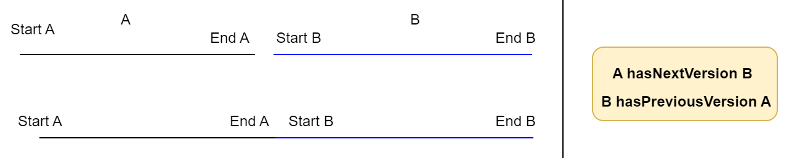
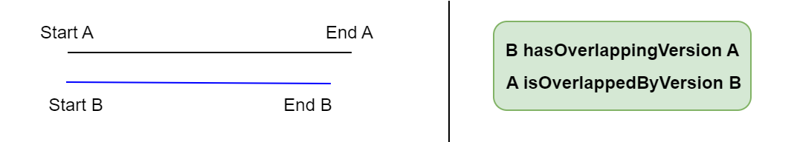
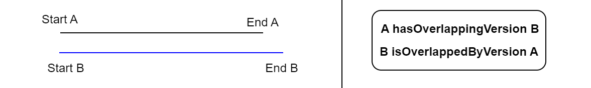

# Process to create the KG : use case of plots

## 1. Create links between root landmarks and their versions in other sources
* Create a relation between a root landmark and all the others landmarks that seem to be versions of this root landmark.
* In the case of plots :
    * Root landmarks are the plots vectorized from the cadastral index map.
    * Others versions of landmarks are all the resources built from each table line of the mutation registers (one line = 1 plot version)
    * The relation between root landmarks and their landmark versions is created using the cadastral number plots. These numbers (=IDs) are not unique  : plots keep the same number in case or split in 2..n plots or merge with others plots.
```sparql
PREFIX add: <http://rdf.geohistoricaldata.org/def/address#>
PREFIX cad_ltype: <http://rdf.geohistoricaldata.org/id/codes/cadastre/landmarkType/>
PREFIX cad_atype: <http://rdf.geohistoricaldata.org/id/codes/cadastre/attributeType/>
PREFIX dcterms: <http://purl.org/dc/terms/>

INSERT {GRAPH <http://rdf.geohistoricaldata.org/landmarksaggregations>{
    ?landmarkversion add:hasRootLandmark ?rootLandmark.
    ?rootLandmark add:isRootLandmarkOf ?landmarkversion.}}
WHERE {
        GRAPH <http://rdf.geohistoricaldata.org/rootlandmarks> {
           ?rootLandmark a add:Landmark ; add:isLandmarkType cad_ltype:Plot.}
        GRAPH <http://rdf.geohistoricaldata.org/landmarksversions> {
        ?landmarkversion a add:Landmark ; add:isLandmarkType cad_ltype:Plot.}
        
        ####### Pseudo-identity constraint (ex: plots)
        ?rootLandmark dcterms:identifier ?plotidm.
        ?landmarkversion dcterms:identifier ?plotidr.
        BIND(
        IF(STRENDS(STR(?plotidr), "p"), 
                SUBSTR(STR(?plotidr), 1, STRLEN(STR(?plotidr)) - 1), 
                ?plotidr
              ) AS ?plotid
            )
        FILTER(?plotidm = ?plotid)
}
```
## 2. Compute temporal relative order between leandmark versions

### 2.1 Compute the temporal gap between two versions of a landmark
* This step aims to compute temporal gaps between two versions of landmarks that have the same root landmark.
* It's an intermediate step to build a temporal relations between versions of landmarks.
* It's an intermediate step to build a temporal relations between versions of landmarks.
* We keep only the positive or null gaps that will be usefull to compute *hasPreviousVersion/hasNextVersion* relations.
```sparql
PREFIX add: <http://rdf.geohistoricaldata.org/def/address#>
PREFIX xsd: <http://www.w3.org/2001/XMLSchema#>
PREFIX ofn: <http://www.ontotext.com/sparql/functions/>

#Compute gaps between versions of landmarks (with the same root) and keep only positive or nul geps.
#CONSTRUCT{?rootLandmark add:hasTimeGap [ add:hasValue ?gap; add:isFirstRL ?landmarkversion; add:isSecondRL ?landmarkversion2]}

INSERT { GRAPH <http://rdf.geohistoricaldata.org/tmp>{
    ?rootLandmark add:hasTimeGap [ add:hasValue ?gap; 
    add:isFirstRL ?landmarkversion; 
    add:isSecondRL ?landmarkversion2]}}
WHERE { 
    ?rootLandmark add:isRootLandmarkOf ?landmarkversion.
    ?rootLandmark add:isRootLandmarkOf ?landmarkversion2.
    ?landmarkversion add:hasTime/add:hasEnd/add:timeStamp ?end.
    ?landmarkversion2 add:hasTime/add:hasBeginning/add:timeStamp ?start2 .
	BIND(ofn:asDays(?start2 - ?end) as ?gap).
	FILTER ((?gap >= 0) && !(sameTerm(?landmarkversion,?landmarkversion2)))
}
```
This step aims to build the temporal relations between versions of plots.

### 2.2 Create *hasPreviousVersion* and *hasNextVersion* in case of null or positive gap
* For each plot, we search for the minimal positive or null gap that is linked to it.
* We create *hasPreviousVersion*/*hasNextVersion* between this landmark and the ones that have a gap equal to the minimal gap.



```sparql
PREFIX add: <http://rdf.geohistoricaldata.org/def/address#>

# Create hasPreviousVersion and hasNextVersion relations when positive or nul temporal gap between versions
#CONSTRUCT {?landmarkversion add:hasNextVersion ?landmarkversion2. ?landmarkversion2 add:hasPreviousVersion ?landmarkversion.}

INSERT { GRAPH <http://rdf.geohistoricaldata.org/order>{
        ?landmarkversion add:hasNextVersion ?landmarkversion2.
        ?landmarkversion2 add:hasPreviousVersion ?landmarkversion.}}
WHERE {
    #Get landmarks that have a gap equal to minimal gap
	GRAPH <http://rdf.geohistoricaldata.org/tmp> {
        ?rootLandmark add:hasTimeGap ?gap.
    	?gap add:hasValue ?ecart.
        ?gap add:isFirstRL ?landmarkversion.
        ?gap add:isSecondRL ?landmarkversion2
    FILTER (?ecart = ?minecart && !sameTerm(?landmarkversion, ?landmarkversion2))}
    
    # Search for minimal gap of each plot
    {SELECT ?landmarkversion (MIN(?ecart2) AS ?minecart)
	WHERE {GRAPH <http://rdf.geohistoricaldata.org/tmp> {
    	?rootLandmark add:hasTimeGap ?gap2.
    	?gap2 add:hasValue ?ecart2.
        ?gap2 add:isFirstRL ?landmarkversion.
        } 
	}
	GROUP BY ?landmarkversion
    ORDER BY ?minecart}
    # End
}
```
* Then, we can delete the *http://rdf.geohistoricaldata.org/tmp* (it will not be use anymore).

### 2.3 Create *hasOverlappingVersion* and *isOverlappedByVersion* in case of negative gap
In case when landmarks versions are overlapping each others (B starts before the end of A), we create *hasOverlappingVersion* and *isOverlappedByVersion* properties.
* *hasOverlappingVersion* means that version **A** starts before **B** 
    * in the special case of two versions starting at the same time, it's the version that ends first that *hasOverlappingVersion*

#### 2.3.1 Case when A starts before B


```sparql
PREFIX add: <http://rdf.geohistoricaldata.org/def/address#>
PREFIX xsd: <http://www.w3.org/2001/XMLSchema#>
PREFIX ofn: <http://www.ontotext.com/sparql/functions/>

# CONSTRUCT{?landmarkversion add:hasOverlappingVersion ?landmarkversion2. ?landmarkversion2 add:isOverlappedByVersion ?landmarkversion.}

INSERT{ GRAPH <http://rdf.geohistoricaldata.org/order>{
    ?landmarkversion add:hasOverlappingVersion ?landmarkversion2. 
    ?landmarkversion2 add:isOverlappedByVersion ?landmarkversion.}}
WHERE { GRAPH <http://rdf.geohistoricaldata.org/landmarksaggregations> 
    {?rootLandmark add:isRootLandmarkOf ?landmarkversion.
    ?rootLandmark add:isRootLandmarkOf ?landmarkversion2.}
    ?landmarkversion add:hasTime/add:hasEnd/add:timeStamp ?end.
    ?landmarkversion add:hasTime/add:hasBeginning/add:timeStamp ?start.
    ?landmarkversion2 add:hasTime/add:hasBeginning/add:timeStamp ?start2 .
    
    BIND(ofn:asDays(?start2 - ?end) as ?ecart).
    BIND(ofn:asDays(?start2 - ?start) as ?ecartDeb).
    FILTER ((?ecart < 0) && (?ecartDeb > 0) && !(sameTerm(?landmarkversion,?landmarkversion2)))
}
```
#### 2.3.2 Case when A and B start at the same time



```sparql
PREFIX add: <http://rdf.geohistoricaldata.org/def/address#>
PREFIX xsd: <http://www.w3.org/2001/XMLSchema#>
PREFIX ofn: <http://www.ontotext.com/sparql/functions/>

#CONSTRUCT{?landmarkversion add:isOverlappedByVersion ?landmarkversion2. ?landmarkversion2 add:hasOverlappingVersion ?landmarkversion.}

INSERT{ GRAPH <http://rdf.geohistoricaldata.org/order>{
    ?landmarkversion add:isOverlappedByVersion ?landmarkversion2. 
    ?landmarkversion2 add:hasOverlappingVersion ?landmarkversion.}}
WHERE {
    GRAPH <http://rdf.geohistoricaldata.org/landmarksaggregations> 
    {?rootLandmark add:isRootLandmarkOf ?landmarkversion.
    ?rootLandmark add:isRootLandmarkOf ?landmarkversion2.}
    ?landmarkversion add:hasTime/add:hasEnd/add:timeStamp ?end.
    ?landmarkversion add:hasTime/add:hasBeginning/add:timeStamp ?start.
    ?landmarkversion2 add:hasTime/add:hasBeginning/add:timeStamp ?start2 .
    ?landmarkversion2 add:hasTime/add:hasEnd/add:timeStamp ?end2.
    BIND(ofn:asDays(?start2 - ?end) as ?ecart).
    BIND(ofn:asDays(?start2 - ?start) as ?ecartDeb).
    BIND(ofn:asDays(?end2 - ?end) as ?ecartFin).
    FILTER ((?ecart < 0) && (?ecartDeb = 0) && (?ecartFin < 0) && !(sameTerm(?landmarkversion,?landmarkversion2)))
}
```


```sparql
PREFIX add: <http://rdf.geohistoricaldata.org/def/address#>
PREFIX xsd: <http://www.w3.org/2001/XMLSchema#>
PREFIX ofn: <http://www.ontotext.com/sparql/functions/>

#CONSTRUCT{?landmarkversion add:hasOverlappingVersion ?landmarkversion2. ?landmarkversion2 add:isOverlappedByVersion  ?landmarkversion.}

INSERT { GRAPH <http://rdf.geohistoricaldata.org/order>{
    ?landmarkversion add:hasOverlappingVersion ?landmarkversion2. 
    ?landmarkversion2 add:isOverlappedByVersion  ?landmarkversion.}}
WHERE {
    GRAPH <http://rdf.geohistoricaldata.org/landmarksaggregations>  
    {?rootLandmark add:isRootLandmarkOf ?landmarkversion.
    ?rootLandmark add:isRootLandmarkOf ?landmarkversion2.}
    ?landmarkversion add:hasTime/add:hasEnd/add:timeStamp ?end.
    ?landmarkversion add:hasTime/add:hasBeginning/add:timeStamp ?start.
    ?landmarkversion2 add:hasTime/add:hasBeginning/add:timeStamp ?start2 .
    ?landmarkversion2 add:hasTime/add:hasEnd/add:timeStamp ?end2.
    BIND(ofn:asDays(?start2 - ?end) as ?ecart).
    BIND(ofn:asDays(?start2 - ?start) as ?ecartDeb).
    BIND(ofn:asDays(?end2 - ?end) as ?ecartFin).
    FILTER ((?ecart < 0) && (?ecartDeb = 0) && (?ecartFin > 0) && !(sameTerm(?landmarkversion,?landmarkversion2)))
}
```
#### 2.2.3 Case when A and B are equals


```sparql
PREFIX add: <http://rdf.geohistoricaldata.org/def/address#>
PREFIX xsd: <http://www.w3.org/2001/XMLSchema#>
PREFIX ofn: <http://www.ontotext.com/sparql/functions/>

#CONSTRUCT{?landmarkversion add:hasOverlappingVersion ?landmarkversion2. ?landmarkversion2 add:isOverlappedByVersion ?landmarkversion.}

INSERT { GRAPH <http://rdf.geohistoricaldata.org/order>{
    ?landmarkversion add:hasOverlappingVersion ?landmarkversion2. 
    ?landmarkversion2 add:isOverlappedByVersion  ?landmarkversion.
    ?landmarkversion2 add:hasOverlappingVersion ?landmarkversion. 
    ?landmarkversion add:isOverlappedByVersion  ?landmarkversion2.}}
WHERE {
    GRAPH <http://rdf.geohistoricaldata.org/landmarksaggregations>  
    {?rootLandmark add:isRootLandmarkOf ?landmarkversion.
    ?rootLandmark add:isRootLandmarkOf ?landmarkversion2.}
    ?landmarkversion add:hasTime/add:hasEnd/add:timeStamp ?end.
    ?landmarkversion add:hasTime/add:hasBeginning/add:timeStamp ?start.
    ?landmarkversion2 add:hasTime/add:hasBeginning/add:timeStamp ?start2 .
    ?landmarkversion2 add:hasTime/add:hasEnd/add:timeStamp ?end2.
    BIND(ofn:asDays(?start2 - ?start) as ?ecartDeb).
    BIND(ofn:asDays(?end2 - ?end) as ?ecartFin).
    FILTER ((?ecartDeb = 0) && (?ecartFin = 0) && !(sameTerm(?landmarkversion,?landmarkversion2)))
}
```
## 3 and 4. Create changes and events (#1)
### 3/4.1 Create changes and events relative to landmarks identity
In the mutation registers, plots ID never change even in case of split or merge of plots. These events lead to the appearance of new landmarks and the disappearance of the previous ones.

In this part, we try to detect the changes and events about Splits.

*NB : Merge will be treated later because all the necessary informations to detect them have not been created yet.*

#### 3/4.1.1 Create Landmark Disappearance Changes and Split Events
To detect splits events, we choose to use the page reports that are used to link the property accounts changes in the mutation registers tables. 

More than one page number in a column *Next property account* means, in most of cases, that the plot has been split between multiple taxpayers. 

* Creation of an Event of type *Split*
* Creation of a Change of type *Landmark Disappearance*

```sparql
PREFIX add: <http://rdf.geohistoricaldata.org/def/address#>
PREFIX cad_ltype: <http://rdf.geohistoricaldata.org/id/codes/cadastre/landmarkType/>
PREFIX cad_atype: <http://rdf.geohistoricaldata.org/id/codes/cadastre/attributeType/>
PREFIX cad: <http://rdf.geohistoricaldata.org/def/cadastre#>
PREFIX srctype: <http://rdf.geohistoricaldata.org/id/codes/cadastre/sourceType/>
PREFIX dcterms: <http://purl.org/dc/terms/>
PREFIX cad_etype: <http://rdf.geohistoricaldata.org/id/codes/cadastre/eventType/>
PREFIX ctype: <http://rdf.geohistoricaldata.org/id/codes/address/changeType/>
PREFIX time: <http://www.w3.org/2006/time#>

INSERT { GRAPH <http://rdf.geohistoricaldata.org/changes_events> {
    ?event a add:Event.
    ?event cad:isEventType cad_etype:Split.
    ?change a add:Change.
    ?change add:isChangeType ctype:LandmarkDisappearance.
    ?change add:dependsOn ?event.
    ?event add:hasTime [a add:TimeInstant ;
           add:timeCalendar time:Gregorian ;
    	   add:timePrecision time:Year ;
           add:timeStamp ?end
    ].
    ?change add:appliedTo ?landmarkversion.
    ?landmarkversion add:changedBy ?change.
    }
}
WHERE{
    SELECT ?landmarkversion ?end (IRI(CONCAT("http://rdf.geohistoricaldata.org/id/event/", STRUUID())) AS ?event) (IRI(CONCAT("http://rdf.geohistoricaldata.org/id/change/",STRUUID())) AS ?change) 
    WHERE {
        {?landmarkversion a add:Landmark.
        ?landmarkversion add:isLandmarkType cad_ltype:Plot. 
        ?landmarkversion add:hasTime/add:hasEnd/add:timeStamp ?end.
        ?landmarkversion add:hasAttribute ?attrMention.
        ?attrMention add:isAttributeType cad_atype:PlotMention.
        ?attrMention add:hasAttributeVersion/cad:passedTo ?portea.
        ?portea cad:isSourceType srctype:FolioNonBati.}
    }
    GROUP BY ?landmarkversion ?end
    HAVING(count(?portea) > 1)
}
```
#### 3/4.1.2 Create LandmarkAppearance Changes linked to Split Events using "Tiré de" = ResteSV
Now, we want to retrieve the first landmark version that follow a disappearance to create Landmark Appearance change.

* Creation of a Change of type *Landmark Appearance* linked to the previously create events.

```sparql
PREFIX add: <http://rdf.geohistoricaldata.org/def/address#>
PREFIX cad_ltype: <http://rdf.geohistoricaldata.org/id/codes/cadastre/landmarkType/>
PREFIX dcterms: <http://purl.org/dc/terms/>
PREFIX cad_atype: <http://rdf.geohistoricaldata.org/id/codes/cadastre/attributeType/>
PREFIX cad: <http://rdf.geohistoricaldata.org/def/cadastre#>
PREFIX srctype: <http://rdf.geohistoricaldata.org/id/codes/cadastre/sourceType/>
PREFIX rico: <https://www.ica.org/standards/RiC/ontology#>
PREFIX cad_spval: <http://rdf.geohistoricaldata.org/id/codes/cadastre/specialCellValue/>
PREFIX ofn: <http://www.ontotext.com/sparql/functions/>
PREFIX ctype: <http://rdf.geohistoricaldata.org/id/codes/address/changeType/>

#CONSTRUCT {?change2 a add:Change. ?change2 add:isChangeType ctype:LandmarkAppearance. ?change2 add:dependsOn ?event. ?nextLandmark add:changedBy ?change2. ?change2 add:appliedTo ?nextLandmark.}

INSERT { GRAPH <http://rdf.geohistoricaldata.org/changes_events>{
    ?change2 a add:Change. 
    ?change2 add:isChangeType ctype:LandmarkAppearance. 
    ?change2 add:dependsOn ?event. 
    ?nextLandmark add:changedBy ?change2. 
    ?change2 add:appliedTo ?nextLandmark.}
}
WHERE {
	SELECT ?nextLandmark ?event (IRI(CONCAT("http://rdf.geohistoricaldata.org/id/change/",STRUUID())) AS ?change2)
	WHERE { 
    	?landmarkversion add:hasRootLandmark ?rootLandmark.
    	?nextLandmark add:hasRootLandmark ?rootLandmark.
    	?landmarkversion (add:hasNextVersion|add:hasOverlappingVersion) ?nextLandmark.
    
		?landmarkversion a add:Landmark; add:isLandmarkType cad_ltype:Plot .
    	?landmarkversion add:hasTime/add:hasEnd/add:timeStamp ?sortie.
    	?landmarkversion add:hasAttribute ?attrMention.
        ?attrMention add:hasAttributeVersion/cad:passedTo ?j1.
        
    	?landmarkversion add:changedBy ?disChange.
    	?disChange add:isChangeType ctype:LandmarkDisappearance.
    	?disChange add:dependsOn ?event.
        
    	?nextLandmark a add:Landmark; add:isLandmarkType cad_ltype:Plot .
   	 	?nextLandmark add:hasTime/add:hasBeginning/add:timeStamp ?entree2.
    	?nextLandmark add:hasAttribute ?attrMention2.
    	?attrMention2 add:isAttributeType cad_atype:PlotMention.
        ?attrMention2 add:hasAttributeVersion/cad:isMentionnedIn/rico:isOrWasConstituentOf+ ?j1.
    	?j1 cad:isSourceType srctype:FolioNonBati.

    	?attrMention2 add:hasAttributeVersion/cad:takenFrom ?tirede2.
    	{?tirede2 cad:isSourceType srctype:FolioNonBati} UNION {FILTER(?tirede2 IN(cad_spval:CelluleVideSV,cad_spval:ResteSV))}

    	FILTER(!sameTerm(?landmarkversion, ?nextLandmark))
    	FILTER(YEAR(?sortie) = YEAR(?entree2))
	}
}
```
### 3/4.2 Create changes and events relative to property account changes
Now, we want to search for the events related to a plot transfert to one property account to another one without split event. 

*NB : In further steps, we will qualify in further details those changes that also might be a taxpayer change.*

#### 3/4.2.1 Create FolioMutation event

* Create *AttributeVersionDisappearance* Change
* Create a *FolioMutation* Event

```sparql
INSERT { GRAPH <http://rdf.geohistoricaldata.org/changes_events>{
    ?change a add:Change.
    ?change add:isChangeType ctype:AttributeVersionDisappearance.
    ?event a add:Event.
    ?event cad:isEventType cad_etype:FolioMutation.
    ?event add:hasTime[add:timePrecision time:Year; add:timeCalendar time:Gregorian; add:timeStamp ?end].
    ?att add:changedBy ?change.
    ?change add:appliedTo ?att.
    ?change add:dependsOn ?event.
    ?event add:hasChange ?change.
    }}
WHERE{
    SELECT ?plot ?att ?attV ?end (IRI(CONCAT("http://rdf.geohistoricaldata.org/id/event/", STRUUID())) AS ?event) (IRI(CONCAT("http://rdf.geohistoricaldata.org/id/change/",STRUUID())) AS ?change)
WHERE {
    ?plot add:hasTime/add:hasEnd/add:timeStamp ?end.
    ?plot add:hasAttribute ?att.
    ?att add:hasAttributeVersion ?attV.
    ?attV cad:isMentionnedIn/rico:isOrWasConstituentOf+ ?folio.
    ?folio cad:isSourceType srctype:FolioNonBati.
    ?attV cad:passedTo ?next.
    ?next cad:isSourceType srctype:FolioNonBati.
    FILTER(!sameTerm(?folio,?next))
    
        {SELECT ?plot (count(distinct ?nextFolio) AS ?nextFoliosCount)
    	WHERE {?plot a add:Landmark; add:isLandmarkType cad_ltype:Plot.
        	?plot add:hasAttribute [add:isAttributeType cad_atype:PlotMention;
                 add:hasAttributeVersion/cad:passedTo ?nextFolio].
        	?nextFolio cad:isSourceType srctype:FolioNonBati.}
    	GROUP BY ?plot 
    	HAVING(?nextFoliosCount = 1)
		}
	}
}
```
### 3/4.2.2 Create AttributeVersionAppearance change linked to a FolioMutation event
* Create an *AttributeVersionAppearance* Change connected to an already created *FolioMutation* Event.

```sparql
PREFIX add: <http://rdf.geohistoricaldata.org/def/address#>
PREFIX ctype: <http://rdf.geohistoricaldata.org/id/codes/address/changeType/>
PREFIX cad_ltype: <http://rdf.geohistoricaldata.org/id/codes/cadastre/landmarkType/>
PREFIX cad: <http://rdf.geohistoricaldata.org/def/cadastre#>
PREFIX rico: <https://www.ica.org/standards/RiC/ontology#>
PREFIX srctype: <http://rdf.geohistoricaldata.org/id/codes/cadastre/sourceType/>
PREFIX dcterms: <http://purl.org/dc/terms/>
PREFIX cad_atype: <http://rdf.geohistoricaldata.org/id/codes/cadastre/attributeType/>
PREFIX cad_etype: <http://rdf.geohistoricaldata.org/id/codes/cadastre/eventType/>

INSERT { GRAPH <http://rdf.geohistoricaldata.org/changes_events>{
	?change2 a add:Change.
    ?change2 add:isChangeType ctype:AttributeVersionAppearance.
    ?change2 add:dependsOn ?event.
    ?event add:hasChange ?change.
    ?attNext add:changedBy ?change2.
    ?change2 add:appliedTo ?attNext.
}}
WHERE {SELECT DISTINCT ?nextPlot ?attNext ?event (IRI(CONCAT("http://rdf.geohistoricaldata.org/id/change/",STRUUID())) AS ?change2)
	WHERE { 
    {SELECT DISTINCT ?plot ?portea ?folio1 ?end ?change ?event
	WHERE {?plot a add:Landmark; add:isLandmarkType cad_ltype:Plot.
           ?plot add:hasAttribute ?att.
           ?att add:hasAttributeVersion/cad:isMentionnedIn/rico:isOrWasConstituentOf+ ?folio1.
           ?att add:hasAttributeVersion/cad:passedTo ?portea.
           ?att add:isAttributeType cad_atype:PlotMention.
    	   ?att add:changedBy ?change.
    	   ?change add:isChangeType ctype:AttributeVersionDisappearance.
           ?change add:dependsOn ?event.
           ?event cad:isEventType cad_etype:FolioMutation.
           ?folio1 cad:isSourceType srctype:FolioNonBati.
           ?plot add:hasTime/add:hasEnd/add:timeStamp ?end.
        	BIND(YEAR(?end) AS ?endY)}}
    
    {SELECT DISTINCT ?nextPlot ?attNext ?folio ?classementid ?classement ?tirede
     WHERE{
        ?nextPlot a add:Landmark; add:isLandmarkType cad_ltype:Plot.
    	?nextPlot add:hasAttribute ?attNext.
        ?attNext add:isAttributeType cad_atype:PlotMention.
        ?attNext add:hasAttributeVersion[cad:takenFrom ?tirede;
    		cad:isMentionnedIn/rico:isOrWasConstituentOf+ ?folio;
    		cad:isMentionnedIn/rico:isOrWasConstituentOf ?cf;
            cad:isMentionnedIn ?classement].
    	?classement dcterms:identifier ?classementid.
    
        FILTER NOT EXISTS {?nextPlot add:changedBy ?change3.
            ?change3 add:isChangeType ctype:AttributeVersionAppearance.}     
            }
    	}
    
    ?plot add:hasRootLandmark ?root.
    ?nextPlot add:hasRootLandmark ?root.
    
    FILTER(sameTerm(?portea,?folio))
    FILTER(!sameTerm(?plot,?nextPlot))
    FILTER(sameTerm(?folio1,?tirede))
}}
```

## 5. Aggregate landmarks versions that have the same identity

### 5.1 [Additionnal step for cadastre] Precise relative order of landmarks versions using documents
Using the temporal relations and the events and changes we have created, we precise the relations between landmarks versions using *Previous/Next property account* attributes. 

#### 5.1.1 Add *hasPreviousVersionInSRCOrder* and *hasNextVersionInSRCOrder* using FolioMutation events
* Create links between landmark versions that are before and after an event of type *FolioMutation*.

```sparql
PREFIX add: <http://rdf.geohistoricaldata.org/def/address#>
PREFIX cad_ltype: <http://rdf.geohistoricaldata.org/id/codes/cadastre/landmarkType/>
PREFIX ctype: <http://rdf.geohistoricaldata.org/id/codes/address/changeType/>
PREFIX cad_atype: <http://rdf.geohistoricaldata.org/id/codes/cadastre/attributeType/>
PREFIX cad_etype: <http://rdf.geohistoricaldata.org/id/codes/cadastre/eventType/>
PREFIX cad: <http://rdf.geohistoricaldata.org/def/cadastre#>

INSERT {GRAPH <http://rdf.geohistoricaldata.org/order>{
    ?plot1 add:hasNextVersionInSRCOrder ?plot2.
    ?plot2 add:hasPreviousVersionInSRCOrder ?plot1.
    }}
WHERE { 
	?plot1 a add:Landmark; add:isLandmarkType cad_ltype:Plot.
    ?plot1 add:hasAttribute[add:isAttributeType cad_atype:PlotMention;add:changedBy ?change1].
    ?change1 add:isChangeType ctype:AttributeVersionDisappearance.
    
    ?plot2 a add:Landmark; add:isLandmarkType cad_ltype:Plot.
    ?plot2 add:hasAttribute[add:isAttributeType cad_atype:PlotMention;add:changedBy ?change2].
    ?change2 add:isChangeType ctype:AttributeVersionAppearance.
    
    ?change1 add:dependsOn ?event.
    ?change2 add:dependsOn ?event.
    ?event cad:isEventType cad_etype:FolioMutation
} 
```

#### 5.1.2 Order landmark versions with the same rootLandmark in the same Property Account
##### 5.1.2.1 Landmark versions with a temporal relation *hasNextVersion*
* Create *hasPreviousVersionInSRCOrder / hasNextVersionInSRCOrder* : 
    * A *hasNextVersion* B
    * A in the same property account than B
    * In the original table, row of B should be after row of A
```sparql
PREFIX cad: <http://rdf.geohistoricaldata.org/def/cadastre#>
PREFIX rico: <https://www.ica.org/standards/RiC/ontology#>
PREFIX srctype: <http://rdf.geohistoricaldata.org/id/codes/cadastre/sourceType/>
PREFIX add: <http://rdf.geohistoricaldata.org/def/address#>
PREFIX cad_ltype: <http://rdf.geohistoricaldata.org/id/codes/cadastre/landmarkType/>
PREFIX dcterms: <http://purl.org/dc/terms/>
PREFIX ctype: <http://rdf.geohistoricaldata.org/id/codes/address/changeType/>

INSERT { GRAPH <http://rdf.geohistoricaldata.org/order>{ 
    ?landmarkversion add:hasNextVersionInSRCOrder ?landmarkversion2. 
    ?landmarkversion2 add:hasPreviousVersionInSRCOrder ?landmarkversion}}
WHERE {
    SELECT ?landmarkversion ?landmarkversion2
    WHERE { 
        #Same root Landmark
        ?landmarkversion add:hasRootLandmark ?rootLandmark.
        ?landmarkversion2 add:hasRootLandmark ?rootLandmark.
        
        ?landmarkversion a add:Landmark; add:isLandmarkType cad_ltype:Plot.
        ?landmarkversion add:hasAttribute [add:hasAttributeVersion/cad:isMentionnedIn ?classement].
        ?classement dcterms:identifier ?rowid.
        
        ?landmarkversion2 a add:Landmark; add:isLandmarkType cad_ltype:Plot.
        ?landmarkversion2 add:hasAttribute [add:hasAttributeVersion/cad:isMentionnedIn ?classement2].
        ?classement2 dcterms:identifier ?rowid2.
        
        ?classement rico:isOrWasConstituentOf ?cf.
        ?classement2 rico:isOrWasConstituentOf ?cf.
        
        ?landmarkversion add:hasNextVersion ?landmarkversion2.
        
        FILTER NOT EXISTS {
            ?landmarkversion2 add:changedBy ?change .
            ?change add:isChangeType ctype:LandmarkAppearance .
        }
    BIND((?rowid2 - ?rowid) AS ?rowDistance)
    FILTER(!sameTerm(?landmarkversion,?landmarkversion2) && ?rowDistance > 0)
}
}
```
##### 5.1.2.2 Landmark versions with a temporal relation *hasOverlappingVersion*
* Create *hasOverlappingVersionInSRCOrder / isOverlappedByVersionInSRCOrder* : 
    * A *hasOverlappingVersion* B
    * A in the same property account than B
    * In the original table, row of B should be after row of A
```sparql
PREFIX cad: <http://rdf.geohistoricaldata.org/def/cadastre#>
PREFIX rico: <https://www.ica.org/standards/RiC/ontology#>
PREFIX srctype: <http://rdf.geohistoricaldata.org/id/codes/cadastre/sourceType/>
PREFIX add: <http://rdf.geohistoricaldata.org/def/address#>
PREFIX cad_ltype: <http://rdf.geohistoricaldata.org/id/codes/cadastre/landmarkType/>
PREFIX dcterms: <http://purl.org/dc/terms/>
PREFIX ctype: <http://rdf.geohistoricaldata.org/id/codes/address/changeType/>

INSERT {GRAPH <http://rdf.geohistoricaldata.org/order>{?landmarkversion add:hasOverlappingVersionInSRCOrder ?landmarkversion2. ?landmarkversion2 add:isOverlappedByVersionInSRCOrder ?landmarkversion.}}
WHERE {
	SELECT ?landmarkversion ?landmarkversion2 
    WHERE { 
    ?landmarkversion add:hasRootLandmark ?rootLandmark.
    ?landmarkversion2 add:hasRootLandmark ?rootLandmark.
    
	?landmarkversion a add:Landmark; add:isLandmarkType cad_ltype:Plot.
    ?landmarkversion add:hasAttribute [add:hasAttributeVersion/cad:isMentionnedIn ?classement].
    ?classement dcterms:identifier ?rowid.
    
    ?landmarkversion2 a add:Landmark; add:isLandmarkType cad_ltype:Plot.
    ?landmarkversion2 add:hasAttribute [add:hasAttributeVersion/cad:isMentionnedIn ?classement2].
    ?classement2 dcterms:identifier ?rowid2.
    
    #In the same CF
    ?classement rico:isOrWasConstituentOf ?cf.
    ?classement2 rico:isOrWasConstituentOf ?cf.
    
    ?landmarkversion add:hasOverlappingVersion ?landmarkversion2.
    ?landmarkversion2 add:isOverlappedByVersion ?landmarkversion.
    
    FILTER NOT EXISTS {
    	?landmarkversion2 add:changedBy ?change .
    	?change add:isChangeType ctype:LandmarkAppearance .
    }
    BIND((?rowid2 - ?rowid) AS ?rowDistance)
    FILTER(!sameTerm(?landmarkversion,?landmarkversion2) && ?rowDistance > 0)
}}
```

## 5.2. Create aggregation landmarks with landmarks versions that share the same identity
* We create links between landmarks versions that seems be the same object.

*NB1 : Merge events have not been treated for the moment*

### 5.2.1 Links between landmark versions of plots created after the cadastre creation
First, we create the links between landmark version of plots created after the creation of the first matrice.
```sparql
PREFIX add: <http://rdf.geohistoricaldata.org/def/address#>
PREFIX cad_ltype: <http://rdf.geohistoricaldata.org/id/codes/cadastre/landmarkType/>
PREFIX ctype: <http://rdf.geohistoricaldata.org/id/codes/address/changeType/>

PREFIX add: <http://rdf.geohistoricaldata.org/def/address#>
PREFIX cad_ltype: <http://rdf.geohistoricaldata.org/id/codes/cadastre/landmarkType/>
PREFIX ctype: <http://rdf.geohistoricaldata.org/id/codes/address/changeType/>

INSERT { GRAPH <http://rdf.geohistoricaldata.org/tmp/siblings>{
    ?plot add:isSiblingOf ?landmarkversion.
    ?landmarkversion add:isSiblingOf ?plot.}
} WHERE { 
	?plot a add:Landmark; add:isLandmarkType cad_ltype:Plot.
    ?plot add:changedBy ?change.
    ?change add:isChangeType ctype:LandmarkAppearance.
    
    ?landmarkversion a add:Landmark; add:isLandmarkType cad_ltype:Plot.
    FILTER NOT EXISTS {
    	?landmarkversion add:changedBy ?change2 .
    	?change2 add:isChangeType ctype:LandmarkAppearance .
    }
    ?plot (add:hasNextVersionInSRCOrder|add:hasOverlappingVersionInSRCOrder)+ ?landmarkversion.
} 
```
### 5.2.2 Links between landmark versions that seems to share the same identity
```sparql
PREFIX add: <http://rdf.geohistoricaldata.org/def/address#>
PREFIX cad_ltype: <http://rdf.geohistoricaldata.org/id/codes/cadastre/landmarkType/>
PREFIX ctype: <http://rdf.geohistoricaldata.org/id/codes/address/changeType/>
PREFIX cad: <http://rdf.geohistoricaldata.org/def/cadastre#>
PREFIX rico: <https://www.ica.org/standards/RiC/ontology#>
PREFIX source: <http://rdf.geohistoricaldata.org/id/source/>

INSERT { GRAPH <http://rdf.geohistoricaldata.org/tmp/siblings>{
       ?plot add:isSiblingOf ?landmarkversion.
       ?landmarkversion add:isSiblingOf ?plot.}}
WHERE { 
    ?plot add:hasRootLandmark ?rootLandmark.
    ?landmarkversion add:hasRootLandmark ?rootLandmark.
	?plot a add:Landmark; add:isLandmarkType cad_ltype:Plot.
    ?landmarkversion a add:Landmark; add:isLandmarkType cad_ltype:Plot.
    ?plot (add:hasNextVersionInSRCOrder|add:hasOverlappingVersionInSRCOrder)+ ?landmarkversion.
    ?plot add:hasAttribute[add:hasAttributeVersion/cad:isMentionnedIn/rico:isOrWasConstituentOf+/rico:isOrWasIncludedIn ?matrice].
    ?landmarkversion add:hasAttribute[add:hasAttributeVersion/cad:isMentionnedIn/rico:isOrWasConstituentOf+/rico:isOrWasIncludedIn ?matrice].
    FILTER NOT EXISTS {
		?plot (add:hasPreviousVersionInSRCOrder|add:isOverlappedByVersionInSRCOrder)+ ?other.
    	?plot add:changedBy ?change2 .
    	?change2 add:isChangeType ctype:LandmarkAppearance.
        ?landmarkversion add:changedBy ?change3.
        ?change3 add:isChangeType ctype:LandmarkAppearance.
    }
    FILTER(sameTerm(?matrice,source:94_Gentilly_MAT_B_NB_1813)||sameTerm(?matrice,source:94_Gentilly_MAT_NB_1848))
    FILTER(!sameTerm(?plot,?landmarkversion))
}
```

```sparql
PREFIX add: <http://rdf.geohistoricaldata.org/def/address#>
PREFIX cad_ltype: <http://rdf.geohistoricaldata.org/id/codes/cadastre/landmarkType/>
PREFIX ctype: <http://rdf.geohistoricaldata.org/id/codes/address/changeType/>
PREFIX cad: <http://rdf.geohistoricaldata.org/def/cadastre#>
PREFIX rico: <https://www.ica.org/standards/RiC/ontology#>
PREFIX cad_spval: <http://rdf.geohistoricaldata.org/id/codes/cadastre/specialCellValue/>

INSERT { GRAPH <http://rdf.geohistoricaldata.org/tmp/siblings>{
    ?plot add:isSiblingOf ?landmarkversion.
    ?landmarkversion add:isSiblingOf ?plot.}
} WHERE { 
	?plot a add:Landmark; add:isLandmarkType cad_ltype:Plot.
    ?plot add:hasAttribute[add:hasAttributeVersion/cad:isMentionnedIn/rico:isOrWasConstituentOf ?cf].
    ?plot add:hasAttribute[add:hasAttributeVersion/cad:takenFrom cad_spval:CelluleVideSV].
    ?plot add:hasTime/add:hasBeginning/add:timeStamp ?start1.
    ?landmarkversion a add:Landmark; add:isLandmarkType cad_ltype:Plot.
    ?landmarkversion add:hasAttribute[add:hasAttributeVersion/cad:isMentionnedIn/rico:isOrWasConstituentOf ?cf].
    ?landmarkversion add:hasTime/add:hasBeginning/add:timeStamp ?start2.
    FILTER NOT EXISTS {
        ?plot add:changedBy ?change.
        ?change add:isChangeType ctype:LandmarkAppearance.
    	?landmarkversion add:changedBy ?change2 .
    	?change2 add:isChangeType ctype:LandmarkAppearance .
    }
    ?plot add:isOverlappedByVersion ?landmarkversion.
    FILTER(YEAR(?start1) = YEAR(?start2))
} 
```
### 5.2.3 Delete ambiguous sibling relations
* Delete sibling relations when one landmark version have two plot IDs (meaning that it result from a merge of two other plots or parts of thoose plots)

```sparql
DELETE {
    ?s add:isSiblingOf ?t.
    ?t add:isSiblingOf ?s
}
WHERE {
    ?s add:isSiblingOf ?t
    {SELECT ?s 
    WHERE { 
        ?s a add:Landmark; add:isLandmarkType cad_ltype:Plot.
        ?s dcterms:identifier ?ids.}
        GROUP BY ?s
    HAVING (count(?ids) > 1)}

    {SELECT ?t
    WHERE { 
        ?t a add:Landmark; add:isLandmarkType cad_ltype:Plot.
        ?t dcterms:identifier ?idt.}
        GROUP BY ?t
    HAVING (count(?idt) = 1)}
}
```

### 5.3 Links between property accounts and landmarks versions that are discribed in several mutation registers

#### 5.3.1 Create links between property accounts from several mutation registers when they have the same taxpayer
* Create link if taxpayers have a similarity link
* *NB : We could had more constraints in future tests.*
```sparql
PREFIX cad: <http://rdf.geohistoricaldata.org/def/cadastre#>
PREFIX add: <http://rdf.geohistoricaldata.org/def/address#>
PREFIX ctype: <http://rdf.geohistoricaldata.org/id/codes/address/changeType/>
PREFIX rico: <https://www.ica.org/standards/RiC/ontology#>
PREFIX source: <http://rdf.geohistoricaldata.org/id/source/>
PREFIX srctype: <http://rdf.geohistoricaldata.org/id/codes/cadastre/sourceType/>

# CONSTRUCT {?cf skos:exactMatch ?cf2.?cf2 skos:exactMatch ?cf}

INSERT{GRAPH <http://rdf.geohistoricaldata.org/cfmatching>{
    ?cf skos:exactMatch ?cf2.
    ?cf2 skos:exactMatch ?cf.}}
WHERE { 
	?taxpayer a cad:Taxpayer.
    ?taxpayer cad:taxpayerLabel ?label.
    ?taxpayer cad:isTaxpayerOf ?attrV.
    ?attrV add:isAttributeVersionOf/add:isAttributeOf ?mutation.
    ?mutation rico:isOrWasConstituentOf ?cf.
    ?mutation rico:isOrWasConstituentOf+/rico:isOrWasIncludedIn ?matrice.
    FILTER(?matrice = source:94_Gentilly_MAT_B_NB_1813)
    
    ?taxpayer2 a cad:Taxpayer.
    ?taxpayer2 cad:taxpayerLabel ?label2.
    ?taxpayer2 cad:isTaxpayerOf ?attrV2.
    ?attrV2 add:isAttributeVersionOf/add:isAttributeOf ?mutation2.
    ?mutation2 rico:isOrWasConstituentOf ?cf2.
    ?mutation2 rico:isOrWasConstituentOf+/rico:isOrWasIncludedIn ?matrice2.
    FILTER(?matrice2 = source:94_Gentilly_MAT_NB_1836)
    
    ?taxpayer skos:exactMatch ?taxpayer2
}
```
#### 5.3.2 Create links between landmarks versions from several mutation registers
```sparql
PREFIX add: <http://rdf.geohistoricaldata.org/def/address#>
PREFIX cad_ltype: <http://rdf.geohistoricaldata.org/id/codes/cadastre/landmarkType/>
PREFIX cad: <http://rdf.geohistoricaldata.org/def/cadastre#>
PREFIX cad_spval: <http://rdf.geohistoricaldata.org/id/codes/cadastre/specialCellValue/>
PREFIX rico: <https://www.ica.org/standards/RiC/ontology#>
PREFIX source: <http://rdf.geohistoricaldata.org/id/source/>
PREFIX srctype: <http://rdf.geohistoricaldata.org/id/codes/cadastre/sourceType/>
PREFIX dcterms: <http://purl.org/dc/terms/>
PREFIX ctype: <http://rdf.geohistoricaldata.org/id/codes/address/changeType/>

INSERT {GRAPH <http://rdf.geohistoricaldata.org/tmp/siblings>{
    ?plot add:isSiblingOf ?plot2.
    ?plot2 add:isSiblingOf ?plot.}}
WHERE { 
	?plot a add:Landmark; add:isLandmarkType cad_ltype:Plot.
    ?plot add:hasAttribute/add:hasAttributeVersion ?attr.
    ?attr cad:passedTo cad_spval:CelluleVideSV.
    ?attr cad:isMentionnedIn/rico:isOrWasConstituentOf+/rico:isOrWasIncludedIn ?matrice.
    ?attr cad:isMentionnedIn/rico:isOrWasConstituentOf+ ?cf.
    ?cf cad:isSourceType srctype:CompteFoncier.
    ?cf rico:hasOrHadConstituent/add:hasAttribute/add:hasAttributeVersion/cad:hasTaxpayer ?taxpayer.
    ?taxpayer cad:isTaxpayerOf/add:isOutdatedBy [add:isChangeType ctype:AttributeVersionDisappearance].
    FILTER(sameTerm(?matrice,source:94_Gentilly_MAT_B_NB_1813))
    
    ?plot2 a add:Landmark; add:isLandmarkType cad_ltype:Plot.
    ?plot2 add:hasAttribute/add:hasAttributeVersion ?attr2.
    ?attr2 cad:takenFrom cad_spval:CelluleVideSV.
    ?attr2 cad:isMentionnedIn/rico:isOrWasConstituentOf+/rico:isOrWasIncludedIn ?matrice2.
    ?attr2 cad:isMentionnedIn/rico:isOrWasConstituentOf+ ?cf2.
    ?cf2 cad:isSourceType srctype:CompteFoncier.
    ?cf2 rico:hasOrHadConstituent/add:hasAttribute/add:hasAttributeVersion/cad:hasTaxpayer ?taxpayer2.
    ?taxpayer2 cad:isTaxpayerOf/add:isMadeEffectiveBy [add:isChangeType ctype:AttributeVersionAppearance].
    
    FILTER(sameTerm(?matrice2,source:94_Gentilly_MAT_NB_1836))
    ?taxpayer skos:exactMatch ?taxpayer2.
    ?plot add:hasNextVersion ?plot2.
}
```

### 5.4 Create an aggregate landmark for each group of sibling landmarks versions
#### 5.4.1 Create a unique label between landmarks that are siblings
* Landmarks with the same label will be traces of the same landmark aggregation.
* One landmark aggregation have at least one trace.

```sparql
PREFIX add: <http://rdf.geohistoricaldata.org/def/address#>
PREFIX owl: <http://www.w3.org/2002/07/owl#>
PREFIX cad_ltype: <http://rdf.geohistoricaldata.org/id/codes/cadastre/landmarkType/>
PREFIX skos: <http://www.w3.org/2004/02/skos/core#>
PREFIX jsfn: <http://www.ontotext.com/js#>

# This query identifies groups of sibling landmarks
INSERT { GRAPH <http://rdf.geohistoricaldata.org/tmp/aggregatedlabel> {
    ?landmark add:hasAggregateLabel ?all
    }}
WHERE {
    BIND(jsfn:sortList(CONCAT(?l,' ',?siblings),'asc',' ') AS ?all)
    {SELECT (STR(GROUP_CONCAT(?sibling)) AS ?siblings) (STR(?landmark) AS ?l) ?landmark
    WHERE {
            ?landmark add:isSiblingOf ?sibling .
            ?landmark a add:Landmark; add:isLandmarkType cad_ltype:Plot.
            ?sibling a add:Landmark; add:isLandmarkType cad_ltype:Plot.
    }
    GROUP BY ?landmark
    ORDER BY ?sibling}
}
```
#### 5.4.2 Create a new landmark using siblings that have the same label (and are in the same aggregation)
```sparql
PREFIX add: <http://rdf.geohistoricaldata.org/def/address#>

INSERT {GRAPH <http://rdf.geohistoricaldata.org/landmarksaggregations> 
    {?aggLandmark a add:Landmark . 
    ?aggLandmark add:isLandmarkType cad_ltype:Plot.
    ?aggLandmark add:hasTrace ?landmark .
    ?aggLandmark dcterms:identifier ?id.
    ?landmark add:isTraceOf ?aggLandmark}} 
WHERE {    
    {        
    SELECT DISTINCT ?siblingLabel 
        WHERE {
            ?landmark add:hasAggregateLabel ?siblingLabel .}
    }

    BIND(URI(CONCAT('http://rdf.geohistoricaldata.org/id/landmark/AGG_', STRUUID())) AS ?aggLandmark)   
    ?landmark add:hasAggregateLabel ?siblingLabel .
    ?landmark dcterms:identifier ?id.}
```
### 5.4.3 Create landmarks for landmarks versions that have no siblings
* One landmark versions = one landmark (aggregation of one landmark version)
```sparql
PREFIX add: <http://rdf.geohistoricaldata.org/def/address#>
PREFIX cad_ltype: <http://rdf.geohistoricaldata.org/id/codes/cadastre/landmarkType/>

INSERT {GRAPH <http://rdf.geohistoricaldata.org/landmarksaggregations> 
    {?aggLandmark a add:Landmark . 
    ?aggLandmark add:isLandmarkType cad_ltype:Plot.
    ?aggLandmark dcterms:identifier ?id.
    ?aggLandmark add:hasTrace ?landmark .
    ?landmark add:isTraceOf ?aggLandmark .
}} 
WHERE {    
    {        
    SELECT DISTINCT ?landmark
    WHERE {
        GRAPH <http://rdf.geohistoricaldata.org/landmarksversions>{
            ?landmark a add:Landmark; add:isLandmarkType cad_ltype:Plot.}
        FILTER NOT EXISTS{?landmark add:isSiblingOf ?other.}}
    }    
    BIND(URI(CONCAT('http://rdf.geohistoricaldata.org/id/landmark/AGG_', STRUUID())) AS ?aggLandmark)
    ?landmark dcterms:identifier ?id.}
```
### 5.5 Link landmarks versions aggregation with their root landmark
* Create the link
```sparql
PREFIX add: <http://rdf.geohistoricaldata.org/def/address#>

INSERT { GRAPH <http://rdf.geohistoricaldata.org/landmarksaggregations> {
    ?aggLandmark add:hasRootLandmark ?root.
    ?root add:isRootLandmarkOf ?aggLandmark.
    ?aggLandmark add:hasTrace ?root.
    ?root add:isTraceOf ?aggLandmark.
    }}
WHERE {
    SELECT distinct ?aggLandmark ?root WHERE {
        ?aggLandmark a add:Landmark; add:isLandmarkType cad_ltype:Plot .  
        ?aggLandmark add:hasTrace ?otherLandmark .  
        ?otherLandmark add:hasRootLandmark ?root . 
    }
    GROUP BY ?aggLandmark ?root}
```
* Create landmark relation with cadastral section
```sparql
PREFIX lrtype: <http://rdf.geohistoricaldata.org/id/codes/address/landmarkRelationType/>
PREFIX add: <http://rdf.geohistoricaldata.org/def/address#>
PREFIX cad_ltype: <http://rdf.geohistoricaldata.org/id/codes/cadastre/landmarkType/>

INSERT {GRAPH <http://rdf.geohistoricaldata.org/landmarksaggregations>{
    ?lrAGG a add:LandmarkRelation.
    ?lrAGG add:isLandmarkRelationType lrtype:Within.
    ?lrAGG add:locatum ?plotAGG.
    ?lrAGG add:relatum ?relatum
    }}
WHERE {SELECT ?plot ?plotAGG ?relatum (UUID() AS ?lrAGG)
	WHERE {
    graph <http://rdf.geohistoricaldata.org/rootlandmarks> {
        ?plot a add:Landmark; add:isLandmarkType cad_ltype:Plot.
		?lr add:locatum ?plot.
        ?lr add:relatum ?relatum.}
    graph <http://rdf.geohistoricaldata.org/landmarksaggregations> {
        ?plotAGG a add:Landmark; add:isLandmarkType cad_ltype:Plot.	}
	?plot add:isRootLandmarkOf ?plotAGG
    }}
```
## 6. Inference of attributes and attributes versions of landmarks (aggregations)
### 6.1 Initialised the attributes of the aggregations using the list of attributes of the landmarks versions
```sparql
PREFIX add: <http://rdf.geohistoricaldata.org/def/address#>

INSERT {GRAPH <http://rdf.geohistoricaldata.org/landmarksaggregations>{ 
    ?aggLandmark add:hasAttribute [a add:Attribute ; add:isAttributeType ?attrType ].  
}} WHERE {{ 
    SELECT DISTINCT ?aggLandmark ?attrType 
    WHERE { GRAPH <http://rdf.geohistoricaldata.org/landmarksaggregations>{ 
        ?aggLandmark a add:Landmark; add:isLandmarkType cad_ltype:Plot.}
        ?aggLandmark add:hasTrace ?landmark .
        ?landmark add:hasAttribute ?attr .
        ?attr add:isAttributeType ?attrType .}}
}
```

### 6.2 Create aggregate attribute versions for PlotNature Attribute for each landmark aggregation
* In this step, we want to build aggregated attributes versions that are equals for each landmark aggregation.

#### 6.3.1 Match PlotNature attribute versions that should be aggregated
1. Match PlotNature attribute versions of landmark versions that :
    * have *hasNextVersion / hasOverlappingVersion / isOverlappedByVersion* temporal relation;
    * have the same nature (*cad:hasPlotNature*);
    * are part of the same landmark version aggregation.
```sparql
PREFIX add: <http://rdf.geohistoricaldata.org/def/address#>
PREFIX cad_ltype: <http://rdf.geohistoricaldata.org/id/codes/cadastre/landmarkType/>
PREFIX cad_atype: <http://rdf.geohistoricaldata.org/id/codes/cadastre/attributeType/>
PREFIX cad: <http://rdf.geohistoricaldata.org/def/cadastre#>
PREFIX skos: <http://www.w3.org/2004/02/skos/core#>

INSERT {GRAPH <http://rdf.geohistoricaldata.org/tmp/natureattributeversions> {
    ?natV1 cad:matchWithVersion ?natV1.
    ?natV1 cad:matchWithVersion ?natV2.
    ?natV2 cad:matchWithVersion ?natV1.
    ?natV2 cad:matchWithVersion ?natV2.
    }}
WHERE {
    ?plot1 (add:hasNextVersion|add:hasOverlappingVersion|add:isOverlappedByVersion) ?plot2.
    ?plotAGG add:hasTrace ?plot1.
    ?plotAGG add:hasTrace ?plot2.

    ?plot1 add:hasAttribute ?nat1.
    ?nat1 add:isAttributeType cad_atype:PlotNature.
    ?nat1 add:hasAttributeVersion ?natV1.
    ?natV1 cad:hasPlotNature ?natV1value.

    ?plot2 add:hasAttribute ?nat2.
    ?nat2 add:isAttributeType cad_atype:PlotNature.
    ?nat2 add:hasAttributeVersion ?natV2.
    ?natV2 cad:hasPlotNature ?natV2value.

    # Comparison of the nature attributes
    BIND(IF((?natV2value = ?natV1value), true, false) AS ?areEqual)
    FILTER(?areEqual = True)
}
```
2. Match PlotNature attribute version with itself when the landmark version that have no *hasNextVersion / hasOverlappingVersion / isOverlappedByVersion* temporal relation with any other landmark version;.
```sparql
INSERT {GRAPH <http://rdf.geohistoricaldata.org/tmp/natureattributeversions> {
        ?natV1 cad:matchWithVersion ?natV1.}}
WHERE {
    ?plotAGG add:hasTrace ?plot1.
    ?plot1 add:hasAttribute ?nat1.
    ?nat1 add:isAttributeType cad_atype:PlotNature.
    ?nat1 add:hasAttributeVersion ?natV1.
}
```
#### 6.3.2 Create the aggregated attributes versions of Nature attribute
```sparql
PREFIX add: <http://rdf.geohistoricaldata.org/def/address#>
PREFIX cad: <http://rdf.geohistoricaldata.org/def/cadastre#>
PREFIX cad_atype: <http://rdf.geohistoricaldata.org/id/codes/cadastre/attributeType/>

INSERT { GRAPH <http://rdf.geohistoricaldata.org/natureattributeversions>{ 
    ?natureAGG add:hasAttributeVersion [ a add:AttributeVersion;
                                         add:hasMergedValue ?mergedValue].
    }}
WHERE {SELECT DISTINCT ?plotAGG ?natureAGG (GROUP_CONCAT(?natV2) AS ?mergedValue)
	WHERE {
        ?natV1 a add:AttributeVersion; 
               cad:matchWithVersion+ ?natV2;
               add:isAttributeVersionOf [add:isAttributeOf ?plot1].
        ?natV2 add:isAttributeVersionOf [add:isAttributeOf ?plot2].

        ?plotAGG add:hasTrace ?plot1.
        ?plotAGG add:hasTrace ?plot2.
        ?plotAGG add:hasAttribute ?natureAGG.
        ?natureAGG add:isAttributeType cad_atype:PlotNature.
    	}
    	GROUP BY ?plotAGG ?natV1 ?natureAGG 
    	ORDER BY ?plotAGG ?mergedValue}
```
#### 6.3.3 Cast add:hasMergedValue elements as URIs
```sparql
PREFIX add: <http://rdf.geohistoricaldata.org/def/address#>
PREFIX spif: <http://spinrdf.org/spif#>

INSERT {GRAPH <http://rdf.geohistoricaldata.org/natureattributeversions>{
    ?attrVAGG add:hasTrace ?attrV.
    ?attrV add:isTraceOf ?attrVAGG.
    }}
WHERE {
    SELECT ?attrVAGG ?attrV
    WHERE {
         ?attrV a add:AttributeVersion; add:isAttributeVersionOf[add:isAttributeType cad_atype:PlotNature].
         FILTER(STR(?attrV) = ?strbn)
        {
        SELECT ?attrVAGG ?strbn
        WHERE { 
            ?attrVAGG add:hasMergedValue ?concatstrbn .
            ?strbn spif:split(?concatstrbn " ").
        }}
    }
}
```
#### 6.3.4 Create events and changes of each PlotNature attribute version
```sparql
PREFIX add: <http://rdf.geohistoricaldata.org/def/address#>
PREFIX time: <http://www.w3.org/2006/time#>
PREFIX ctype: <http://rdf.geohistoricaldata.org/id/codes/address/changeType/>
PREFIX cad: <http://rdf.geohistoricaldata.org/def/cadastre#>
PREFIX cad_etype: <http://rdf.geohistoricaldata.org/id/codes/cadastre/eventType/>


INSERT { GRAPH <http://rdf.geohistoricaldata.org/natureattributeversions> {
    ?event1 a add:Event.
    ?event1 cad:isEventType cad_etype:PlotNatureEvent.
    ?event2 a add:Event.
    ?event2 cad:isEventType cad_etype:PlotNatureEvent.
    ?change1 a add:Change.
    ?change1 add:isChangeType ctype:AttributeVersionAppearance.
    ?change2 a add:Change.
	?change2 add:isChangeType ctype:AttributeVersionDisappearance.
    ?event1 add:hasTime[add:timeStamp ?minBeginning; add:timeCalendar time:Gregorian; add:timePrecision time:Year].
    ?event2 add:hasTime[add:timeStamp ?maxEnd; add:timeCalendar time:Gregorian; add:timePrecision time:Year].
    ?change1 add:dependsOn ?event1.
    ?change2 add:dependsOn ?event2.
    ?change1 add:appliedTo ?attrVAGG.
    ?change2 add:appliedTo ?attrVAGG.
    ?attrVAGG add:changedBy ?change1.
    ?attrVAGG add:changedBy ?change2.
}}
WHERE {{
     SELECT ?plotAGG ?attrVAGG (MIN(?beginning) AS ?minBeginning) (MAX(?end) AS ?maxEnd) (IRI(CONCAT("http://rdf.geohistoricaldata.org/id/event/",STRUUID())) AS ?event1) (IRI(CONCAT("http://rdf.geohistoricaldata.org/id/event/",STRUUID())) AS ?event2) (IRI(CONCAT("http://rdf.geohistoricaldata.org/id/change/",STRUUID())) AS ?change1) (IRI(CONCAT("http://rdf.geohistoricaldata.org/id/change/",STRUUID())) AS ?change2)
	WHERE { 
            GRAPH <http://rdf.geohistoricaldata.org/landmarksaggregations>{
            ?plotAGG a add:Landmark; add:isLandmarkType cad_ltype:Plot.
         }
        ?attrVAGG add:isAttributeVersionOf/add:isAttributeOf ?plotAGG.
    	?attrVAGG add:hasTrace ?attrV.
    	?attrV add:isAttributeVersionOf ?attr.
    	?attr add:isAttributeOf ?plot.
        ?attr add:isAttributeType cad_atype:PlotNature.
    	?plot add:hasTime/add:hasBeginning/add:timeStamp ?beginning.
    	?plot add:hasTime/add:hasEnd/add:timeStamp ?end.
		}
    GROUP BY ?attrVAGG ?plotAGG}
}
```
#### 6.3.5 Add cad:hasPlotNature to aggregated attributeversion
```sparql
PREFIX add: <http://rdf.geohistoricaldata.org/def/address#>
PREFIX cad: <http://rdf.geohistoricaldata.org/def/cadastre#>

INSERT { GRAPH <http://rdf.geohistoricaldata.org/natureattributeversions> {
    ?attrVAGG cad:hasPlotNature ?natureValue.
    }}
WHERE {{
	SELECT DISTINCT ?attrVAGG ?natureValue 
	WHERE { 
		?attrVAGG a add:AttributeVersion.
    	?attrVAGG add:hasTrace ?attrV.
    	?attrV cad:hasPlotNature ?natureValue.
	}}
}
```
### 6.4. Addresses
#### 6.4.1 Match PlotAddress attribute versions that have the same value
```sparql
PREFIX cad_atype: <http://rdf.geohistoricaldata.org/id/codes/cadastre/attributeType/>
PREFIX cad: <http://rdf.geohistoricaldata.org/def/cadastre#>
PREFIX add: <http://rdf.geohistoricaldata.org/def/address#>

INSERT {GRAPH <http://rdf.geohistoricaldata.org/tmp/addressattributeversions> {
    ?addV1 cad:matchWithVersion ?addV1.
    ?addV1 cad:matchWithVersion ?addV2.
    ?addV2 cad:matchWithVersion ?addV1.
    ?addV2 cad:matchWithVersion ?addV2.
    }}
WHERE {
    ?plot1 (add:hasNextVersion|add:hasOverlappingVersion|add:isOverlappedByVersion) ?plot2.
    ?plotAGG add:hasTrace ?plot1.
    ?plotAGG add:hasTrace ?plot2.

    ?plot1 add:hasAttribute ?add1.
    ?add1 add:isAttributeType cad_atype:PlotAddress.
    ?add1 add:hasAttributeVersion ?addV1.
    ?addV1 cad:hasPlotAddress/add:relatum ?addV1value.

    ?plot2 add:hasAttribute ?add2.
    ?add2 add:isAttributeType cad_atype:PlotAddress.
    ?add2 add:hasAttributeVersion ?addV2.
    ?addV2 cad:hasPlotAddress/add:relatum ?addV2value.

    # Comparison of the nature attributes
    BIND(IF((?addV2value = ?addV1value), true, false) AS ?areEqual)
    FILTER(?areEqual = True)
}
```

```sparql
PREFIX cad_atype: <http://rdf.geohistoricaldata.org/id/codes/cadastre/attributeType/>
PREFIX cad: <http://rdf.geohistoricaldata.org/def/cadastre#>
PREFIX add: <http://rdf.geohistoricaldata.org/def/address#>

INSERT {GRAPH <http://rdf.geohistoricaldata.org/tmp/addressattributeversions> {
    ?addV1 cad:matchWithVersion ?addV1.
    }}
WHERE {
    ?plotAGG add:hasTrace ?plot1.
    ?plot1 add:hasAttribute ?add1.
    ?add1 add:isAttributeType cad_atype:PlotAddress.
    ?add1 add:hasAttributeVersion ?addV1.
}
```
#### 6.4.2 Create the aggregated versions of PlotAddress attribute
```sparql
PREFIX add: <http://rdf.geohistoricaldata.org/def/address#>
PREFIX cad: <http://rdf.geohistoricaldata.org/def/cadastre#>
PREFIX cad_atype: <http://rdf.geohistoricaldata.org/id/codes/cadastre/attributeType/>

INSERT { GRAPH <http://rdf.geohistoricaldata.org/addressattributeversions>{ 
    ?addAGG add:hasAttributeVersion [ a add:AttributeVersion;
                                         add:hasMergedValue ?mergedValue].
    }}
WHERE {SELECT DISTINCT ?plotAGG ?addAGG (GROUP_CONCAT(?addV2) AS ?mergedValue)
	WHERE {
        ?addV1 a add:AttributeVersion; 
               cad:matchWithVersion+ ?addV2;
               add:isAttributeVersionOf [add:isAttributeOf ?plot1].
        ?addV2 add:isAttributeVersionOf [add:isAttributeOf ?plot2].

        ?plotAGG add:hasTrace ?plot1.
        ?plotAGG add:hasTrace ?plot2.
        ?plotAGG add:hasAttribute ?addAGG.
        ?addAGG add:isAttributeType cad_atype:PlotAddress.
    	}
    	GROUP BY ?plotAGG ?addV1 ?addAGG 
    	ORDER BY ?plotAGG ?mergedValue}
```
#### 6.4.3 Cast add:hasMergedValue elements as URIs
```sparql
PREFIX add: <http://rdf.geohistoricaldata.org/def/address#>
PREFIX spif: <http://spinrdf.org/spif#>

INSERT {GRAPH <http://rdf.geohistoricaldata.org/addressattributeversions>{
    ?attrVAGG add:hasTrace ?attrV.
    ?attrV add:isTraceOf ?attrVAGG.
    }}
WHERE {
    SELECT ?attrVAGG ?attrV
    WHERE {
        ?attrV a add:AttributeVersion; add:isAttributeVersionOf[add:isAttributeType cad_atype:PlotAddress].
         FILTER(STR(?attrV) = ?strbn)
        {
        SELECT ?attrVAGG ?strbn
        WHERE { 
            ?attrVAGG add:hasMergedValue ?concatstrbn .
            ?strbn spif:split(?concatstrbn " ").
        }}
    }
}

```
#### 6.4.4 Create events and changes of each PlotAddress attribute version
```sparql
PREFIX add: <http://rdf.geohistoricaldata.org/def/address#>
PREFIX time: <http://www.w3.org/2006/time#>
PREFIX ctype: <http://rdf.geohistoricaldata.org/id/codes/address/changeType/>
PREFIX cad: <http://rdf.geohistoricaldata.org/def/cadastre#>
PREFIX cad_etype: <http://rdf.geohistoricaldata.org/id/codes/cadastre/eventType/>


INSERT { GRAPH <http://rdf.geohistoricaldata.org/addressattributeversions> {
    ?event1 a add:Event.
    ?event1 cad:isEventType cad_etype:PlotAddressEvent.
    ?event2 a add:Event.
    ?event2 cad:isEventType cad_etype:PlotAddressEvent.
    ?change1 a add:Change.
    ?change1 add:isChangeType ctype:AttributeVersionAppearance.
    ?change2 a add:Change.
	?change2 add:isChangeType ctype:AttributeVersionDisappearance.
    ?event1 add:hasTime[add:timeStamp ?minBeginning; add:timeCalendar time:Gregorian; add:timePrecision time:Year].
    ?event2 add:hasTime[add:timeStamp ?maxEnd; add:timeCalendar time:Gregorian; add:timePrecision time:Year].
    ?change1 add:dependsOn ?event1.
    ?change2 add:dependsOn ?event2.
    ?change1 add:appliedTo ?attrVAGG.
    ?change2 add:appliedTo ?attrVAGG.
    ?attrVAGG add:changedBy ?change1.
    ?attrVAGG add:changedBy ?change2.
}}
WHERE {{
     SELECT ?plotAGG ?attrVAGG (MIN(?beginning) AS ?minBeginning) (MAX(?end) AS ?maxEnd) (IRI(CONCAT("http://rdf.geohistoricaldata.org/id/event/",STRUUID())) AS ?event1) (IRI(CONCAT("http://rdf.geohistoricaldata.org/id/event/",STRUUID())) AS ?event2) (IRI(CONCAT("http://rdf.geohistoricaldata.org/id/change/",STRUUID())) AS ?change1) (IRI(CONCAT("http://rdf.geohistoricaldata.org/id/change/",STRUUID())) AS ?change2)
	WHERE { 
        ?attrVAGG add:isAttributeVersionOf/add:isAttributeOf ?plotAGG.
    	?attrVAGG add:hasTrace ?attrV.
    	?attrV add:isAttributeVersionOf ?attr.
        ?attr add:isAttributeType cad_atype:PlotAddress.
    	?attr add:isAttributeOf ?plot.
    	?plot add:hasTime/add:hasBeginning/add:timeStamp ?beginning.
    	?plot add:hasTime/add:hasEnd/add:timeStamp ?end.
		}
    GROUP BY ?attrVAGG ?plotAGG}
}
```
#### 6.4.5 Add cad:hasPlotAddress to aggregated attributeversion
```sparql
PREFIX add: <http://rdf.geohistoricaldata.org/def/address#>
PREFIX cad: <http://rdf.geohistoricaldata.org/def/cadastre#>

INSERT { GRAPH <http://rdf.geohistoricaldata.org/addressattributeversions> {
    ?attrVAGG cad:hasPlotAddress ?addValue.
    }}
WHERE {{
	SELECT DISTINCT ?attrVAGG ?addValue 
	WHERE { 
		?attrVAGG a add:AttributeVersion.
    	?attrVAGG add:hasTrace ?attrV.
    	?attrV cad:hasPlotAddress ?addValue.
	}}
}
```

### 6.5. Taxpayers
#### 6.5.1 Match PlotTaxpayer attribute versions that have the same value
```sparql
PREFIX cad_atype: <http://rdf.geohistoricaldata.org/id/codes/cadastre/attributeType/>
PREFIX cad: <http://rdf.geohistoricaldata.org/def/cadastre#>
PREFIX add: <http://rdf.geohistoricaldata.org/def/address#>

INSERT {GRAPH <http://rdf.geohistoricaldata.org/tmp/taxpayerattributeversions> {
    ?taxV1 cad:matchWithVersion ?taxV1.
    ?taxV1 cad:matchWithVersion ?taxV2.
    ?taxV2 cad:matchWithVersion ?taxV1.
    ?taxV2 cad:matchWithVersion ?taxV2.
    }}
WHERE {
    ?plot1 (add:hasNextVersion|add:hasOverlappingVersion|add:isOverlappedByVersion) ?plot2.
    ?plotAGG add:hasTrace ?plot1.
    ?plotAGG add:hasTrace ?plot2.

    ?plot1 add:hasAttribute ?tax1.
    ?tax1 add:isAttributeType cad_atype:PlotTaxpayer.
    ?tax1 add:hasAttributeVersion ?taxV1.
    ?taxV1 cad:hasTaxpayer ?taxV1value.

    ?plot2 add:hasAttribute ?tax2.
    ?tax2 add:isAttributeType cad_atype:PlotTaxpayer.
    ?tax2 add:hasAttributeVersion ?taxV2.
    ?taxV2 cad:hasTaxpayer ?taxV2value.

    # Comparison of the nature attributes
    BIND(IF((?taxV2value = ?taxV1value), true, false) AS ?areEqual)
    FILTER(?areEqual = True)
}
```
```sparql
PREFIX cad_atype: <http://rdf.geohistoricaldata.org/id/codes/cadastre/attributeType/>
PREFIX cad: <http://rdf.geohistoricaldata.org/def/cadastre#>
PREFIX add: <http://rdf.geohistoricaldata.org/def/address#>

INSERT {GRAPH <http://rdf.geohistoricaldata.org/tmp/taxpayerattributeversions> {
    ?taxV1 cad:matchWithVersion ?taxV1.
    }}
WHERE {
    ?plotAGG add:hasTrace ?plot1.
    ?plot1 add:hasAttribute ?tax1.
    ?tax1 add:isAttributeType cad_atype:PlotTaxpayer.
    ?tax1 add:hasAttributeVersion ?taxV1.
}
```
#### 6.5.2 Create the aggregated versions of PlotTaxpayer attribute
```sparql
PREFIX add: <http://rdf.geohistoricaldata.org/def/address#>
PREFIX cad: <http://rdf.geohistoricaldata.org/def/cadastre#>
PREFIX cad_atype: <http://rdf.geohistoricaldata.org/id/codes/cadastre/attributeType/>

INSERT { GRAPH <http://rdf.geohistoricaldata.org/taxpayerattributeversions>{ 
    ?taxAGG add:hasAttributeVersion [ a add:AttributeVersion;
                                         add:hasMergedValue ?mergedValue].
    }}
WHERE {SELECT DISTINCT ?plotAGG ?taxAGG (GROUP_CONCAT(?taxV2) AS ?mergedValue)
	WHERE {
        ?taxV1 a add:AttributeVersion; 
               cad:matchWithVersion+ ?taxV2;
               add:isAttributeVersionOf [add:isAttributeOf ?plot1].
        ?taxV2 add:isAttributeVersionOf [add:isAttributeOf ?plot2].

        ?plotAGG add:hasTrace ?plot1.
        ?plotAGG add:hasTrace ?plot2.
        ?plotAGG add:hasAttribute ?taxAGG.
        ?taxAGG add:isAttributeType cad_atype:PlotTaxpayer.
    	}
    	GROUP BY ?plotAGG ?taxV1 ?taxAGG 
    	ORDER BY ?plotAGG ?mergedValue}
```
#### 6.4.3 Cast add:hasMergedValue elements as URIs
```sparql
PREFIX add: <http://rdf.geohistoricaldata.org/def/address#>
PREFIX spif: <http://spinrdf.org/spif#>

INSERT {GRAPH <http://rdf.geohistoricaldata.org/taxpayerattributeversions>{
    ?attrVAGG add:hasTrace ?attrV.
    ?attrV add:isTraceOf ?attrVAGG.
    }}
WHERE {
    SELECT ?attrVAGG ?attrV
    WHERE {
        ?attrV a add:AttributeVersion; add:isAttributeVersionOf[add:isAttributeType cad_atype:PlotTaxpayer].
         FILTER(STR(?attrV) = ?strbn)
        {
        SELECT ?attrVAGG ?strbn
        WHERE { 
            ?attrVAGG add:hasMergedValue ?concatstrbn .
            ?strbn spif:split(?concatstrbn " ").
        }}
    }
}
```
#### 6.5.4 Create events and changes of each PlotTaxpayer attribute version
```sparql
PREFIX add: <http://rdf.geohistoricaldata.org/def/address#>
PREFIX cad: <http://rdf.geohistoricaldata.org/def/cadastre#>
PREFIX cad_etype: <http://rdf.geohistoricaldata.org/id/codes/cadastre/eventType/>
PREFIX ctype: <http://rdf.geohistoricaldata.org/id/codes/address/changeType/>
PREFIX time: <http://www.w3.org/2006/time#>
PREFIX cad_atype: <http://rdf.geohistoricaldata.org/id/codes/cadastre/attributeType/>

INSERT { GRAPH <http://rdf.geohistoricaldata.org/taxpayerattributeversions> {
    ?event1 a add:Event.
    ?event1 cad:isEventType cad_etype:PlotTaxpayerEvent.
    ?event2 a add:Event.
    ?event2 cad:isEventType cad_etype:PlotTaxpayerEvent.
    ?change1 a add:Change.
    ?change1 add:isChangeType ctype:AttributeVersionAppearance.
    ?change2 a add:Change.
	?change2 add:isChangeType ctype:AttributeVersionDisappearance.
    ?event1 add:hasTime[add:timeStamp ?minBeginning; add:timeCalendar time:Gregorian; add:timePrecision time:Year].
    ?event2 add:hasTime[add:timeStamp ?maxEnd; add:timeCalendar time:Gregorian; add:timePrecision time:Year].
    ?change1 add:dependsOn ?event1.
    ?change2 add:dependsOn ?event2.
    ?change1 add:appliedTo ?attrVAGG.
    ?change2 add:appliedTo ?attrVAGG.
    ?attrVAGG add:changedBy ?change1.
    ?attrVAGG add:changedBy ?change2.
}}
WHERE {{
     SELECT ?plotAGG ?attrVAGG (MIN(?beginning) AS ?minBeginning) (MAX(?end) AS ?maxEnd) (IRI(CONCAT("http://rdf.geohistoricaldata.org/id/event/",STRUUID())) AS ?event1) (IRI(CONCAT("http://rdf.geohistoricaldata.org/id/event/",STRUUID())) AS ?event2) (IRI(CONCAT("http://rdf.geohistoricaldata.org/id/change/",STRUUID())) AS ?change1) (IRI(CONCAT("http://rdf.geohistoricaldata.org/id/change/",STRUUID())) AS ?change2)
	WHERE { 
        ?attrVAGG add:isAttributeVersionOf/add:isAttributeOf ?plotAGG.
    	?attrVAGG add:hasTrace ?attrV.
    	?attrV add:isAttributeVersionOf ?attr.
        ?attr add:isAttributeType cad_atype:PlotTaxpayer.
    	?attr add:isAttributeOf ?plot.
        ?attr add:changedBy ?change1.
        ?change1 add:dependsOn ?event1.
        ?change1 add:isChangeType ctype:AttributeVersionAppearance.
    	?event1 add:hasTime/add:timeStamp ?beginning.
        ?attr add:changedBy ?change2.
        ?change2 add:isChangeType ctype:AttributeVersionDisappearance.
        ?change2 add:dependsOn ?event2.
    	?event2 add:hasTime/add:timeStamp ?end.
		}
    GROUP BY ?attrVAGG ?plotAGG}
}
```
#### 6.5.5 Add *cad:hasTaxpayer* to aggregated attributeversion
```sparql
PREFIX add: <http://rdf.geohistoricaldata.org/def/address#>
PREFIX cad: <http://rdf.geohistoricaldata.org/def/cadastre#>

INSERT { GRAPH <http://rdf.geohistoricaldata.org/taxpayerattributeversions> {
    ?attrVAGG cad:hasTaxpayer ?addValue.
    }}
WHERE {{
	SELECT DISTINCT ?attrVAGG ?addValue 
	WHERE { 
		?attrVAGG a add:AttributeVersion; add:isAttributeVersionOf[add:isAttributeType cad_atype:PlotTaxpayer].
    	?attrVAGG add:hasTrace ?attrV.
    	?attrV cad:hasTaxpayer ?addValue.
	}}
}
```
### 6.6. *cad:PlotMention*
#### 6.6.1 Create *cad:matchWithVersion* links between same attribute version *PlotMention* attribute
* Should create the same number of links that of landmarks versions.
```sparql
INSERT {GRAPH <http://rdf.geohistoricaldata.org/tmp/mentionattributeversions> {   
    ?mentionV1 cad:matchWithVersion ?mentionV1.
}}
WHERE {
    ?plotAGG add:hasTrace ?plot1.
    ?plot1 add:hasAttribute ?mention1.
    ?mention1 add:isAttributeType cad_atype:PlotMention.
    ?mention1 add:hasAttributeVersion ?mentionV1.
    ?mentionV1 cad:isMentionnedIn ?mentionV1value.
}
```
#### 6.6.2 Create the aggregated versions of PlotMention attribute
```sparql
PREFIX add: <http://rdf.geohistoricaldata.org/def/address#>
PREFIX cad: <http://rdf.geohistoricaldata.org/def/cadastre#>
PREFIX cad_atype: <http://rdf.geohistoricaldata.org/id/codes/cadastre/attributeType/>

INSERT { GRAPH <http://rdf.geohistoricaldata.org/mentionattributeversions>{ 
    ?mentionAGG add:hasAttributeVersion [ a add:AttributeVersion;
                                         add:hasMergedValue ?mergedValue].
    }}
WHERE {SELECT DISTINCT ?plotAGG ?mentionAGG (GROUP_CONCAT(?mentionV2) AS ?mergedValue)
	WHERE {
        ?mentionV1 a add:AttributeVersion; 
               cad:matchWithVersion+ ?mentionV2;
               add:isAttributeVersionOf [add:isAttributeOf ?plot1].
        ?mentionV2 add:isAttributeVersionOf [add:isAttributeOf ?plot2].

        ?plotAGG add:hasTrace ?plot1.
        ?plotAGG add:hasTrace ?plot2.
        ?plotAGG add:hasAttribute ?mentionAGG.
        ?mentionAGG add:isAttributeType cad_atype:PlotMention.
    	}
    	GROUP BY ?plotAGG ?mentionV1 ?mentionAGG 
    	ORDER BY ?plotAGG ?mergedValue}
```
#### 6.6.3 Cast add:hasMergedValue elements as URIs
```sparql
PREFIX add: <http://rdf.geohistoricaldata.org/def/address#>
PREFIX spif: <http://spinrdf.org/spif#>

INSERT {GRAPH <http://rdf.geohistoricaldata.org/mentionattributeversions>{
    ?attrVAGG add:hasTrace ?attrV.
    ?attrV add:isTraceOf ?attrVAGG.
    }}
WHERE {
    SELECT ?attrVAGG ?attrV
    WHERE {
        ?attrV a add:AttributeVersion; add:isAttributeVersionOf[add:isAttributeType cad_atype:PlotMention].
         FILTER(STR(?attrV) = ?strbn)
        {
        SELECT ?attrVAGG ?strbn
        WHERE { 
            ?attrVAGG add:hasMergedValue ?concatstrbn .
            ?strbn spif:split(?concatstrbn " ").
        }}
    }
}
```
#### 6.6.4 Create events and changes of each *PlotMention* attribute version
```sparql
PREFIX add: <http://rdf.geohistoricaldata.org/def/address#>
PREFIX cad: <http://rdf.geohistoricaldata.org/def/cadastre#>
PREFIX cad_etype: <http://rdf.geohistoricaldata.org/id/codes/cadastre/eventType/>
PREFIX ctype: <http://rdf.geohistoricaldata.org/id/codes/address/changeType/>
PREFIX time: <http://www.w3.org/2006/time#>
PREFIX cad_atype: <http://rdf.geohistoricaldata.org/id/codes/cadastre/attributeType/>
INSERT { GRAPH <http://rdf.geohistoricaldata.org/mentionattributeversions> {
    ?event1 a add:Event.
    ?event1 cad:isEventType cad_etype:PlotMentionEvent.
    ?event2 a add:Event.
    ?event2 cad:isEventType cad_etype:PlotMentionEvent.
    ?change1 a add:Change.
    ?change1 add:isChangeType ctype:AttributeVersionAppearance.
    ?change2 a add:Change.
	?change2 add:isChangeType ctype:AttributeVersionDisappearance.
    ?event1 add:hasTime[add:timeStamp ?minBeginning; add:timeCalendar time:Gregorian; add:timePrecision time:Year].
    ?event2 add:hasTime[add:timeStamp ?maxEnd; add:timeCalendar time:Gregorian; add:timePrecision time:Year].
    ?change1 add:dependsOn ?event1.
    ?change2 add:dependsOn ?event2.
    ?change1 add:appliedTo ?attrVAGG.
    ?change2 add:appliedTo ?attrVAGG.
    ?attrVAGG add:changedBy ?change1.
    ?attrVAGG add:changedBy ?change2.
}}
WHERE {{
     SELECT ?plotAGG ?attrVAGG (MIN(?beginning) AS ?minBeginning) (MAX(?end) AS ?maxEnd) (IRI(CONCAT("http://rdf.geohistoricaldata.org/id/event/",STRUUID())) AS ?event1) (IRI(CONCAT("http://rdf.geohistoricaldata.org/id/event/",STRUUID())) AS ?event2) (IRI(CONCAT("http://rdf.geohistoricaldata.org/id/change/",STRUUID())) AS ?change1) (IRI(CONCAT("http://rdf.geohistoricaldata.org/id/change/",STRUUID())) AS ?change2)
	WHERE { 
        ?attrVAGG add:isAttributeVersionOf/add:isAttributeOf ?plotAGG.
    	?attrVAGG add:hasTrace ?attrV.
    	?attrV add:isAttributeVersionOf ?attr.
        ?attr add:isAttributeType cad_atype:PlotMention.
    	?attr add:isAttributeOf ?plot.
    	?plot add:hasTime/add:hasBeginning/add:timeStamp ?beginning.
    	?plot add:hasTime/add:hasEnd/add:timeStamp ?end.
		}
    GROUP BY ?attrVAGG ?plotAGG}
}
```
#### 6.5.5 Add *cad:isMentionnedIn*, *cad:takenFrom*, *cad:passedTo* to aggregated *PlotMention* attribute version
```sparql
PREFIX cad: <http://rdf.geohistoricaldata.org/def/cadastre#>
PREFIX add: <http://rdf.geohistoricaldata.org/def/address#>
PREFIX cad_atype: <http://rdf.geohistoricaldata.org/id/codes/cadastre/attributeType/>

INSERT { GRAPH <http://rdf.geohistoricaldata.org/mentionattributeversions> {
    ?attrVAGG cad:isMentionnedIn ?mention.
    ?attrVAGG cad:takenFrom ?tirede.
    ?attrVAGG cad:passedTo ?portea.
}}
WHERE {{
	SELECT DISTINCT ?attrVAGG ?mention ?tirede ?portea
	WHERE { 
		?attrVAGG a add:AttributeVersion; add:isAttributeVersionOf[add:isAttributeType cad_atype:PlotMention].
    	?attrVAGG add:hasTrace ?attrV.
    	?attrV cad:isMentionnedIn ?mention.
        ?attrV cad:takenFrom ?tirede.
        ?attrV cad:passedTo ?portea.
	}}
}
```
## 7. Clean knowledge graph
### 7.1 Delete tmp named graphs related to attributes versions
* We can delete all the *http://rdf.geohistoricaldata.org/tmp/XXXXX* named graphs :
    * *http://rdf.geohistoricaldata.org/tmp/natureattributeversions*
    * *http://rdf.geohistoricaldata.org/tmp/addressattributeversions*
    * *http://rdf.geohistoricaldata.org/tmp/taxpayerattributeversions*
    * *etc.*

### 7.2 Clean tmp properties related to landmarks
* To be shure
```sparql
PREFIX add: <http://rdf.geohistoricaldata.org/def/address#>
DELETE {
    ?obj add:hasAggregateLabel ?obj2
    }
WHERE {
    ?obj add:hasAggregateLabel ?obj2
}
```
* Execute the following request : 
```sparql
PREFIX add: <http://rdf.geohistoricaldata.org/def/address#>
DELETE {
    ?obj add:hasMergedValue ?obj2
    }
WHERE {
    ?obj add:hasMergedValue ?obj2
}
```