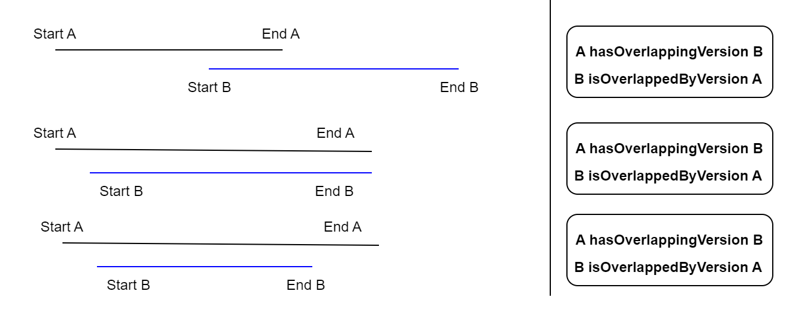
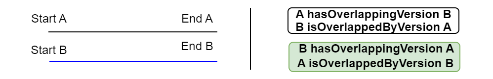

# Process to create the KG : use case of plots

## 1. Identity-based landmark versions rooting
* Create a relation between a root landmark and all the others landmarks that seem to be versions of this root landmark.
* In the case of plots :
    * Root landmarks are the plots vectorized from the cadastral index map.
    * Others versions of landmarks are all the resources built from each table line of the mutation registers (one line = 1 plot version)
    * The relation between root landmarks and their landmark versions is created using the cadastral number plots. These numbers (=IDs) are not unique  : plots keep the same number in case or split in 2..n plots or merge with others plots.
```sparql
PREFIX addr: <http://rdf.geohistoricaldata.org/def/address#>
PREFIX cad_ltype: <http://rdf.geohistoricaldata.org/id/codes/cadastre/landmarkType/>
PREFIX cad_atype: <http://rdf.geohistoricaldata.org/id/codes/cadastre/attributeType/>
PREFIX dcterms: <http://purl.org/dc/terms/>

INSERT {GRAPH <http://rdf.geohistoricaldata.org/landmarksaggregations>{
    ?landmarkversion addr:hasRootLandmark ?rootLandmark.
    ?rootLandmark addr:isRootLandmarkOf ?landmarkversion.}}
WHERE {
        GRAPH <http://rdf.geohistoricaldata.org/rootlandmarks> {
           ?rootLandmark a addr:Landmark ; addr:isLandmarkType cad_ltype:Plot.}
        GRAPH <http://rdf.geohistoricaldata.org/landmarksversions> {
        ?landmarkversion a addr:Landmark ; addr:isLandmarkType cad_ltype:Plot.}
        
        ####### Pseudo-identity constraint (ex: plots)
        ?rootLandmark dcterms:identifier ?plotidm.
        ?landmarkversion dcterms:identifier ?plotidr.
        BIND(
        IF(STRENDS(STR(?plotidr), "p"), 
                SUBSTR(STR(?plotidr), 1, STRLEN(STR(?plotidr)) - 1), 
                ?plotidr
              ) AS ?plotid
            )
        FILTER(?plotidm = ?plotid)
}
```
## 2. Inferring temporal order of landmark versions

### 2.1 Compute the temporal gap between two versions of a landmark
* This step aims to compute temporal gaps between two versions of landmarks that have the same root landmark.
* It's an intermediate step to build a temporal relations between versions of landmarks.
* We keep only the positive or null gaps that will be usefull to compute *hasPreviousVersion/hasNextVersion* relations.
```sparql
PREFIX addr: <http://rdf.geohistoricaldata.org/def/address#>
PREFIX xsd: <http://www.w3.org/2001/XMLSchema#>
PREFIX ofn: <http://www.ontotext.com/sparql/functions/>

#Compute gaps between versions of landmarks (with the same root) and keep only positive or nul geps.
#CONSTRUCT{?rootLandmark addr:hasTimeGap [ addr:hasValue ?gap; addr:isFirstRL ?landmarkversion; addr:isSecondRL ?landmarkversion2]}

INSERT { GRAPH <http://rdf.geohistoricaldata.org/tmp>{
    ?rootLandmark addr:hasTimeGap [ addr:hasValue ?gap; 
    addr:isFirstRL ?landmarkversion; 
    addr:isSecondRL ?landmarkversion2]}}
WHERE { 
    ?rootLandmark addr:isRootLandmarkOf ?landmarkversion.
    ?rootLandmark addr:isRootLandmarkOf ?landmarkversion2.
    ?landmarkversion addr:hasTime/addr:hasEnd/addr:timeStamp ?end.
    ?landmarkversion2 addr:hasTime/addr:hasBeginning/addr:timeStamp ?start2 .
	BIND(ofn:asDays(?start2 - ?end) as ?gap).
	FILTER ((?gap >= 0) && !(sameTerm(?landmarkversion,?landmarkversion2)))
}
```
This step aims to build the temporal relations between versions of plots.

### 2.2 Create *hasPreviousVersion* and *hasNextVersion* in case of null or positive gap
* For each plot, we search for the minimal positive or null gap that is linked to it.
* We create *hasPreviousVersion*/*hasNextVersion* between this landmark and the ones that have a gap equal to the minimal gap.


```sparql
PREFIX addr: <http://rdf.geohistoricaldata.org/def/address#>

# Create hasPreviousVersion and hasNextVersion relations when positive or nul temporal gap between versions
#CONSTRUCT {?landmarkversion addr:hasNextVersion ?landmarkversion2. ?landmarkversion2 addr:hasPreviousVersion ?landmarkversion.}

INSERT { GRAPH <http://rdf.geohistoricaldata.org/order>{
        ?landmarkversion addr:hasNextVersion ?landmarkversion2.
        ?landmarkversion2 addr:hasPreviousVersion ?landmarkversion.}}
WHERE {
    #Get landmarks that have a gap equal to minimal gap
	GRAPH <http://rdf.geohistoricaldata.org/tmp> {
        ?rootLandmark addr:hasTimeGap ?gap.
    	?gap addr:hasValue ?ecart.
        ?gap addr:isFirstRL ?landmarkversion.
        ?gap addr:isSecondRL ?landmarkversion2
    FILTER (?ecart = ?minecart && !sameTerm(?landmarkversion, ?landmarkversion2))}
    
    # Search for minimal gap of each plot
    {SELECT ?landmarkversion (MIN(?ecart2) AS ?minecart)
	WHERE {GRAPH <http://rdf.geohistoricaldata.org/tmp> {
    	?rootLandmark addr:hasTimeGap ?gap2.
    	?gap2 addr:hasValue ?ecart2.
        ?gap2 addr:isFirstRL ?landmarkversion.
        } 
	}
	GROUP BY ?landmarkversion
    ORDER BY ?minecart}
    # End
}
```
* Then, we can delete the *http://rdf.geohistoricaldata.org/tmp* (it will not be use anymore).

### 2.3 Create *hasOverlappingVersion* and *isOverlappedByVersion* in case of negative gap
In case when landmarks versions are overlapping each others (B starts before the end of A), we create *hasOverlappingVersion* and *isOverlappedByVersion* properties.
* *hasOverlappingVersion* means that version **A** starts before **B** 
    * in the special case of two versions starting at the same time, it's the version that ends first that *hasOverlappingVersion*

#### 2.3.1 Case when A starts before B


```sparql
PREFIX addr: <http://rdf.geohistoricaldata.org/def/address#>
PREFIX xsd: <http://www.w3.org/2001/XMLSchema#>
PREFIX ofn: <http://www.ontotext.com/sparql/functions/>

# CONSTRUCT{?landmarkversion addr:hasOverlappingVersion ?landmarkversion2. ?landmarkversion2 addr:isOverlappedByVersion ?landmarkversion.}

INSERT{ GRAPH <http://rdf.geohistoricaldata.org/order>{
    ?landmarkversion addr:hasOverlappingVersion ?landmarkversion2. 
    ?landmarkversion2 addr:isOverlappedByVersion ?landmarkversion.}}
WHERE { GRAPH <http://rdf.geohistoricaldata.org/landmarksaggregations> 
    {?rootLandmark addr:isRootLandmarkOf ?landmarkversion.
    ?rootLandmark addr:isRootLandmarkOf ?landmarkversion2.}
    ?landmarkversion addr:hasTime/addr:hasEnd/addr:timeStamp ?end.
    ?landmarkversion addr:hasTime/addr:hasBeginning/addr:timeStamp ?start.
    ?landmarkversion2 addr:hasTime/addr:hasBeginning/addr:timeStamp ?start2 .
    
    BIND(ofn:asDays(?start2 - ?end) as ?ecart).
    BIND(ofn:asDays(?start2 - ?start) as ?ecartDeb).
    FILTER ((?ecart < 0) && (?ecartDeb > 0) && !(sameTerm(?landmarkversion,?landmarkversion2)))
}
```
#### 2.3.2 Case when A and B start at the same time


```sparql
PREFIX addr: <http://rdf.geohistoricaldata.org/def/address#>
PREFIX xsd: <http://www.w3.org/2001/XMLSchema#>
PREFIX ofn: <http://www.ontotext.com/sparql/functions/>

#CONSTRUCT{?landmarkversion addr:isOverlappedByVersion ?landmarkversion2. ?landmarkversion2 addr:hasOverlappingVersion ?landmarkversion.}

INSERT{ GRAPH <http://rdf.geohistoricaldata.org/order>{
    ?landmarkversion addr:isOverlappedByVersion ?landmarkversion2. 
    ?landmarkversion2 addr:hasOverlappingVersion ?landmarkversion.}}
WHERE {
    GRAPH <http://rdf.geohistoricaldata.org/landmarksaggregations> 
    {?rootLandmark addr:isRootLandmarkOf ?landmarkversion.
    ?rootLandmark addr:isRootLandmarkOf ?landmarkversion2.}
    ?landmarkversion addr:hasTime/addr:hasEnd/addr:timeStamp ?end.
    ?landmarkversion addr:hasTime/addr:hasBeginning/addr:timeStamp ?start.
    ?landmarkversion2 addr:hasTime/addr:hasBeginning/addr:timeStamp ?start2 .
    ?landmarkversion2 addr:hasTime/addr:hasEnd/addr:timeStamp ?end2.
    BIND(ofn:asDays(?start2 - ?end) as ?ecart).
    BIND(ofn:asDays(?start2 - ?start) as ?ecartDeb).
    BIND(ofn:asDays(?end2 - ?end) as ?ecartFin).
    FILTER ((?ecart < 0) && (?ecartDeb = 0) && (?ecartFin < 0) && !(sameTerm(?landmarkversion,?landmarkversion2)))
}
```


```sparql
PREFIX addr: <http://rdf.geohistoricaldata.org/def/address#>
PREFIX xsd: <http://www.w3.org/2001/XMLSchema#>
PREFIX ofn: <http://www.ontotext.com/sparql/functions/>

#CONSTRUCT{?landmarkversion addr:hasOverlappingVersion ?landmarkversion2. ?landmarkversion2 addr:isOverlappedByVersion  ?landmarkversion.}

INSERT { GRAPH <http://rdf.geohistoricaldata.org/order>{
    ?landmarkversion addr:hasOverlappingVersion ?landmarkversion2. 
    ?landmarkversion2 addr:isOverlappedByVersion  ?landmarkversion.}}
WHERE {
    GRAPH <http://rdf.geohistoricaldata.org/landmarksaggregations>  
    {?rootLandmark addr:isRootLandmarkOf ?landmarkversion.
    ?rootLandmark addr:isRootLandmarkOf ?landmarkversion2.}
    ?landmarkversion addr:hasTime/addr:hasEnd/addr:timeStamp ?end.
    ?landmarkversion addr:hasTime/addr:hasBeginning/addr:timeStamp ?start.
    ?landmarkversion2 addr:hasTime/addr:hasBeginning/addr:timeStamp ?start2 .
    ?landmarkversion2 addr:hasTime/addr:hasEnd/addr:timeStamp ?end2.
    BIND(ofn:asDays(?start2 - ?end) as ?ecart).
    BIND(ofn:asDays(?start2 - ?start) as ?ecartDeb).
    BIND(ofn:asDays(?end2 - ?end) as ?ecartFin).
    FILTER ((?ecart < 0) && (?ecartDeb = 0) && (?ecartFin > 0) && !(sameTerm(?landmarkversion,?landmarkversion2)))
}
```
#### 2.2.3 Case when A and B are equals



```sparql
PREFIX addr: <http://rdf.geohistoricaldata.org/def/address#>
PREFIX xsd: <http://www.w3.org/2001/XMLSchema#>
PREFIX ofn: <http://www.ontotext.com/sparql/functions/>

#CONSTRUCT{?landmarkversion addr:hasOverlappingVersion ?landmarkversion2. ?landmarkversion2 addr:isOverlappedByVersion ?landmarkversion.}

INSERT { GRAPH <http://rdf.geohistoricaldata.org/order>{
    ?landmarkversion addr:hasOverlappingVersion ?landmarkversion2. 
    ?landmarkversion2 addr:isOverlappedByVersion  ?landmarkversion.
    ?landmarkversion2 addr:hasOverlappingVersion ?landmarkversion. 
    ?landmarkversion addr:isOverlappedByVersion  ?landmarkversion2.}}
WHERE {
    GRAPH <http://rdf.geohistoricaldata.org/landmarksaggregations>  
    {?rootLandmark addr:isRootLandmarkOf ?landmarkversion.
    ?rootLandmark addr:isRootLandmarkOf ?landmarkversion2.}
    ?landmarkversion addr:hasTime/addr:hasEnd/addr:timeStamp ?end.
    ?landmarkversion addr:hasTime/addr:hasBeginning/addr:timeStamp ?start.
    ?landmarkversion2 addr:hasTime/addr:hasBeginning/addr:timeStamp ?start2 .
    ?landmarkversion2 addr:hasTime/addr:hasEnd/addr:timeStamp ?end2.
    BIND(ofn:asDays(?start2 - ?start) as ?ecartDeb).
    BIND(ofn:asDays(?end2 - ?end) as ?ecartFin).
    FILTER ((?ecartDeb = 0) && (?ecartFin = 0) && !(sameTerm(?landmarkversion,?landmarkversion2)))
}
```
## 3. Inferring changes and events related to landmarks (#1)
### 3.1 Create changes and events relative to landmarks identity
In the mutation registers, plots ID never change even in case of split or merge of plots. These events lead to the appearance of new landmarks and the disappearance of the previous ones.

In this part, we try to detect the changes and events about Splits.

*NB : Merge will be treated later because all the necessary informations to detect them have not been created yet.*

#### 3.1.1 Create Landmark Disappearance Changes and Split Events
To detect splits events, we choose to use the page reports that are used to link the property accounts changes in the mutation registers tables. 

More than one page number in a column *Next property account* means, in most of cases, that the plot has been split between multiple taxpayers. 

* Creation of an Event of type *Split*
* Creation of a Change of type *Landmark Disappearance*

```sparql
PREFIX addr: <http://rdf.geohistoricaldata.org/def/address#>
PREFIX cad_ltype: <http://rdf.geohistoricaldata.org/id/codes/cadastre/landmarkType/>
PREFIX cad_atype: <http://rdf.geohistoricaldata.org/id/codes/cadastre/attributeType/>
PREFIX cad: <http://rdf.geohistoricaldata.org/def/cadastre#>
PREFIX srctype: <http://rdf.geohistoricaldata.org/id/codes/cadastre/sourceType/>
PREFIX dcterms: <http://purl.org/dc/terms/>
PREFIX cad_etype: <http://rdf.geohistoricaldata.org/id/codes/cadastre/eventType/>
PREFIX ctype: <http://rdf.geohistoricaldata.org/id/codes/address/changeType/>
PREFIX time: <http://www.w3.org/2006/time#>

INSERT { GRAPH <http://rdf.geohistoricaldata.org/changes_events> {
    ?event a addr:Event.
    ?event cad:isEventType cad_etype:Split.
    ?change a addr:Change.
    ?change addr:isChangeType ctype:LandmarkDisappearance.
    ?change addr:dependsOn ?event.
    ?event addr:hasTime [a addr:TimeInstant ;
           addr:timeCalendar time:Gregorian ;
    	   addr:timePrecision time:Year ;
           addr:timeStamp ?end
    ].
    ?change addr:appliedTo ?landmarkversion.
    ?landmarkversion addr:changedBy ?change.
    }
}
WHERE{
    SELECT ?landmarkversion ?end (IRI(CONCAT("http://rdf.geohistoricaldata.org/id/event/", STRUUID())) AS ?event) (IRI(CONCAT("http://rdf.geohistoricaldata.org/id/change/",STRUUID())) AS ?change) 
    WHERE {
        {?landmarkversion a addr:Landmark.
        ?landmarkversion addr:isLandmarkType cad_ltype:Plot. 
        ?landmarkversion addr:hasTime/addr:hasEnd/addr:timeStamp ?end.
        ?landmarkversion addr:hasAttribute ?attrMention.
        ?attrMention addr:isAttributeType cad_atype:PlotMention.
        ?attrMention addr:hasAttributeVersion/cad:passedTo ?portea.
        ?portea cad:isSourceType srctype:FolioNonBati.}
    }
    GROUP BY ?landmarkversion ?end
    HAVING(count(?portea) > 1)
}
```
#### 3.1.2 Create LandmarkAppearance Changes linked to Split Events using "Tiré de" = ResteSV
Now, we want to retrieve the first landmark version that follow a disappearance to create Landmark Appearance change.

* Creation of a Change of type *Landmark Appearance* linked to the previously create events.

```sparql
PREFIX addr: <http://rdf.geohistoricaldata.org/def/address#>
PREFIX cad_ltype: <http://rdf.geohistoricaldata.org/id/codes/cadastre/landmarkType/>
PREFIX dcterms: <http://purl.org/dc/terms/>
PREFIX cad_atype: <http://rdf.geohistoricaldata.org/id/codes/cadastre/attributeType/>
PREFIX cad: <http://rdf.geohistoricaldata.org/def/cadastre#>
PREFIX srctype: <http://rdf.geohistoricaldata.org/id/codes/cadastre/sourceType/>
PREFIX rico: <https://www.ica.org/standards/RiC/ontology#>
PREFIX cad_spval: <http://rdf.geohistoricaldata.org/id/codes/cadastre/specialCellValue/>
PREFIX ofn: <http://www.ontotext.com/sparql/functions/>
PREFIX ctype: <http://rdf.geohistoricaldata.org/id/codes/address/changeType/>

#CONSTRUCT {?change2 a addr:Change. ?change2 addr:isChangeType ctype:LandmarkAppearance. ?change2 addr:dependsOn ?event. ?nextLandmark addr:changedBy ?change2. ?change2 addr:appliedTo ?nextLandmark.}

INSERT { GRAPH <http://rdf.geohistoricaldata.org/changes_events>{
    ?change2 a addr:Change. 
    ?change2 addr:isChangeType ctype:LandmarkAppearance. 
    ?change2 addr:dependsOn ?event. 
    ?nextLandmark addr:changedBy ?change2. 
    ?change2 addr:appliedTo ?nextLandmark.}
}
WHERE {
	SELECT ?nextLandmark ?event (IRI(CONCAT("http://rdf.geohistoricaldata.org/id/change/",STRUUID())) AS ?change2)
	WHERE { 
    	?landmarkversion addr:hasRootLandmark ?rootLandmark.
    	?nextLandmark addr:hasRootLandmark ?rootLandmark.
    	?landmarkversion (addr:hasNextVersion|addr:hasOverlappingVersion) ?nextLandmark.
    
		?landmarkversion a addr:Landmark; addr:isLandmarkType cad_ltype:Plot .
    	?landmarkversion addr:hasTime/addr:hasEnd/addr:timeStamp ?sortie.
    	?landmarkversion addr:hasAttribute ?attrMention.
        ?attrMention addr:hasAttributeVersion/cad:passedTo ?j1.
        
    	?landmarkversion addr:changedBy ?disChange.
    	?disChange addr:isChangeType ctype:LandmarkDisappearance.
    	?disChange addr:dependsOn ?event.
        
    	?nextLandmark a addr:Landmark; addr:isLandmarkType cad_ltype:Plot .
   	 	?nextLandmark addr:hasTime/addr:hasBeginning/addr:timeStamp ?entree2.
    	?nextLandmark addr:hasAttribute ?attrMention2.
    	?attrMention2 addr:isAttributeType cad_atype:PlotMention.
        ?attrMention2 addr:hasAttributeVersion/cad:isMentionnedIn/rico:isOrWasConstituentOf+ ?j1.
    	?j1 cad:isSourceType srctype:FolioNonBati.

    	?attrMention2 addr:hasAttributeVersion/cad:takenFrom ?tirede2.
    	{?tirede2 cad:isSourceType srctype:FolioNonBati} UNION {FILTER(?tirede2 IN(cad_spval:ResteSV))}

    	FILTER(!sameTerm(?landmarkversion, ?nextLandmark))
    	FILTER(YEAR(?sortie) = YEAR(?entree2))
	}
}
```

## 4. Inferring landmarks identity
Aggregate landmarks versions that seems to be the same real-world object.

### 4.1 Create changes and events relative to property account changes
Now, we want to search for the events related to a plot transfert to one property account to another one without split event. 

*NB : In further steps, we will qualify in further details those changes that also might be a taxpayer change.*

#### 4.1.1 Create FolioMutation event
* Create *AttributeVersionDisappearance* Change
* Create a *FolioMutation* Event

```sparql
PREFIX addr: <http://rdf.geohistoricaldata.org/def/address#>
PREFIX ctype: <http://rdf.geohistoricaldata.org/id/codes/address/changeType/>
PREFIX cad: <http://rdf.geohistoricaldata.org/def/cadastre#>
PREFIX cad_etype: <http://rdf.geohistoricaldata.org/id/codes/cadastre/eventType/>
PREFIX time: <http://www.w3.org/2006/time#>
PREFIX rico: <https://www.ica.org/standards/RiC/ontology#>
PREFIX srctype: <http://rdf.geohistoricaldata.org/id/codes/cadastre/sourceType/>
PREFIX cad_ltype: <http://rdf.geohistoricaldata.org/id/codes/cadastre/landmarkType/>
PREFIX cad_atype: <http://rdf.geohistoricaldata.org/id/codes/cadastre/attributeType/>

INSERT { GRAPH <http://rdf.geohistoricaldata.org/changes_events>{
    ?change a addr:Change.
    ?change addr:isChangeType ctype:AttributeVersionDisappearance.
    ?event a addr:Event.
    ?event cad:isEventType cad_etype:FolioMutation.
    ?event addr:hasTime[addr:timePrecision time:Year; addr:timeCalendar time:Gregorian; addr:timeStamp ?end].
    ?att addr:changedBy ?change.
    ?change addr:appliedTo ?att.
    ?change addr:dependsOn ?event.
    ?event addr:hasChange ?change.
    }}
WHERE{
    SELECT ?plot ?att ?attV ?end (IRI(CONCAT("http://rdf.geohistoricaldata.org/id/event/", STRUUID())) AS ?event) (IRI(CONCAT("http://rdf.geohistoricaldata.org/id/change/",STRUUID())) AS ?change)
WHERE {
    ?plot addr:hasTime/addr:hasEnd/addr:timeStamp ?end.
    ?plot addr:hasAttribute ?att.
    ?att addr:hasAttributeVersion ?attV.
    ?attV cad:isMentionnedIn/rico:isOrWasConstituentOf+ ?folio.
    ?folio cad:isSourceType srctype:FolioNonBati.
    ?attV cad:passedTo ?next.
    ?next cad:isSourceType srctype:FolioNonBati.
    FILTER(!sameTerm(?folio,?next))
    
        {SELECT ?plot (count(distinct ?nextFolio) AS ?nextFoliosCount)
    	WHERE {?plot a addr:Landmark; addr:isLandmarkType cad_ltype:Plot.
        	?plot addr:hasAttribute [addr:isAttributeType cad_atype:PlotMention;
                 addr:hasAttributeVersion/cad:passedTo ?nextFolio].
        	?nextFolio cad:isSourceType srctype:FolioNonBati.}
    	GROUP BY ?plot 
    	HAVING(?nextFoliosCount = 1)
		}
	}
}
```
### 4.1.2 Create AttributeVersionAppearance change linked to a FolioMutation event
* Create an *AttributeVersionAppearance* Change connected to an already created *FolioMutation* Event.

```sparql
PREFIX addr: <http://rdf.geohistoricaldata.org/def/address#>
PREFIX ctype: <http://rdf.geohistoricaldata.org/id/codes/address/changeType/>
PREFIX cad_ltype: <http://rdf.geohistoricaldata.org/id/codes/cadastre/landmarkType/>
PREFIX cad: <http://rdf.geohistoricaldata.org/def/cadastre#>
PREFIX rico: <https://www.ica.org/standards/RiC/ontology#>
PREFIX srctype: <http://rdf.geohistoricaldata.org/id/codes/cadastre/sourceType/>
PREFIX dcterms: <http://purl.org/dc/terms/>
PREFIX cad_atype: <http://rdf.geohistoricaldata.org/id/codes/cadastre/attributeType/>
PREFIX cad_etype: <http://rdf.geohistoricaldata.org/id/codes/cadastre/eventType/>

INSERT { GRAPH <http://rdf.geohistoricaldata.org/changes_events>{
	?change2 a addr:Change.
    ?change2 addr:isChangeType ctype:AttributeVersionAppearance.
    ?change2 addr:dependsOn ?event.
    ?event addr:hasChange ?change.
    ?attNext addr:changedBy ?change2.
    ?change2 addr:appliedTo ?attNext.
}}
WHERE {SELECT DISTINCT ?nextPlot ?attNext ?event (IRI(CONCAT("http://rdf.geohistoricaldata.org/id/change/",STRUUID())) AS ?change2)
	WHERE { 
    {SELECT DISTINCT ?plot ?portea ?folio1 ?end ?change ?event
	WHERE {?plot a addr:Landmark; addr:isLandmarkType cad_ltype:Plot.
           ?plot addr:hasAttribute ?att.
           ?att addr:hasAttributeVersion/cad:isMentionnedIn/rico:isOrWasConstituentOf+ ?folio1.
           ?att addr:hasAttributeVersion/cad:passedTo ?portea.
           ?att addr:isAttributeType cad_atype:PlotMention.
    	   ?att addr:changedBy ?change.
    	   ?change addr:isChangeType ctype:AttributeVersionDisappearance.
           ?change addr:dependsOn ?event.
           ?event cad:isEventType cad_etype:FolioMutation.
           ?folio1 cad:isSourceType srctype:FolioNonBati.
           ?plot addr:hasTime/addr:hasEnd/addr:timeStamp ?end.
        	BIND(YEAR(?end) AS ?endY)}}
    
    {SELECT DISTINCT ?nextPlot ?attNext ?folio ?classementid ?classement ?tirede
     WHERE{
        ?nextPlot a addr:Landmark; addr:isLandmarkType cad_ltype:Plot.
    	?nextPlot addr:hasAttribute ?attNext.
        ?attNext addr:isAttributeType cad_atype:PlotMention.
        ?attNext addr:hasAttributeVersion[cad:takenFrom ?tirede;
    		cad:isMentionnedIn/rico:isOrWasConstituentOf+ ?folio;
    		cad:isMentionnedIn/rico:isOrWasConstituentOf ?cf;
            cad:isMentionnedIn ?classement].
    	?classement dcterms:identifier ?classementid.
    
        FILTER NOT EXISTS {?nextPlot addr:changedBy ?change3.
            ?change3 addr:isChangeType ctype:AttributeVersionAppearance.}     
            }
    	}
    
    ?plot addr:hasRootLandmark ?root.
    ?nextPlot addr:hasRootLandmark ?root.
    
    FILTER(sameTerm(?portea,?folio))
    FILTER(!sameTerm(?plot,?nextPlot))
    FILTER(sameTerm(?folio1,?tirede))
}}
```
### 4.2 Precise relative order of landmarks versions using documents
Using the temporal relations and the events and changes we have created, we precise the relations between landmarks versions using *Previous/Next property account* attributes. 

#### 4.2.1 Add *hasPreviousVersionInSRCOrder* and *hasNextVersionInSRCOrder* using FolioMutation events
* Create links between landmark versions that are before and after an event of type *FolioMutation*.

```sparql
PREFIX addr: <http://rdf.geohistoricaldata.org/def/address#>
PREFIX cad_ltype: <http://rdf.geohistoricaldata.org/id/codes/cadastre/landmarkType/>
PREFIX ctype: <http://rdf.geohistoricaldata.org/id/codes/address/changeType/>
PREFIX cad_atype: <http://rdf.geohistoricaldata.org/id/codes/cadastre/attributeType/>
PREFIX cad_etype: <http://rdf.geohistoricaldata.org/id/codes/cadastre/eventType/>
PREFIX cad: <http://rdf.geohistoricaldata.org/def/cadastre#>

INSERT {GRAPH <http://rdf.geohistoricaldata.org/order>{
    ?plot1 addr:hasNextVersionInSRCOrder ?plot2.
    ?plot2 addr:hasPreviousVersionInSRCOrder ?plot1.
    }}
WHERE { 
	?plot1 a addr:Landmark; addr:isLandmarkType cad_ltype:Plot.
    ?plot1 addr:hasAttribute[addr:isAttributeType cad_atype:PlotMention;addr:changedBy ?change1].
    ?change1 addr:isChangeType ctype:AttributeVersionDisappearance.
    
    ?plot2 a addr:Landmark; addr:isLandmarkType cad_ltype:Plot.
    ?plot2 addr:hasAttribute[addr:isAttributeType cad_atype:PlotMention;addr:changedBy ?change2].
    ?change2 addr:isChangeType ctype:AttributeVersionAppearance.
    
    ?change1 addr:dependsOn ?event.
    ?change2 addr:dependsOn ?event.
    ?event cad:isEventType cad_etype:FolioMutation
} 
```

#### 4.2.2 Order landmark versions with the same rootLandmark in the same Property Account
##### 4.2.2.1 Landmark versions with a temporal relation *hasNextVersion*
* Create *hasPreviousVersionInSRCOrder / hasNextVersionInSRCOrder* : 
    * A *hasNextVersion* B
    * A in the same property account than B
    * In the original table, row of B should be after row of A
```sparql
PREFIX cad: <http://rdf.geohistoricaldata.org/def/cadastre#>
PREFIX rico: <https://www.ica.org/standards/RiC/ontology#>
PREFIX srctype: <http://rdf.geohistoricaldata.org/id/codes/cadastre/sourceType/>
PREFIX addr: <http://rdf.geohistoricaldata.org/def/address#>
PREFIX cad_ltype: <http://rdf.geohistoricaldata.org/id/codes/cadastre/landmarkType/>
PREFIX dcterms: <http://purl.org/dc/terms/>
PREFIX ctype: <http://rdf.geohistoricaldata.org/id/codes/address/changeType/>

INSERT { GRAPH <http://rdf.geohistoricaldata.org/order>{ 
    ?landmarkversion addr:hasNextVersionInSRCOrder ?landmarkversion2. 
    ?landmarkversion2 addr:hasPreviousVersionInSRCOrder ?landmarkversion}}
WHERE {
    SELECT ?landmarkversion ?landmarkversion2
    WHERE { 
        #Same root Landmark
        ?landmarkversion addr:hasRootLandmark ?rootLandmark.
        ?landmarkversion2 addr:hasRootLandmark ?rootLandmark.
        
        ?landmarkversion a addr:Landmark; addr:isLandmarkType cad_ltype:Plot.
        ?landmarkversion addr:hasAttribute [addr:hasAttributeVersion/cad:isMentionnedIn ?classement].
        ?classement dcterms:identifier ?rowid.
        
        ?landmarkversion2 a addr:Landmark; addr:isLandmarkType cad_ltype:Plot.
        ?landmarkversion2 addr:hasAttribute [addr:hasAttributeVersion/cad:isMentionnedIn ?classement2].
        ?classement2 dcterms:identifier ?rowid2.
        
        ?classement rico:isOrWasConstituentOf ?cf.
        ?classement2 rico:isOrWasConstituentOf ?cf.
        
        ?landmarkversion addr:hasNextVersion ?landmarkversion2.
        
        FILTER NOT EXISTS {
            ?landmarkversion2 addr:changedBy ?change .
            ?change addr:isChangeType ctype:LandmarkAppearance .
        }
    BIND((?rowid2 - ?rowid) AS ?rowDistance)
    FILTER(!sameTerm(?landmarkversion,?landmarkversion2) && ?rowDistance > 0)
}
}
```
##### 4.2.2.2 Landmark versions with a temporal relation *hasOverlappingVersion*
* Create *hasOverlappingVersionInSRCOrder / isOverlappedByVersionInSRCOrder* : 
    * A *hasOverlappingVersion* B
    * A in the same property account than B
    * In the original table, row of B should be after row of A
```sparql
PREFIX cad: <http://rdf.geohistoricaldata.org/def/cadastre#>
PREFIX rico: <https://www.ica.org/standards/RiC/ontology#>
PREFIX srctype: <http://rdf.geohistoricaldata.org/id/codes/cadastre/sourceType/>
PREFIX addr: <http://rdf.geohistoricaldata.org/def/address#>
PREFIX cad_ltype: <http://rdf.geohistoricaldata.org/id/codes/cadastre/landmarkType/>
PREFIX dcterms: <http://purl.org/dc/terms/>
PREFIX ctype: <http://rdf.geohistoricaldata.org/id/codes/address/changeType/>

INSERT {GRAPH <http://rdf.geohistoricaldata.org/order>{?landmarkversion addr:hasOverlappingVersionInSRCOrder ?landmarkversion2. ?landmarkversion2 addr:isOverlappedByVersionInSRCOrder ?landmarkversion.}}
WHERE {
	SELECT ?landmarkversion ?landmarkversion2 
    WHERE { 
    ?landmarkversion addr:hasRootLandmark ?rootLandmark.
    ?landmarkversion2 addr:hasRootLandmark ?rootLandmark.
    
	?landmarkversion a addr:Landmark; addr:isLandmarkType cad_ltype:Plot.
    ?landmarkversion addr:hasAttribute [addr:hasAttributeVersion/cad:isMentionnedIn ?classement].
    ?classement dcterms:identifier ?rowid.
    
    ?landmarkversion2 a addr:Landmark; addr:isLandmarkType cad_ltype:Plot.
    ?landmarkversion2 addr:hasAttribute [addr:hasAttributeVersion/cad:isMentionnedIn ?classement2].
    ?classement2 dcterms:identifier ?rowid2.
    
    #In the same CF
    ?classement rico:isOrWasConstituentOf ?cf.
    ?classement2 rico:isOrWasConstituentOf ?cf.
    
    ?landmarkversion addr:hasOverlappingVersion ?landmarkversion2.
    ?landmarkversion2 addr:isOverlappedByVersion ?landmarkversion.
    
    FILTER NOT EXISTS {
    	?landmarkversion2 addr:changedBy ?change .
    	?change addr:isChangeType ctype:LandmarkAppearance .
    }
    BIND((?rowid2 - ?rowid) AS ?rowDistance)
    FILTER(!sameTerm(?landmarkversion,?landmarkversion2) && ?rowDistance > 0)
}}
```

### 4.3. Create aggregation landmarks with landmarks versions that share the same identity
* We create links between landmarks versions that seems be the same object.

*NB1 : Merge events have not been treated for the moment*

#### 4.3.1 Links between landmark versions of plots created after the cadastre creation
First, we create the links between landmark version of plots created after the creation of the first matrice.
```sparql
PREFIX addr: <http://rdf.geohistoricaldata.org/def/address#>
PREFIX cad_ltype: <http://rdf.geohistoricaldata.org/id/codes/cadastre/landmarkType/>
PREFIX ctype: <http://rdf.geohistoricaldata.org/id/codes/address/changeType/>

INSERT { GRAPH <http://rdf.geohistoricaldata.org/tmp/siblings>{
    ?plot addr:isSiblingOf ?landmarkversion.
    ?landmarkversion addr:isSiblingOf ?plot.}
} WHERE { 
	?plot a addr:Landmark; addr:isLandmarkType cad_ltype:Plot.
    ?plot addr:changedBy ?change.
    ?change addr:isChangeType ctype:LandmarkAppearance.
    
    ?landmarkversion a addr:Landmark; addr:isLandmarkType cad_ltype:Plot.
    FILTER NOT EXISTS {
    	?landmarkversion addr:changedBy ?change2 .
    	?change2 addr:isChangeType ctype:LandmarkAppearance .
    }
    ?plot (addr:hasNextVersionInSRCOrder|addr:hasOverlappingVersionInSRCOrder)+ ?landmarkversion.
} 
```
#### 4.3.2 Links between landmark versions that seems to share the same identity
```sparql
PREFIX addr: <http://rdf.geohistoricaldata.org/def/address#>
PREFIX cad_ltype: <http://rdf.geohistoricaldata.org/id/codes/cadastre/landmarkType/>
PREFIX ctype: <http://rdf.geohistoricaldata.org/id/codes/address/changeType/>
PREFIX cad: <http://rdf.geohistoricaldata.org/def/cadastre#>
PREFIX rico: <https://www.ica.org/standards/RiC/ontology#>
PREFIX source: <http://rdf.geohistoricaldata.org/id/source/>

INSERT { GRAPH <http://rdf.geohistoricaldata.org/tmp/siblings>{
       ?plot addr:isSiblingOf ?landmarkversion.
       ?landmarkversion addr:isSiblingOf ?plot.}}
WHERE { 
    ?plot addr:hasRootLandmark ?rootLandmark.
    ?landmarkversion addr:hasRootLandmark ?rootLandmark.
	?plot a addr:Landmark; addr:isLandmarkType cad_ltype:Plot.
    ?landmarkversion a addr:Landmark; addr:isLandmarkType cad_ltype:Plot.
    ?plot (addr:hasNextVersionInSRCOrder|addr:hasOverlappingVersionInSRCOrder)+ ?landmarkversion.
    ?plot addr:hasAttribute[addr:hasAttributeVersion/cad:isMentionnedIn/rico:isOrWasConstituentOf+/rico:isOrWasIncludedIn ?matrice].
    ?landmarkversion addr:hasAttribute[addr:hasAttributeVersion/cad:isMentionnedIn/rico:isOrWasConstituentOf+/rico:isOrWasIncludedIn ?matrice].
    FILTER NOT EXISTS {
		?plot (addr:hasPreviousVersionInSRCOrder|addr:isOverlappedByVersionInSRCOrder)+ ?other.
    	?plot addr:changedBy ?change2 .
    	?change2 addr:isChangeType ctype:LandmarkAppearance.
        ?landmarkversion addr:changedBy ?change3.
        ?change3 addr:isChangeType ctype:LandmarkAppearance.
    }
    FILTER(sameTerm(?matrice,source:94_Gentilly_MAT_B_NB_1813)||sameTerm(?matrice,source:94_Gentilly_MAT_NB_1848))
    FILTER(!sameTerm(?plot,?landmarkversion))
}
```

```sparql
PREFIX addr: <http://rdf.geohistoricaldata.org/def/address#>
PREFIX cad_ltype: <http://rdf.geohistoricaldata.org/id/codes/cadastre/landmarkType/>
PREFIX ctype: <http://rdf.geohistoricaldata.org/id/codes/address/changeType/>
PREFIX cad: <http://rdf.geohistoricaldata.org/def/cadastre#>
PREFIX rico: <https://www.ica.org/standards/RiC/ontology#>
PREFIX cad_spval: <http://rdf.geohistoricaldata.org/id/codes/cadastre/specialCellValue/>

INSERT { GRAPH <http://rdf.geohistoricaldata.org/tmp/siblings>{
    ?plot addr:isSiblingOf ?landmarkversion.
    ?landmarkversion addr:isSiblingOf ?plot.}
} WHERE { 
	?plot a addr:Landmark; addr:isLandmarkType cad_ltype:Plot.
    ?plot addr:hasAttribute[addr:hasAttributeVersion/cad:isMentionnedIn/rico:isOrWasConstituentOf ?cf].
    ?plot addr:hasAttribute[addr:hasAttributeVersion/cad:takenFrom cad_spval:CelluleVideSV].
    ?plot addr:hasTime/addr:hasBeginning/addr:timeStamp ?start1.
    ?landmarkversion a addr:Landmark; addr:isLandmarkType cad_ltype:Plot.
    ?landmarkversion addr:hasAttribute[addr:hasAttributeVersion/cad:isMentionnedIn/rico:isOrWasConstituentOf ?cf].
    ?landmarkversion addr:hasTime/addr:hasBeginning/addr:timeStamp ?start2.
    FILTER NOT EXISTS {
        ?plot addr:changedBy ?change.
        ?change addr:isChangeType ctype:LandmarkAppearance.
    	?landmarkversion addr:changedBy ?change2 .
    	?change2 addr:isChangeType ctype:LandmarkAppearance .
    }
    ?plot addr:isOverlappedByVersion ?landmarkversion.
    FILTER(YEAR(?start1) = YEAR(?start2))
} 
```
#### 4.3.3 Delete ambiguous sibling relations
* Delete sibling relations when one landmark version have two plot IDs (meaning that it result from a merge of two other plots or parts of thoose plots)

```
PREFIX addr: <http://rdf.geohistoricaldata.org/def/address#>
PREFIX cad_ltype: <http://rdf.geohistoricaldata.org/id/codes/cadastre/landmarkType/>
PREFIX dcterms: <http://purl.org/dc/terms/>

DELETE {
    ?s addr:isSiblingOf ?t.
    ?t addr:isSiblingOf ?s
}
WHERE {
    ?s addr:isSiblingOf ?t
    {SELECT ?s 
    WHERE { 
        ?s a addr:Landmark; addr:isLandmarkType cad_ltype:Plot.
        ?s dcterms:identifier ?ids.}
        GROUP BY ?s
    HAVING (count(?ids) > 1)}

    {SELECT ?t
    WHERE { 
        ?t a addr:Landmark; addr:isLandmarkType cad_ltype:Plot.
        ?t dcterms:identifier ?idt.}
        GROUP BY ?t
    HAVING (count(?idt) = 1)}
}
```

### 4.4 Links between property accounts and landmarks versions that are discribed in several mutation registers

#### 4.4.1 Create links between property accounts from several mutation registers when they have the same taxpayer
* Create link if taxpayers have a similarity link
* *NB : We could had more constraints in future tests.*
```sparql
PREFIX skos: <http://www.w3.org/2004/02/skos/core#>
PREFIX cad: <http://rdf.geohistoricaldata.org/def/cadastre#>
PREFIX addr: <http://rdf.geohistoricaldata.org/def/address#>
PREFIX rico: <https://www.ica.org/standards/RiC/ontology#>
PREFIX source: <http://rdf.geohistoricaldata.org/id/source/>

INSERT{GRAPH <http://rdf.geohistoricaldata.org/cfmatching>{
    ?cf skos:exactMatch ?cf2.
    ?cf2 skos:exactMatch ?cf.}}
WHERE { 
	?taxpayer a cad:Taxpayer.
    ?taxpayer cad:taxpayerLabel ?label.
    ?taxpayer cad:isTaxpayerOf ?attrV.
    ?attrV addr:isAttributeVersionOf/addr:isAttributeOf ?mutation.
    ?mutation rico:isOrWasConstituentOf ?cf.
    ?mutation rico:isOrWasConstituentOf+/rico:isOrWasIncludedIn ?matrice.
    FILTER(?matrice = source:94_Gentilly_MAT_B_NB_1813)
    
    ?taxpayer2 a cad:Taxpayer.
    ?taxpayer2 cad:taxpayerLabel ?label2.
    ?taxpayer2 cad:isTaxpayerOf ?attrV2.
    ?attrV2 addr:isAttributeVersionOf/addr:isAttributeOf ?mutation2.
    ?mutation2 rico:isOrWasConstituentOf ?cf2.
    ?mutation2 rico:isOrWasConstituentOf+/rico:isOrWasIncludedIn ?matrice2.
    FILTER(?matrice2 = source:94_Gentilly_MAT_NB_1836)
    
    ?taxpayer skos:exactMatch ?taxpayer2
}
```
#### 4.4.2 Create links between landmarks versions from several mutation registers
```sparql
PREFIX addr: <http://rdf.geohistoricaldata.org/def/address#>
PREFIX cad_ltype: <http://rdf.geohistoricaldata.org/id/codes/cadastre/landmarkType/>
PREFIX cad: <http://rdf.geohistoricaldata.org/def/cadastre#>
PREFIX cad_spval: <http://rdf.geohistoricaldata.org/id/codes/cadastre/specialCellValue/>
PREFIX rico: <https://www.ica.org/standards/RiC/ontology#>
PREFIX srctype: <http://rdf.geohistoricaldata.org/id/codes/cadastre/sourceType/>
PREFIX ctype: <http://rdf.geohistoricaldata.org/id/codes/address/changeType/>
PREFIX source: <http://rdf.geohistoricaldata.org/id/source/>
PREFIX skos: <http://www.w3.org/2004/02/skos/core#>

INSERT {GRAPH <http://rdf.geohistoricaldata.org/tmp/siblings>{
    ?plot addr:isSiblingOf ?plot2.
    ?plot2 addr:isSiblingOf ?plot.}}
WHERE { 
	?plot a addr:Landmark; addr:isLandmarkType cad_ltype:Plot.
    ?plot addr:hasAttribute/addr:hasAttributeVersion ?attr.
    ?attr cad:passedTo cad_spval:CelluleVideSV.
    ?attr cad:isMentionnedIn/rico:isOrWasConstituentOf+/rico:isOrWasIncludedIn ?matrice.
    ?attr cad:isMentionnedIn/rico:isOrWasConstituentOf+ ?cf.
    ?cf cad:isSourceType srctype:CompteFoncier.
    ?cf rico:hasOrHadConstituent/addr:hasAttribute/addr:hasAttributeVersion/cad:hasTaxpayer ?taxpayer.
    ?taxpayer cad:isTaxpayerOf/addr:isOutdatedBy [addr:isChangeType ctype:AttributeVersionDisappearance].
    FILTER(sameTerm(?matrice,source:94_Gentilly_MAT_B_NB_1813))
    
    ?plot2 a addr:Landmark; addr:isLandmarkType cad_ltype:Plot.
    ?plot2 addr:hasAttribute/addr:hasAttributeVersion ?attr2.
    ?attr2 cad:takenFrom cad_spval:CelluleVideSV.
    ?attr2 cad:isMentionnedIn/rico:isOrWasConstituentOf+/rico:isOrWasIncludedIn ?matrice2.
    ?attr2 cad:isMentionnedIn/rico:isOrWasConstituentOf+ ?cf2.
    ?cf2 cad:isSourceType srctype:CompteFoncier.
    ?cf2 rico:hasOrHadConstituent/addr:hasAttribute/addr:hasAttributeVersion/cad:hasTaxpayer ?taxpayer2.
    ?taxpayer2 cad:isTaxpayerOf/addr:isMadeEffectiveBy [addr:isChangeType ctype:AttributeVersionAppearance].
    
    FILTER(sameTerm(?matrice2,source:94_Gentilly_MAT_NB_1836))
    ?taxpayer skos:exactMatch ?taxpayer2.
    ?plot addr:hasNextVersion ?plot2.
}
```

### 4.5 Create an aggregate landmark for each group of sibling landmarks versions
#### 4.5.1 Create a unique label between landmarks that are siblings
* Landmarks with the same label will be traces of the same landmark aggregation.
* One landmark aggregation have at least one trace.

```sparql
PREFIX addr: <http://rdf.geohistoricaldata.org/def/address#>
PREFIX owl: <http://www.w3.org/2002/07/owl#>
PREFIX cad_ltype: <http://rdf.geohistoricaldata.org/id/codes/cadastre/landmarkType/>
PREFIX skos: <http://www.w3.org/2004/02/skos/core#>
PREFIX jsfn: <http://www.ontotext.com/js#>

# This query identifies groups of sibling landmarks
INSERT { GRAPH <http://rdf.geohistoricaldata.org/tmp/aggregatedlabel> {
    ?landmark addr:hasAggregateLabel ?all
    }}
WHERE {
    BIND(jsfn:sortList(CONCAT(?l,' ',?siblings),'asc',' ') AS ?all)
    {SELECT (STR(GROUP_CONCAT(?sibling)) AS ?siblings) (STR(?landmark) AS ?l) ?landmark
    WHERE {
            ?landmark addr:isSiblingOf ?sibling .
            ?landmark a addr:Landmark; addr:isLandmarkType cad_ltype:Plot.
            ?sibling a addr:Landmark; addr:isLandmarkType cad_ltype:Plot.
    }
    GROUP BY ?landmark
    ORDER BY ?sibling}
}
```
#### 4.5.2 Create a new landmark using siblings that have the same label (and are in the same aggregation)
```sparql
PREFIX addr: <http://rdf.geohistoricaldata.org/def/address#>
PREFIX cad_ltype: <http://rdf.geohistoricaldata.org/id/codes/cadastre/landmarkType/>
PREFIX dcterms: <http://purl.org/dc/terms/>

INSERT {GRAPH <http://rdf.geohistoricaldata.org/landmarksaggregations> 
    {?aggLandmark a addr:Landmark . 
    ?aggLandmark addr:isLandmarkType cad_ltype:Plot.
    ?aggLandmark addr:hasTrace ?landmark .
    ?aggLandmark dcterms:identifier ?id.
    ?landmark addr:isTraceOf ?aggLandmark}} 
WHERE {    
    {        
    SELECT DISTINCT ?siblingLabel 
        WHERE {
            ?landmark addr:hasAggregateLabel ?siblingLabel .}
    }

    BIND(URI(CONCAT('http://rdf.geohistoricaldata.org/id/landmark/AGG_', STRUUID())) AS ?aggLandmark)   
    ?landmark addr:hasAggregateLabel ?siblingLabel .
    ?landmark dcterms:identifier ?id.}
```
#### 4.5.3 Create landmarks for landmarks versions that have no siblings
* One landmark versions = one landmark (aggregation of one landmark version)
```sparql
PREFIX addr: <http://rdf.geohistoricaldata.org/def/address#>
PREFIX cad_ltype: <http://rdf.geohistoricaldata.org/id/codes/cadastre/landmarkType/>
PREFIX dcterms: <http://purl.org/dc/terms/>

INSERT {GRAPH <http://rdf.geohistoricaldata.org/landmarksaggregations> 
    {?aggLandmark a addr:Landmark . 
    ?aggLandmark addr:isLandmarkType cad_ltype:Plot.
    ?aggLandmark dcterms:identifier ?id.
    ?aggLandmark addr:hasTrace ?landmark .
    ?landmark addr:isTraceOf ?aggLandmark .
}} 
WHERE {    
    {        
    SELECT DISTINCT ?landmark
    WHERE {
        GRAPH <http://rdf.geohistoricaldata.org/landmarksversions>{
            ?landmark a addr:Landmark; addr:isLandmarkType cad_ltype:Plot.}
        FILTER NOT EXISTS{?landmark addr:isSiblingOf ?other.}}
    }    
    BIND(URI(CONCAT('http://rdf.geohistoricaldata.org/id/landmark/AGG_', STRUUID())) AS ?aggLandmark)
    ?landmark dcterms:identifier ?id.}
```

### 4.6 Link landmarks versions aggregation with their root landmark
```sparql
PREFIX addr: <http://rdf.geohistoricaldata.org/def/address#>
PREFIX cad_ltype: <http://rdf.geohistoricaldata.org/id/codes/cadastre/landmarkType/>

INSERT { GRAPH <http://rdf.geohistoricaldata.org/landmarksaggregations> {
    ?aggLandmark addr:hasRootLandmark ?root.
    ?root addr:isRootLandmarkOf ?aggLandmark.
    }}
WHERE {
    SELECT distinct ?aggLandmark ?root WHERE {
        GRAPH <http://rdf.geohistoricaldata.org/landmarksaggregations>{
        ?aggLandmark a addr:Landmark; addr:isLandmarkType cad_ltype:Plot .  }
        ?aggLandmark addr:hasTrace ?otherLandmark.
        ?otherLandmark addr:hasRootLandmark ?root . 
    }
    GROUP BY ?aggLandmark ?root}
```

### 4.7 Create landmark relation with cadastral section
```sparql
PREFIX lrtype: <http://rdf.geohistoricaldata.org/id/codes/address/landmarkRelationType/>
PREFIX addr: <http://rdf.geohistoricaldata.org/def/address#>
PREFIX cad_ltype: <http://rdf.geohistoricaldata.org/id/codes/cadastre/landmarkType/>

INSERT {GRAPH <http://rdf.geohistoricaldata.org/landmarksaggregations>{
    ?lrAGG a addr:LandmarkRelation.
    ?lrAGG addr:isLandmarkRelationType lrtype:Within.
    ?lrAGG addr:locatum ?plotAGG.
    ?lrAGG addr:relatum ?relatum
    }}
WHERE {SELECT ?plot ?plotAGG ?relatum (UUID() AS ?lrAGG)
	WHERE {
    graph <http://rdf.geohistoricaldata.org/rootlandmarks> {
        ?plot a addr:Landmark; addr:isLandmarkType cad_ltype:Plot.
		?lr addr:locatum ?plot.
        ?lr addr:relatum ?relatum.}
    graph <http://rdf.geohistoricaldata.org/landmarksaggregations> {
        ?plotAGG a addr:Landmark; addr:isLandmarkType cad_ltype:Plot.	}
	?plot addr:isRootLandmarkOf ?plotAGG
    }}
```
## 5. Inferring attribute versions
### 5.1 Initialised the attributes of the aggregations using the list of attributes of the landmarks versions
```sparql
PREFIX addr: <http://rdf.geohistoricaldata.org/def/address#>
PREFIX cad_ltype: <http://rdf.geohistoricaldata.org/id/codes/cadastre/landmarkType/>

INSERT {GRAPH <http://rdf.geohistoricaldata.org/landmarksaggregations>{ 
    ?aggLandmark addr:hasAttribute [a addr:Attribute ; addr:isAttributeType ?attrType ].  
}} WHERE {{ 
    SELECT DISTINCT ?aggLandmark ?attrType 
    WHERE { GRAPH <http://rdf.geohistoricaldata.org/landmarksaggregations>{ 
        ?aggLandmark a addr:Landmark; addr:isLandmarkType cad_ltype:Plot.}
        ?aggLandmark addr:hasTrace ?landmark .
        ?landmark addr:hasAttribute ?attr .
        ?attr addr:isAttributeType ?attrType .}}
}
```

### 5.2 Nature
* In this step, we want to build aggregated attributes versions that are equals for each landmark aggregation.

#### 5.2.1 Match PlotNature attribute versions that should be aggregated
1. Compare attribute versions (PlotNature) from plots versions that are traces of the same aggregated landmark.
```sparql
PREFIX addr: <http://rdf.geohistoricaldata.org/def/address#>
PREFIX cad_ltype: <http://rdf.geohistoricaldata.org/id/codes/cadastre/landmarkType/>
PREFIX cad_atype: <http://rdf.geohistoricaldata.org/id/codes/cadastre/attributeType/>
PREFIX cad: <http://rdf.geohistoricaldata.org/def/cadastre#>
PREFIX skos: <http://www.w3.org/2004/02/skos/core#>

INSERT {GRAPH <http://rdf.geohistoricaldata.org/tmp/natureattributeversions> {
    ?natV1 ?property ?natV2.
    ?natV2 ?property ?natV1.
    }}
WHERE {
    ?plotAGG addr:hasTrace ?plot1.
    ?plotAGG addr:hasTrace ?plot2.

    ?plot1 addr:hasAttribute ?nat1.
    ?nat1 addr:isAttributeType cad_atype:PlotNature.
    ?nat1 addr:hasAttributeVersion ?natV1.
    ?natV1 cad:hasPlotNature ?natV1value.

    ?plot2 addr:hasAttribute ?nat2.
    ?nat2 addr:isAttributeType cad_atype:PlotNature.
    ?nat2 addr:hasAttributeVersion ?natV2.
    ?natV2 cad:hasPlotNature ?natV2value.

    # Comparison of the nature attributes
    BIND(IF((?natV2value = ?natV1value), addr:sameVersionValueAs, addr:differentVersionValueFrom) AS ?property)
}
```
2. Match PlotNature attribute versions of landmark versions that :
    * have *hasNextVersion / hasOverlappingVersion / isOverlappedByVersion* temporal relation;
    * have the same nature (*cad:hasPlotNature*);
    * are part of the same landmark version aggregation.
```sparql
PREFIX addr: <http://rdf.geohistoricaldata.org/def/address#>
PREFIX cad_ltype: <http://rdf.geohistoricaldata.org/id/codes/cadastre/landmarkType/>
PREFIX cad_atype: <http://rdf.geohistoricaldata.org/id/codes/cadastre/attributeType/>
PREFIX cad: <http://rdf.geohistoricaldata.org/def/cadastre#>
PREFIX skos: <http://www.w3.org/2004/02/skos/core#>
PREFIX cad_spval: <http://rdf.geohistoricaldata.org/id/codes/cadastre/specialCellValue/>

INSERT {GRAPH <http://rdf.geohistoricaldata.org/tmp/natureattributeversions> {
    ?natV1 addr:toBeMergedWith ?natV1.
    ?natV1 addr:toBeMergedWith ?natV2.
    ?natV2 addr:toBeMergedWith ?natV1.
    ?natV2 addr:toBeMergedWith ?natV2.
    }}
WHERE {
    ?plot1 (addr:hasNextVersion|addr:hasOverlappingVersion|addr:isOverlappedByVersion)+ ?plot2.
    ?plotAGG addr:hasTrace ?plot1.
    ?plotAGG addr:hasTrace ?plot2.

    ?plot1 addr:hasAttribute ?nat1.
    ?nat1 addr:isAttributeType cad_atype:PlotNature.
    ?nat1 addr:hasAttributeVersion ?natV1.
    ?natV1 cad:hasPlotNature ?natV1value.

    ?plot2 addr:hasAttribute ?nat2.
    ?nat2 addr:isAttributeType cad_atype:PlotNature.
    ?nat2 addr:hasAttributeVersion ?natV2.
    ?natV2 cad:hasPlotNature ?natV2value.

    # Comparison of the nature attributes
    ?natV1 addr:sameVersionValueAs ?natV2
}
```
3. Match PlotNature attribute version with itself when the landmark version that have no *hasNextVersion / hasOverlappingVersion / isOverlappedByVersion* temporal relation with any other landmark version.
```sparql
PREFIX addr: <http://rdf.geohistoricaldata.org/def/address#>
PREFIX cad_atype: <http://rdf.geohistoricaldata.org/id/codes/cadastre/attributeType/>

INSERT {GRAPH <http://rdf.geohistoricaldata.org/tmp/natureattributeversions> {
        ?natV1 addr:toBeMergedWith ?natV1.}}
WHERE {
    ?plotAGG addr:hasTrace ?plot1.
    ?plot1 addr:hasAttribute ?nat1.
    ?nat1 addr:isAttributeType cad_atype:PlotNature.
    ?nat1 addr:hasAttributeVersion ?natV1.
}
```
#### 5.2.2 Create the aggregated attributes versions of Nature attribute
```sparql
PREFIX addr: <http://rdf.geohistoricaldata.org/def/address#>
PREFIX cad: <http://rdf.geohistoricaldata.org/def/cadastre#>
PREFIX cad_atype: <http://rdf.geohistoricaldata.org/id/codes/cadastre/attributeType/>

INSERT { GRAPH <http://rdf.geohistoricaldata.org/natureattributeversions>{ 
    ?natureAGG addr:hasAttributeVersion [ a addr:AttributeVersion;
                                         addr:hasMergedValue ?mergedValue].
    }}
WHERE {SELECT DISTINCT ?plotAGG ?natureAGG (GROUP_CONCAT(?natV2) AS ?mergedValue)
	WHERE {
        ?natV1 a addr:AttributeVersion; 
               addr:toBeMergedWith+ ?natV2;
               addr:isAttributeVersionOf [addr:isAttributeOf ?plot1].
        ?natV2 addr:isAttributeVersionOf [addr:isAttributeOf ?plot2].

        ?plotAGG addr:hasTrace ?plot1.
        ?plotAGG addr:hasTrace ?plot2.
        ?plotAGG addr:hasAttribute ?natureAGG.
        ?natureAGG addr:isAttributeType cad_atype:PlotNature.
    	}
    	GROUP BY ?plotAGG ?natV1 ?natureAGG 
    	ORDER BY ?plotAGG ?mergedValue}
```
#### 5.2.3 Cast addr:hasMergedValue elements as URIs
```sparql
PREFIX addr: <http://rdf.geohistoricaldata.org/def/address#>
PREFIX cad_atype: <http://rdf.geohistoricaldata.org/id/codes/cadastre/attributeType/>
PREFIX spif: <http://spinrdf.org/spif#>

INSERT {GRAPH <http://rdf.geohistoricaldata.org/natureattributeversions>{
    ?attrVAGG addr:hasTrace ?attrV.
    ?attrV addr:isTraceOf ?attrVAGG.
    }}
WHERE {
    SELECT ?attrVAGG ?attrV
    WHERE {
         ?attrV a addr:AttributeVersion; addr:isAttributeVersionOf[addr:isAttributeType cad_atype:PlotNature].
         FILTER(STR(?attrV) = ?strbn)
        {
        SELECT ?attrVAGG ?strbn
        WHERE { 
            ?attrVAGG addr:hasMergedValue ?concatstrbn .
            ?strbn spif:split(?concatstrbn " ").
        }}
    }
}
```
#### 5.2.4 Add cad:hasPlotNature to aggregated attributeversion
```sparql
PREFIX addr: <http://rdf.geohistoricaldata.org/def/address#>
PREFIX cad: <http://rdf.geohistoricaldata.org/def/cadastre#>

INSERT { GRAPH <http://rdf.geohistoricaldata.org/natureattributeversions> {
    ?attrVAGG cad:hasPlotNature ?natureValue.
    }}
WHERE {{
	SELECT DISTINCT ?attrVAGG ?natureValue 
	WHERE { 
		?attrVAGG a addr:AttributeVersion.
    	?attrVAGG addr:hasTrace ?attrV.
    	?attrV cad:hasPlotNature ?natureValue.
	}}
}
```
### 5.3. Addresses
#### 5.3.1 Match PlotAddress attribute versions that have the same value
1. Compare attribute versions (PlotAddress) from plots versions that are traces of the same aggregated landmark.
```sparql
PREFIX addr: <http://rdf.geohistoricaldata.org/def/address#>
PREFIX cad_ltype: <http://rdf.geohistoricaldata.org/id/codes/cadastre/landmarkType/>
PREFIX cad_atype: <http://rdf.geohistoricaldata.org/id/codes/cadastre/attributeType/>
PREFIX cad: <http://rdf.geohistoricaldata.org/def/cadastre#>
PREFIX skos: <http://www.w3.org/2004/02/skos/core#>

INSERT {GRAPH <http://rdf.geohistoricaldata.org/tmp/addressattributeversions> {
    ?addV1 ?property ?addV2.
    ?addV2 ?property ?addV1.
    }}
WHERE {
    ?plotAGG addr:hasTrace ?plot1.
    ?plotAGG addr:hasTrace ?plot2.

    ?plot1 addr:hasAttribute ?add1.
    ?add1 addr:isAttributeType cad_atype:PlotAddress.
    ?add1 addr:hasAttributeVersion ?addV1.
    ?addV1 cad:hasPlotAddress/addr:relatum ?addV1value.

    ?plot2 addr:hasAttribute ?add2.
    ?add2 addr:isAttributeType cad_atype:PlotAddress.
    ?add2 addr:hasAttributeVersion ?addV2.
    ?addV1 cad:hasPlotAddress/addr:relatum ?addV2value.

    # Comparison of the nature attributes
    BIND(IF((?addV2value = ?addV1value), addr:sameVersionValueAs, addr:differentVersionValueFrom) AS ?property)
}
```
2. Match PlotAddress attribute versions of landmark versions that :
    * have *hasNextVersion / hasOverlappingVersion / isOverlappedByVersion* temporal relation;
    * have the same nature (*sameVersionValueAs*);
```sparql
PREFIX cad_atype: <http://rdf.geohistoricaldata.org/id/codes/cadastre/attributeType/>
PREFIX cad: <http://rdf.geohistoricaldata.org/def/cadastre#>
PREFIX addr: <http://rdf.geohistoricaldata.org/def/address#>

INSERT {GRAPH <http://rdf.geohistoricaldata.org/tmp/addressattributeversions> {
    ?addV1 addr:toBeMergedWith ?addV1.
    ?addV1 addr:toBeMergedWith ?addV2.
    ?addV2 addr:toBeMergedWith ?addV1.
    ?addV2 addr:toBeMergedWith ?addV2.
    }}
WHERE {
    ?plot1 (addr:hasNextVersion|addr:hasOverlappingVersion|addr:isOverlappedByVersion) ?plot2.
    ?plotAGG addr:hasTrace ?plot1.
    ?plotAGG addr:hasTrace ?plot2.

    ?plot1 addr:hasAttribute ?add1.
    ?add1 addr:isAttributeType cad_atype:PlotAddress.
    ?add1 addr:hasAttributeVersion ?addV1.

    ?plot2 addr:hasAttribute ?add2.
    ?add2 addr:isAttributeType cad_atype:PlotAddress.
    ?add2 addr:hasAttributeVersion ?addV2.

    # Comparison of the address attributes
    ?addV2 addr:sameVersionValueAs ?addV1
}
```
3. Match PlotAddress attribute version with itself when the landmark version that have no *hasNextVersion / hasOverlappingVersion / isOverlappedByVersion* temporal relation with any other landmark version.
```sparql
PREFIX cad_atype: <http://rdf.geohistoricaldata.org/id/codes/cadastre/attributeType/>
PREFIX cad: <http://rdf.geohistoricaldata.org/def/cadastre#>
PREFIX addr: <http://rdf.geohistoricaldata.org/def/address#>

INSERT {GRAPH <http://rdf.geohistoricaldata.org/tmp/addressattributeversions> {
    ?addV1 addr:toBeMergedWith ?addV1.
    }}
WHERE {
    ?plotAGG addr:hasTrace ?plot1.
    ?plot1 addr:hasAttribute ?add1.
    ?add1 addr:isAttributeType cad_atype:PlotAddress.
    ?add1 addr:hasAttributeVersion ?addV1.
}
```
#### 5.3.2 Create the aggregated versions of PlotAddress attribute
```sparql
PREFIX addr: <http://rdf.geohistoricaldata.org/def/address#>
PREFIX cad_atype: <http://rdf.geohistoricaldata.org/id/codes/cadastre/attributeType/>
INSERT { GRAPH <http://rdf.geohistoricaldata.org/addressattributeversions>{ 
    ?addAGG addr:hasAttributeVersion [ a addr:AttributeVersion;
                                         addr:hasMergedValue ?mergedValue].
    }}
WHERE {SELECT DISTINCT ?plotAGG ?addAGG (GROUP_CONCAT(?addV2) AS ?mergedValue)
	WHERE {
        GRAPH <http://rdf.geohistoricaldata.org/tmp/addressattributeversions>{
            ?addV1 addr:toBeMergedWith+ ?addV2.}

        ?addV1 a addr:AttributeVersion;
               addr:isAttributeVersionOf [addr:isAttributeOf ?plot1].
        ?addV2 addr:isAttributeVersionOf [addr:isAttributeOf ?plot2].

        ?plotAGG addr:hasTrace ?plot1.
        ?plotAGG addr:hasTrace ?plot2.
        ?plotAGG addr:hasAttribute ?addAGG.
        ?addAGG addr:isAttributeType cad_atype:PlotAddress.
    	}
    	GROUP BY ?plotAGG ?addV1 ?addAGG 
    	ORDER BY ?plotAGG ?mergedValue}
```
#### 5.3.3 Cast addr:hasMergedValue elements as URIs
```sparql
PREFIX addr: <http://rdf.geohistoricaldata.org/def/address#>
PREFIX cad_atype: <http://rdf.geohistoricaldata.org/id/codes/cadastre/attributeType/>
PREFIX spif: <http://spinrdf.org/spif#>

INSERT {GRAPH <http://rdf.geohistoricaldata.org/addressattributeversions>{
    ?attrVAGG addr:hasTrace ?attrV.
    ?attrV addr:isTraceOf ?attrVAGG.
    }}
WHERE {
    SELECT ?attrVAGG ?attrV
    WHERE {
        ?attrV a addr:AttributeVersion; addr:isAttributeVersionOf[addr:isAttributeType cad_atype:PlotAddress].
         FILTER(STR(?attrV) = ?strbn)
        {
        SELECT ?attrVAGG ?strbn
        WHERE { 
            ?attrVAGG addr:hasMergedValue ?concatstrbn .
            ?strbn spif:split(?concatstrbn " ").
        }}
    }
}
```
#### 5.3.4 Add cad:hasPlotAddress to aggregated attributeversion
```sparql
PREFIX cad: <http://rdf.geohistoricaldata.org/def/cadastre#>
PREFIX addr: <http://rdf.geohistoricaldata.org/def/address#>

INSERT { GRAPH <http://rdf.geohistoricaldata.org/addressattributeversions> {
    ?attrVAGG cad:hasPlotAddress [ a addr:LandmarkRelation;
    								addr:locatum ?plotAGG;
        							addr:relatum ?relatum].
    }}
WHERE {{
	SELECT DISTINCT ?plotAGG ?attrVAGG ?relatum
	WHERE { 
		?attrVAGG a addr:AttributeVersion.
        ?attrVAGG addr:isAttributeVersionOf/addr:isAttributeOf ?plotAGG.
    	?attrVAGG addr:hasTrace ?attrV.
    	?attrV cad:hasPlotAddress ?addValue.
        ?addValue addr:relatum ?relatum
	}}
}
```

### 5.4. Taxpayers
#### 5.4.1 Match PlotTaxpayer attribute versions that have the same value
1. Compare attribute versions (PlotTaxpayer) from plots versions that are traces of the same aggregated landmark.
```sparql
PREFIX addr: <http://rdf.geohistoricaldata.org/def/address#>
PREFIX cad_atype: <http://rdf.geohistoricaldata.org/id/codes/cadastre/attributeType/>
PREFIX cad: <http://rdf.geohistoricaldata.org/def/cadastre#>
INSERT {GRAPH <http://rdf.geohistoricaldata.org/tmp/taxpayerattributeversions> {
    ?taxV1 ?property ?taxV2.
    ?taxV2 ?property ?taxV1.
    }}
WHERE {
    ?plotAGG addr:hasTrace ?plot1.
    ?plotAGG addr:hasTrace ?plot2.

    ?plot1 addr:hasAttribute ?tax1.
    ?tax1 addr:isAttributeType cad_atype:PlotTaxpayer.
    ?tax1 addr:hasAttributeVersion ?taxV1.
    ?taxV1 cad:hasTaxpayer ?taxV1value.

    ?plot2 addr:hasAttribute ?tax2.
    ?tax2 addr:isAttributeType cad_atype:PlotTaxpayer.
    ?tax2 addr:hasAttributeVersion ?taxV2.
    ?taxV2 cad:hasTaxpayer ?taxV2value.

    # Comparison of the nature attributes
    BIND(IF((?taxV2value = ?taxV1value), addr:sameVersionValueAs, addr:differentVersionValueFrom) AS ?property)
}
```
2. Match Taxpayer attribute versions of landmark versions that :
    * have *hasNextVersion / hasOverlappingVersion / isOverlappedByVersion* temporal relation;
    * have the same nature (*sameVersionValueAs*);
```sparql
PREFIX cad_atype: <http://rdf.geohistoricaldata.org/id/codes/cadastre/attributeType/>
PREFIX cad: <http://rdf.geohistoricaldata.org/def/cadastre#>
PREFIX addr: <http://rdf.geohistoricaldata.org/def/address#>

INSERT {GRAPH <http://rdf.geohistoricaldata.org/tmp/taxpayerattributeversions> {
    ?taxV1 addr:toBeMergedWith ?taxV1.
    ?taxV1 addr:toBeMergedWith ?taxV2.
    ?taxV2 addr:toBeMergedWith ?taxV1.
    ?taxV2 addr:toBeMergedWith ?taxV2.
    }}
WHERE {
    ?plot1 (addr:hasNextVersion|addr:hasOverlappingVersion|addr:isOverlappedByVersion)+ ?plot2.
    ?plotAGG addr:hasTrace ?plot1.
    ?plotAGG addr:hasTrace ?plot2.

    ?plot1 addr:hasAttribute ?tax1.
    ?tax1 addr:isAttributeType cad_atype:PlotTaxpayer.
    ?tax1 addr:hasAttributeVersion ?taxV1.
    ?taxV1 cad:hasTaxpayer ?taxV1value.

    ?plot2 addr:hasAttribute ?tax2.
    ?tax2 addr:isAttributeType cad_atype:PlotTaxpayer.
    ?tax2 addr:hasAttributeVersion ?taxV2.
    ?taxV2 cad:hasTaxpayer ?taxV2value.

    # Comparison of the taxpayer attributes
    ?taxV2 addr:sameVersionValueAs ?taxV1
}
```
3. Match PlotTaxpayer attribute version with itself when the landmark version that have no *hasNextVersion / hasOverlappingVersion / isOverlappedByVersion* temporal relation with any other landmark version.
```sparql
PREFIX cad_atype: <http://rdf.geohistoricaldata.org/id/codes/cadastre/attributeType/>
PREFIX cad: <http://rdf.geohistoricaldata.org/def/cadastre#>
PREFIX addr: <http://rdf.geohistoricaldata.org/def/address#>

INSERT {GRAPH <http://rdf.geohistoricaldata.org/tmp/taxpayerattributeversions> {
    ?taxV1 addr:toBeMergedWith ?taxV1.
    }}
WHERE {
    ?plotAGG addr:hasTrace ?plot1.
    ?plot1 addr:hasAttribute ?tax1.
    ?tax1 addr:isAttributeType cad_atype:PlotTaxpayer.
    ?tax1 addr:hasAttributeVersion ?taxV1.
}
```
#### 5.4.2 Create the aggregated versions of PlotTaxpayer attribute
```sparql
PREFIX addr: <http://rdf.geohistoricaldata.org/def/address#>
PREFIX cad_atype: <http://rdf.geohistoricaldata.org/id/codes/cadastre/attributeType/>

INSERT { GRAPH <http://rdf.geohistoricaldata.org/taxpayerattributeversions>{ 
    ?taxAGG addr:hasAttributeVersion [ a addr:AttributeVersion;
                                         addr:hasMergedValue ?mergedValue].
    }}
WHERE {SELECT DISTINCT ?plotAGG ?taxAGG (GROUP_CONCAT(?taxV2) AS ?mergedValue)
	WHERE {
        GRAPH <http://rdf.geohistoricaldata.org/tmp/taxpayerattributeversions>{?taxV1 addr:toBeMergedWith+ ?taxV2.}
        ?taxV1 a addr:AttributeVersion; 
               addr:isAttributeVersionOf [addr:isAttributeOf ?plot1].
        ?taxV2 addr:isAttributeVersionOf [addr:isAttributeOf ?plot2].

        ?plotAGG addr:hasTrace ?plot1.
        ?plotAGG addr:hasTrace ?plot2.
        ?plotAGG addr:hasAttribute ?taxAGG.
        ?taxAGG addr:isAttributeType cad_atype:PlotTaxpayer.
    	}
    	GROUP BY ?plotAGG ?taxV1 ?taxAGG 
    	ORDER BY ?plotAGG ?mergedValue}
```
#### 5.4.3 Cast addr:hasMergedValue elements as URIs
```sparql
PREFIX addr: <http://rdf.geohistoricaldata.org/def/address#>
PREFIX cad_atype: <http://rdf.geohistoricaldata.org/id/codes/cadastre/attributeType/>
PREFIX spif: <http://spinrdf.org/spif#>

INSERT {GRAPH <http://rdf.geohistoricaldata.org/taxpayerattributeversions>{
    ?attrVAGG addr:hasTrace ?attrV.
    ?attrV addr:isTraceOf ?attrVAGG.
    }}
WHERE {
    SELECT ?attrVAGG ?attrV
    WHERE {
        ?attrV a addr:AttributeVersion; addr:isAttributeVersionOf[addr:isAttributeType cad_atype:PlotTaxpayer].
         FILTER(STR(?attrV) = ?strbn)
        {
        SELECT ?attrVAGG ?strbn
        WHERE { 
            ?attrVAGG addr:hasMergedValue ?concatstrbn .
            ?strbn spif:split(?concatstrbn " ").
        }}
    }
}
```
#### 5.4.4 Add *cad:hasTaxpayer* to aggregated attributeversion
```sparql
PREFIX addr: <http://rdf.geohistoricaldata.org/def/address#>
PREFIX cad: <http://rdf.geohistoricaldata.org/def/cadastre#>

INSERT { GRAPH <http://rdf.geohistoricaldata.org/taxpayerattributeversions> {
	?attrVAGG cad:hasTaxpayer ?taxpayer.
}}
WHERE {{
	SELECT DISTINCT ?plotAGG ?attrVAGG ?taxpayer
	WHERE { 
		?attrVAGG a addr:AttributeVersion.
        ?attrVAGG addr:isAttributeVersionOf/addr:isAttributeOf ?plotAGG.
    	?attrVAGG addr:hasTrace ?attrV.
    	?attrV cad:hasTaxpayer ?taxpayer
	}
}}
```
### 5.5. PlotMention
#### 5.5.1 Create *addr:toBeMergedWith* links between same attribute version *PlotMention* attribute
* Should create the same number of links that of landmarks versions.
```sparql
PREFIX addr: <http://rdf.geohistoricaldata.org/def/address#>
PREFIX cad_atype: <http://rdf.geohistoricaldata.org/id/codes/cadastre/attributeType/>
PREFIX cad: <http://rdf.geohistoricaldata.org/def/cadastre#>

INSERT {GRAPH <http://rdf.geohistoricaldata.org/tmp/mentionattributeversions> {   
    ?mentionV1 addr:toBeMergedWith ?mentionV1.
}}
WHERE {
    ?plotAGG addr:hasTrace ?plot1.
    ?plot1 addr:hasAttribute ?mention1.
    ?mention1 addr:isAttributeType cad_atype:PlotMention.
    ?mention1 addr:hasAttributeVersion ?mentionV1.
    ?mentionV1 cad:isMentionnedIn ?mentionV1value.
}
```
#### 5.5.2 Create the aggregated versions of PlotMention attribute
```sparql
PREFIX addr: <http://rdf.geohistoricaldata.org/def/address#>
PREFIX cad_atype: <http://rdf.geohistoricaldata.org/id/codes/cadastre/attributeType/>

INSERT { GRAPH <http://rdf.geohistoricaldata.org/mentionattributeversions>{ 
    ?mentionAGG addr:hasAttributeVersion [ a addr:AttributeVersion;
                                         addr:hasMergedValue ?mergedValue].
    }}
WHERE {SELECT DISTINCT ?plotAGG ?mentionAGG (GROUP_CONCAT(?mentionV2) AS ?mergedValue)
	WHERE {
        ?mentionV1 a addr:AttributeVersion; 
               addr:toBeMergedWith+ ?mentionV2;
               addr:isAttributeVersionOf [addr:isAttributeOf ?plot1].
        ?mentionV2 addr:isAttributeVersionOf [addr:isAttributeOf ?plot2].

        ?plotAGG addr:hasTrace ?plot1.
        ?plotAGG addr:hasTrace ?plot2.
        ?plotAGG addr:hasAttribute ?mentionAGG.
        ?mentionAGG addr:isAttributeType cad_atype:PlotMention.
    	}
    	GROUP BY ?plotAGG ?mentionV1 ?mentionAGG 
    	ORDER BY ?plotAGG ?mergedValue}
```
#### 5.5.3 Cast addr:hasMergedValue elements as URIs
```sparql
PREFIX addr: <http://rdf.geohistoricaldata.org/def/address#>
PREFIX cad_atype: <http://rdf.geohistoricaldata.org/id/codes/cadastre/attributeType/>
PREFIX spif: <http://spinrdf.org/spif#>

INSERT {GRAPH <http://rdf.geohistoricaldata.org/mentionattributeversions>{
    ?attrVAGG addr:hasTrace ?attrV.
    ?attrV addr:isTraceOf ?attrVAGG.
    }}
WHERE {
    SELECT ?attrVAGG ?attrV
    WHERE {
        ?attrV a addr:AttributeVersion; addr:isAttributeVersionOf[addr:isAttributeType cad_atype:PlotMention].
         FILTER(STR(?attrV) = ?strbn)
        {
        SELECT ?attrVAGG ?strbn
        WHERE { 
            ?attrVAGG addr:hasMergedValue ?concatstrbn .
            ?strbn spif:split(?concatstrbn " ").
        }}
    }
}
```
#### 5.5.4 Add *cad:isMentionnedIn*, *cad:takenFrom*, *cad:passedTo* to aggregated *PlotMention* attribute version
```sparql
PREFIX cad: <http://rdf.geohistoricaldata.org/def/cadastre#>
PREFIX addr: <http://rdf.geohistoricaldata.org/def/address#>
PREFIX cad_atype: <http://rdf.geohistoricaldata.org/id/codes/cadastre/attributeType/>

INSERT { GRAPH <http://rdf.geohistoricaldata.org/mentionattributeversions> {
    ?attrVAGG cad:isMentionnedIn ?mention.
    ?attrVAGG cad:takenFrom ?tirede.
    ?attrVAGG cad:passedTo ?portea.
}}
WHERE {{
	SELECT DISTINCT ?attrVAGG ?mention ?tirede ?portea
	WHERE { 
		?attrVAGG a addr:AttributeVersion; addr:isAttributeVersionOf[addr:isAttributeType cad_atype:PlotMention].
    	?attrVAGG addr:hasTrace ?attrV.
    	?attrV cad:isMentionnedIn ?mention.
        ?attrV cad:takenFrom ?tirede.
        ?attrV cad:passedTo ?portea.
	}}
}
```
## 6. Inferring changes and events related to the attributes
### 6.1 Infer events and changes of PlotNature attribute versions
```sparql
PREFIX addr: <http://rdf.geohistoricaldata.org/def/address#>
PREFIX cad: <http://rdf.geohistoricaldata.org/def/cadastre#>
PREFIX cad_etype: <http://rdf.geohistoricaldata.org/id/codes/cadastre/eventType/>
PREFIX ctype: <http://rdf.geohistoricaldata.org/id/codes/address/changeType/>
PREFIX time: <http://www.w3.org/2006/time#>
PREFIX cad_ltype: <http://rdf.geohistoricaldata.org/id/codes/cadastre/landmarkType/>
PREFIX cad_atype: <http://rdf.geohistoricaldata.org/id/codes/cadastre/attributeType/>

INSERT { GRAPH <http://rdf.geohistoricaldata.org/natureattributeversions> {
    ?event1 a addr:Event.
    ?event1 cad:isEventType cad_etype:PlotNatureEvent.
    ?event2 a addr:Event.
    ?event2 cad:isEventType cad_etype:PlotNatureEvent.
    ?change1 a addr:Change.
    ?change1 addr:isChangeType ctype:AttributeVersionAppearance.
    ?change2 a addr:Change.
	?change2 addr:isChangeType ctype:AttributeVersionDisappearance.
    ?event1 addr:hasTime[addr:timeStamp ?minBeginning; addr:timeCalendar time:Gregorian; addr:timePrecision time:Year].
    ?event2 addr:hasTime[addr:timeStamp ?maxEnd; addr:timeCalendar time:Gregorian; addr:timePrecision time:Year].
    ?change1 addr:dependsOn ?event1.
    ?change2 addr:dependsOn ?event2.
    ?change1 addr:appliedTo ?attrAGG.
    ?change2 addr:appliedTo ?attrAGG.
    ?attrAGG addr:changedBy ?change1.
    ?attrAGG addr:changedBy ?change2.
    ?change1 addr:makesEffective ?attrVAGG.
    ?change2 addr:outdates ?attrVAGG.
}}
WHERE {{
     SELECT ?plotAGG ?attrAGG ?attrVAGG (MIN(?beginning) AS ?minBeginning) (MAX(?end) AS ?maxEnd) (IRI(CONCAT("http://rdf.geohistoricaldata.org/id/event/",STRUUID())) AS ?event1) (IRI(CONCAT("http://rdf.geohistoricaldata.org/id/event/",STRUUID())) AS ?event2) (IRI(CONCAT("http://rdf.geohistoricaldata.org/id/change/",STRUUID())) AS ?change1) (IRI(CONCAT("http://rdf.geohistoricaldata.org/id/change/",STRUUID())) AS ?change2)
	WHERE { 
            GRAPH <http://rdf.geohistoricaldata.org/landmarksaggregations>{
            ?plotAGG a addr:Landmark; addr:isLandmarkType cad_ltype:Plot.
         }
        ?attrVAGG addr:isAttributeVersionOf ?attrAGG.
        ?attrAGG addr:isAttributeOf ?plotAGG.
    	?attrVAGG addr:hasTrace ?attrV.
    	?attrV addr:isAttributeVersionOf ?attr.
    	?attr addr:isAttributeOf ?plot.
        ?attr addr:isAttributeType cad_atype:PlotNature.
    	?plot addr:hasTime/addr:hasBeginning/addr:timeStamp ?beginning.
    	?plot addr:hasTime/addr:hasEnd/addr:timeStamp ?end.
		}
    GROUP BY ?attrVAGG ?attrAGG ?plotAGG}
}
```
### 6.2 Infer events and changes of PlotAddress attribute versions
```sparql
PREFIX addr: <http://rdf.geohistoricaldata.org/def/address#>
PREFIX cad: <http://rdf.geohistoricaldata.org/def/cadastre#>
PREFIX cad_etype: <http://rdf.geohistoricaldata.org/id/codes/cadastre/eventType/>
PREFIX ctype: <http://rdf.geohistoricaldata.org/id/codes/address/changeType/>
PREFIX time: <http://www.w3.org/2006/time#>
PREFIX cad_atype: <http://rdf.geohistoricaldata.org/id/codes/cadastre/attributeType/>

INSERT { GRAPH <http://rdf.geohistoricaldata.org/addressattributeversions> {
    ?event1 a addr:Event.
    ?event1 cad:isEventType cad_etype:PlotAddressEvent.
    ?event2 a addr:Event.
    ?event2 cad:isEventType cad_etype:PlotAddressEvent.
    ?change1 a addr:Change.
    ?change1 addr:isChangeType ctype:AttributeVersionAppearance.
    ?change2 a addr:Change.
	?change2 addr:isChangeType ctype:AttributeVersionDisappearance.
    ?event1 addr:hasTime[addr:timeStamp ?minBeginning; addr:timeCalendar time:Gregorian; addr:timePrecision time:Year].
    ?event2 addr:hasTime[addr:timeStamp ?maxEnd; addr:timeCalendar time:Gregorian; addr:timePrecision time:Year].
    ?change1 addr:dependsOn ?event1.
    ?change2 addr:dependsOn ?event2.
    ?change1 addr:appliedTo ?attrAGG.
    ?change2 addr:appliedTo ?attrAGG.
    ?attrAGG addr:changedBy ?change1.
    ?attrAGG addr:changedBy ?change2.
    ?change1 addr:makesEffective ?attrVAGG.
    ?change2 addr:outdates ?attrVAGG.
}}
WHERE {{
     SELECT ?plotAGG ?attrVAGG ?attrAGG (MIN(?beginning) AS ?minBeginning) (MAX(?end) AS ?maxEnd) (IRI(CONCAT("http://rdf.geohistoricaldata.org/id/event/",STRUUID())) AS ?event1) (IRI(CONCAT("http://rdf.geohistoricaldata.org/id/event/",STRUUID())) AS ?event2) (IRI(CONCAT("http://rdf.geohistoricaldata.org/id/change/",STRUUID())) AS ?change1) (IRI(CONCAT("http://rdf.geohistoricaldata.org/id/change/",STRUUID())) AS ?change2)
	WHERE { 
        ?attrVAGG addr:isAttributeVersionOf/addr:isAttributeOf ?plotAGG.
    	?attrVAGG addr:hasTrace ?attrV.
    	?attrV addr:isAttributeVersionOf ?attr.
        ?attr addr:isAttributeType cad_atype:PlotAddress.
    	?attr addr:isAttributeOf ?plot.
    	?plot addr:hasTime/addr:hasBeginning/addr:timeStamp ?beginning.
    	?plot addr:hasTime/addr:hasEnd/addr:timeStamp ?end.
		}
    GROUP BY ?plotAGG ?attrVAGG ?attrAGG}
}
```
### 6.3 Infer events and changes of PlotTaxpayer attribute versions
```sparql
PREFIX addr: <http://rdf.geohistoricaldata.org/def/address#>
PREFIX cad: <http://rdf.geohistoricaldata.org/def/cadastre#>
PREFIX cad_etype: <http://rdf.geohistoricaldata.org/id/codes/cadastre/eventType/>
PREFIX ctype: <http://rdf.geohistoricaldata.org/id/codes/address/changeType/>
PREFIX time: <http://www.w3.org/2006/time#>
PREFIX cad_ltype: <http://rdf.geohistoricaldata.org/id/codes/cadastre/landmarkType/>
PREFIX cad_atype: <http://rdf.geohistoricaldata.org/id/codes/cadastre/attributeType/>

INSERT { GRAPH <http://rdf.geohistoricaldata.org/taxpayerattributeversions> {
    ?event1 a addr:Event.
    ?event1 cad:isEventType cad_etype:PlotTaxpayerEvent.
    ?event2 a addr:Event.
    ?event2 cad:isEventType cad_etype:PlotTaxpayerEvent.
    ?change1 a addr:Change.
    ?change1 addr:isChangeType ctype:AttributeVersionAppearance.
    ?change2 a addr:Change.
	?change2 addr:isChangeType ctype:AttributeVersionDisappearance.
    ?event1 addr:hasTime[addr:timeStamp ?minBeginning; addr:timeCalendar time:Gregorian; addr:timePrecision time:Year].
    ?event2 addr:hasTime[addr:timeStamp ?maxEnd; addr:timeCalendar time:Gregorian; addr:timePrecision time:Year].
    ?change1 addr:dependsOn ?event1.
    ?change2 addr:dependsOn ?event2.
    ?change1 addr:appliedTo ?attrAGG.
    ?change2 addr:appliedTo ?attrAGG.
    ?attrAGG addr:changedBy ?change1.
    ?attrAGG addr:changedBy ?change2.
    ?change1 addr:makesEffective ?attrVAGG.
    ?change2 addr:outdates ?attrVAGG.
    }}
WHERE {
SELECT DISTINCT ?plotAGG ?attrAGG ?attrVAGG (MIN(?t1) AS ?minBeginning) (MAX(?t2) AS ?maxEnd) (IRI(CONCAT("http://rdf.geohistoricaldata.org/id/event/",STRUUID())) AS ?event1) (IRI(CONCAT("http://rdf.geohistoricaldata.org/id/event/",STRUUID())) AS ?event2) (IRI(CONCAT("http://rdf.geohistoricaldata.org/id/change/",STRUUID())) AS ?change1) (IRI(CONCAT("http://rdf.geohistoricaldata.org/id/change/",STRUUID())) AS ?change2)
WHERE {
    GRAPH <http://rdf.geohistoricaldata.org/landmarksversions> {
        ?plot a addr:Landmark; addr:isLandmarkType cad_ltype:Plot.}
        ?plot addr:hasAttribute ?att.
        ?att addr:isAttributeType cad_atype:PlotTaxpayer.
        ?att addr:hasAttributeVersion ?attV.
    	?attV cad:hasTaxpayer ?taxpayer.
   		?attV addr:isMadeEffectiveBy ?c1.
    	?c1 addr:dependsOn/addr:hasTime/addr:timeStamp ?t1.
    	?attV addr:isOutdatedBy ?c2.
    	?c2 addr:dependsOn/addr:hasTime/addr:timeStamp ?t2.
    
		?plot addr:isTraceOf ?plotAGG.
    	?plotAGG addr:hasAttribute ?attrAGG.
    	?attrAGG addr:isAttributeType cad_atype:PlotTaxpayer; addr:hasAttributeVersion ?attrVAGG.
    	?attrVAGG cad:hasTaxpayer ?taxpayerAGG.
    	FILTER(sameTerm(?taxpayer,?taxpayerAGG))
}
GROUP BY ?plotAGG ?attrAGG ?attrVAGG ?taxpayerAGG}
```